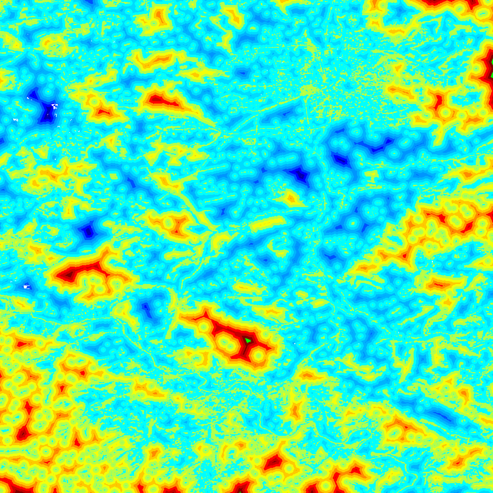
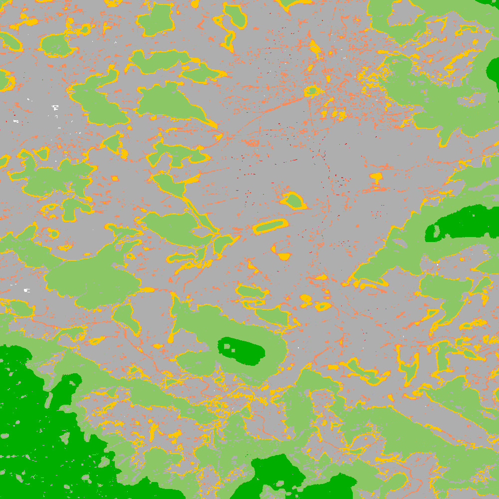
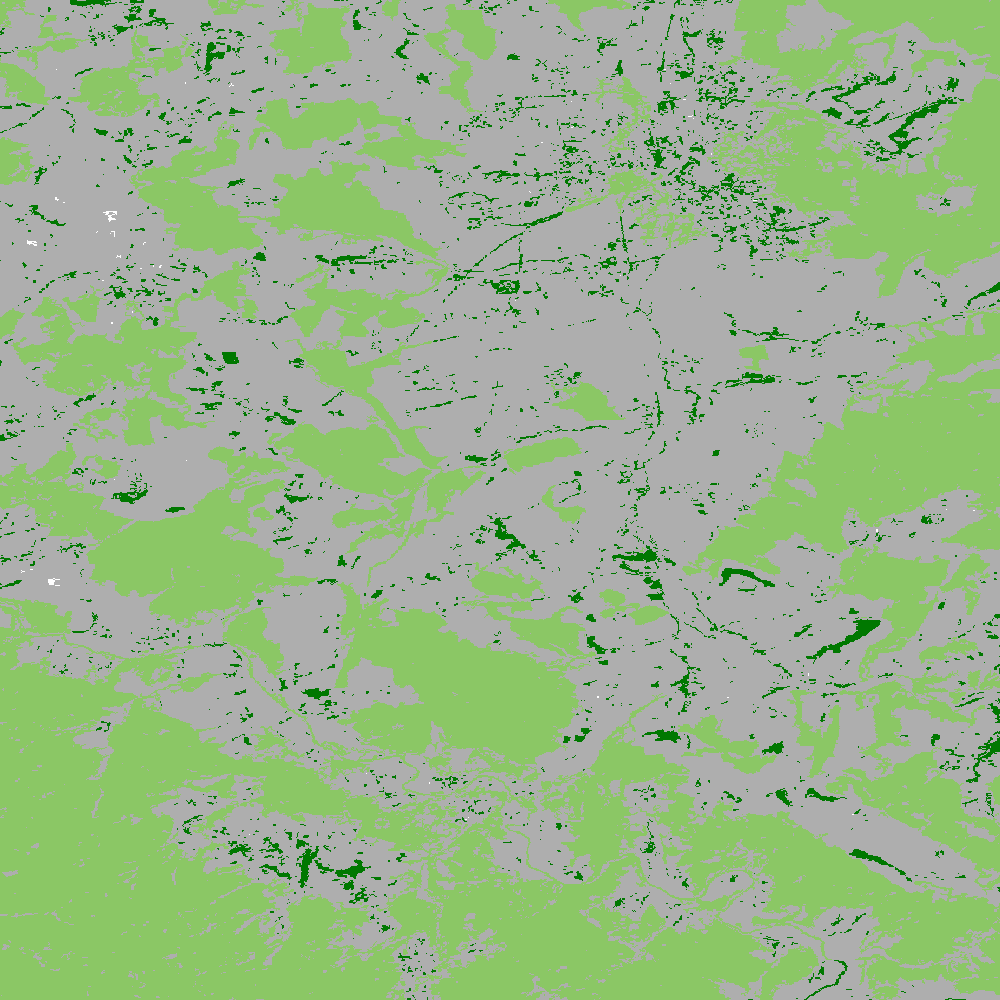
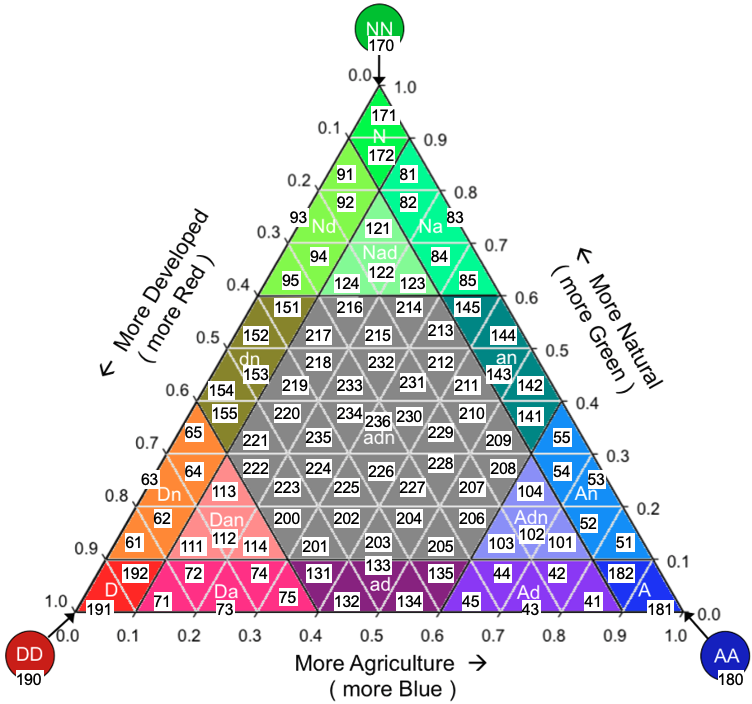
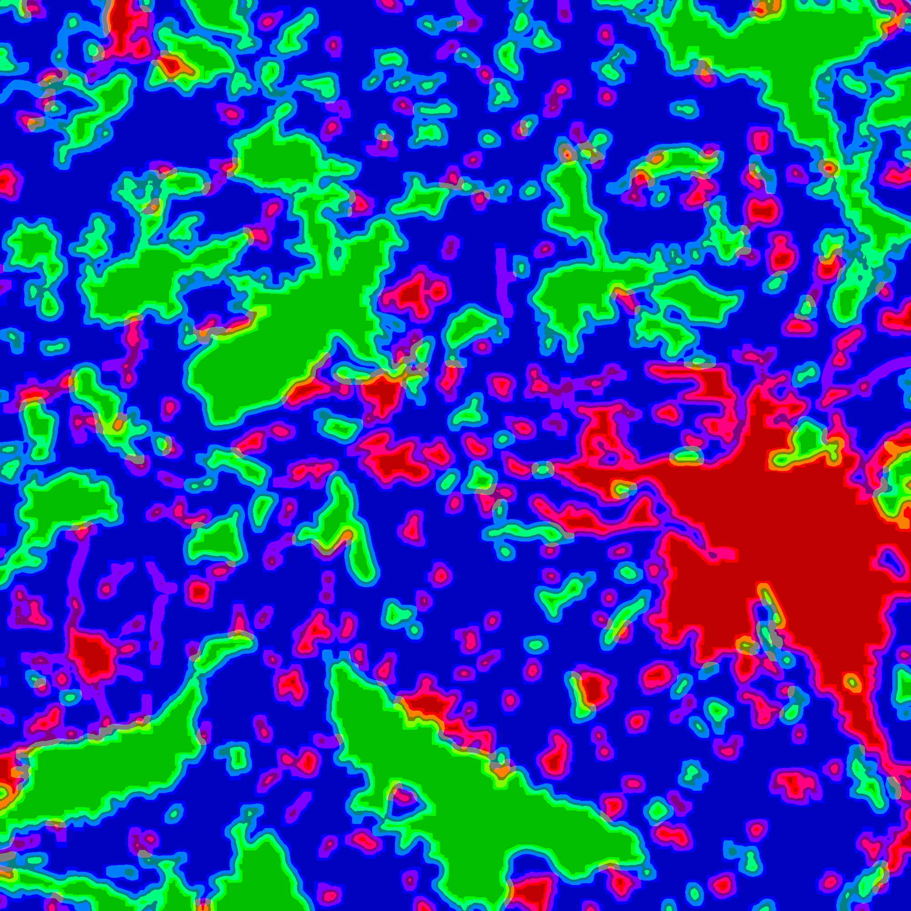
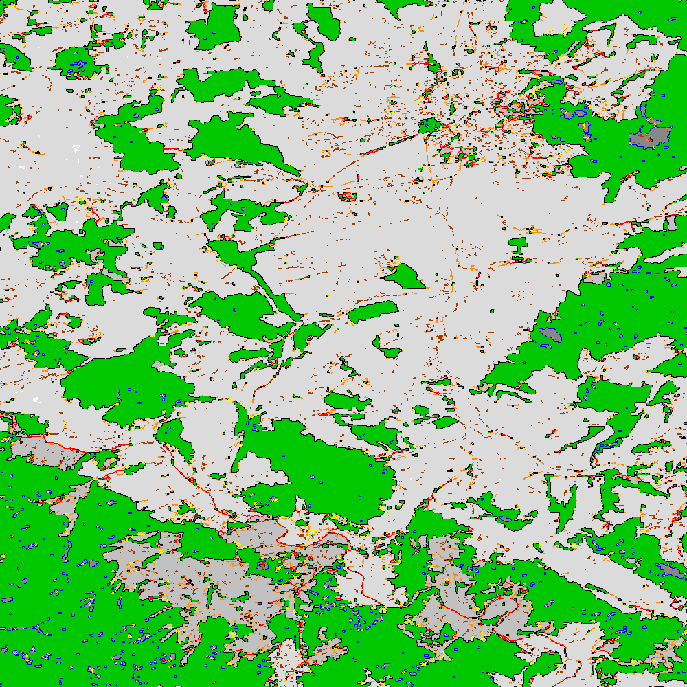
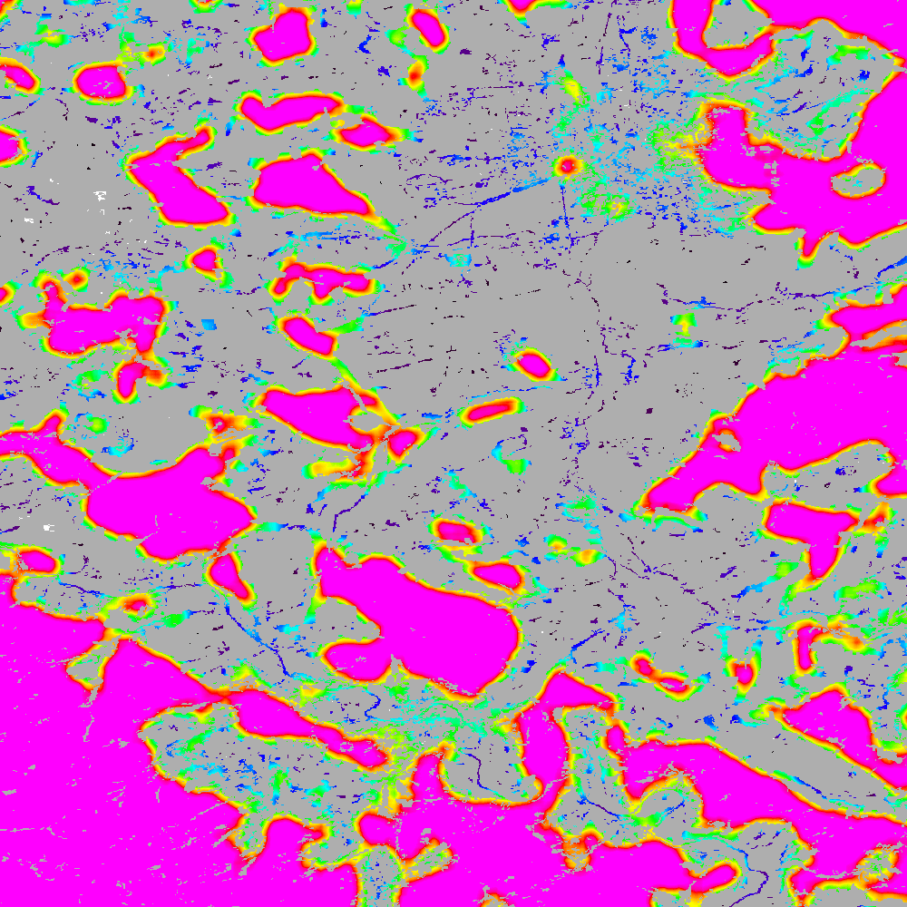
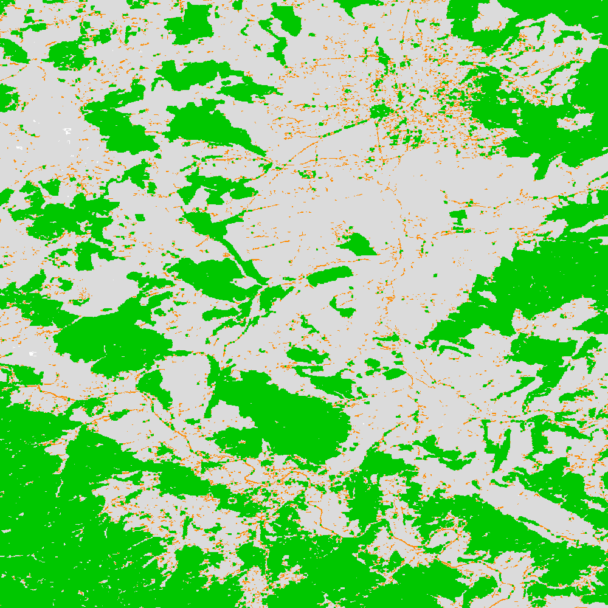

GuidosToolbox Workbench – GWB
=============================

The GuidosToolbox Workbench (**GWB**, `homepage <https://forest.jrc.ec.europa.eu/en/activities/lpa/gwb/>`_) is a subset of the desktop software package GuidosToolbox (`GTB <https://forest.jrc.ec.europa.eu/en/activities/lpa/gtb/>`_) designed as a cmd-line application for Linux 64bit servers. 

This document provides usage instructions for the cmd-line implementation of  **GWB**. Documentation on the GWB SEPAL browser-based application is available `here <https://docs.sepal.io/en/latest/modules/dwn/gwb.html>`_. 

Initial setup
-------------

As regular user, please first copy the **GWB** setup into your :code:`$HOME` account using the command: 

.. code-block:: console

    $ cp -fr /opt/GWB/*put ~/

You will now find the new directories :code:`input` and :code:`output` in your :code:`$HOME` account.

-   :code:`input`: This directory contains module-specific parameter files, two sample geotif images and a README file.
-   :code:`output`: This directory is empty.

All GWB modules require categorical raster input maps in data type unsigned byte (8bit), with discrete integer values within [0, 255] byte. The two sample images in the directory :code:`input` are:

-   :code:`example.tif`: 0 byte - Missing, 1 byte - Background, 2 byte - Foreground
-   :code:`clc3class.tif`: 1 byte - Agriculture, 2 byte - Natural, 3 byte - Developed

**GWB** is designed to apply the module-specific settings of the respective parameter file to all tif-images placed in the directory :code:`input`. The module-specific results will be written into the directory :code:`output`.

.. note::

    -   Please also run the above cp-command to update your **GWB**-setup files with potentially modified files provided by a newer version of **GWB**.  
    -   The directory :code:`input` has a subdirectory :code:`backup` having backup copies of all parameter files. This subdirectory may also be used to temporarily store images that should be excluded from processing.

Example of the **GWB** setup in the user account :code:`/home/prambaud`.

.. code-block:: console

    $ pwd
    /home/prambaud

    $ ls output/
    $ ls input/
    acc-parameters.txt   clc3class.tif        example.tif         
    frag-parameters.txt  mspa-parameters.txt  parc-parameters.txt  
    rec-parameters.txt   spa-parameters.txt   backup              
    dist-parameters.txt  fad-parameters.txt   lm-parameters.txt    
    p223-parameters.txt  readme.txt           rss-parameters.txt

    $ less input/readme.txt
    Images:
    - GWB will process all images from the folder 'input' having the suffix: .tif

    Parameter files: *-parameter.txt
    - please do not delete these files
    - modify only the settings at the end of the file enclosed by *****

    Directory backup: not needed for processing
    - a set of backup parameter files is included here
    - temporarily store images here that you want to exclude from processing    

Usage Instructions Overview
---------------------------

To get an overview of all **GWB** modules enter the command: :code:`GWB`

.. code-block:: console

    $ GWB
    ===============================================================================
    GWB: GuidosToolbox-Workbench:
    ===============================================================================
    cmd-line image analysis modules from GuidosToolbox 
    (https://forest.jrc.ec.europa.eu/en/activities/lpa/gtb/):
    Usage of GWB implies compliance with the conditions in the EULA_GWB.pdf
    (https://ies-ows.jrc.ec.europa.eu/gtb/GWB/EULA_GWB.pdf)
    
    GWB_check4updates
       Display installed and current program version
       and test for program updates 
 
    GWB_ACC: Accounting of image objects and area classes
        Requirements: 1b-BG, 2b-FG, optional: 0b-missing, 
        optional: 3b-special background 1, 4b-special background 2
        Parameter file: input/acc-parameters.txt
 
    GWB_DIST: Euclidean Distance and Hypsometric Curve
        Requirements: 1b-BG, 2b-FG, optional: 0b-missing
        Parameter file: input/dist-parameters.txt
 
    GWB_FAD: Multiscale fragmentation analysis
        Requirements: 1b-BG, 2b-FG, optional: 0b-missing, 
        optional: 3b-special BG, 4b-non-fragmenting BG
        Parameter file: input/fad-parameters.txt
    
    GWB_FRAG: user-selected custom scale fragmentation analysis
        Requirements: 1b-BG, 2b-FG, optional: 0b-missing, 
        optional: 3b-special BG, 4b-non-fragmenting BG
        Parameter file: input/frag-parameters.txt
    
    GWB_LM: Landscape Mosaic 
        Requirements: 1b-Agriculture, 2b-Natural, 3b-Developed 
        optional: 0b-missing
        Parameter file: input/lm-parameters.txt
    
    GWB_MSPA: Morphological Spatial Pattern Analysis (up to 25 classes)
        Requirements: 1b-BG, 2b-FG, optional: 0b-missing
        Parameter file: input/mspa-parameters.txt
    
    GWB_P223: Foreground Density [%], Contagion [%], or Adjacency [%]
        Spatcon: P2, P22, P23, Shannon, Sumd
        Requirements: 1b-BG, 2b-FG, 3b-specific BG (for Adjacency), optional: 0b-missing
        Parameter file: input/p223-parameters.txt
    
    GWB_PARC: Landscape Parcellation index
        Requirements: [1b, 255b]-land cover classes, optional: 0b-missing
        Parameter file: input/parc-parameters.txt
    
    GWB_REC: Recode class values
        Requirements: categorical map with up to 256 classes [0b, 255b]
        Parameter file: input/rec-parameters.txt
    
    GWB_RSS: Restoration Status summary
        Requirements: 1b-BG, 2b-FG, optional: 0b-missing
        Parameter file: input/rss-parameters.txt
    
    GWB_SPA: Spatial Pattern Analysis (2, 3, 5, or 6 classes)
        Requirements: 1b-BG, 2b-FG, optional: 0b-missing
        Parameter file: input/spa-parameters.txt
    
    More details in the module-specific parameter files, or run: GWB_XXX --help
    
    Usage: 
        a) standalone mode (within the directory GWB): 
            ./GWB_ACC  OR add a custom full path to your input and output directory i.e.: 
                ./GWB_ACC -i=<your dir_input> -o=<your dir_output>
    
        b) system mode (GWB installed in /opt/): 
            add the full path to your input and output directory i.e.: 
                GWB_ACC -i=<your dir_input> -o=<your dir_output>
    
    To get started in system mode, copy the input/output directories to
    your home folder using the command:
    cp -fr /opt/GWB/*put ~/
    ===============================================================================

It is also possible to use the "help" option: :code:`GWB_ACC --help`

.. code-block:: console

    $ GWB_ACC --help
    ----------------------------------------------------------------------------------
    usage: /usr/bin/GWB_ACC -i=dir_input -o=dir_output
    -i=<full path to directory 'input'> 
    (with your input images and parameter files);
    Standalone mode: GWB/input 
    -o=<full path to directory 'output'> 
    (location for results, must exist and must be empty);
    Standalone mode: GWB/output 
    --help: show options

    Standalone mode: ./GWB_ACC
    System mode/use custom directories: GWB_ACC -i=<your dir_input> -o=<your dir_output>
    ----------------------------------------------------------------------------------

.. tip::
    
    When used for the first time, please accept the `EULA <https://ies-ows.jrc.ec.europa.eu/gtb/GWB/EULA_GWB.pdf>`_ terms. This step is only needed once.

Additional, general remarks:

-   The directory :code:`output` must be empty before running a new analysis. Please watch out for hidden files/folders in this directory, which may be the result of an interrupted execution. The safest way to empty the directory is to delete it and recreate a new directory :code:`output`.
-   **GWB** will automatically process all suitable geotiff images (single band and of datatype byte) from the directory :code:`input`. Images of different format or that are not compatible with the selected analysis module requirements will be skipped. Details on each image processing result can be found in the log-file in the directory :code:`output`.
-   **GWB** is written in the  the `IDL language <https://www.l3harrisgeospatial.com/Software-Technology/IDL>`_. It includes all required IDL libraries and the source code of each module, stored in the folder: :code:`/opt/GWB/tools/source/`.
-   To list your current version of **GWB**, or to check for potential new **GWB** versions, please run the command: 

    .. code-block:: console

        $ GWB_check4updates

-   Any distance or area measures are calculated in pixels. It is therefore crucial to use images in equal area projection. Conversion to meters/hectares require to know the pixel resolution.

Available Commands
------------------

.. danger:: 

    Please enter your own settings by amending the module-specific parameters within the section marked with :code:`*******` in the respective input/<module>-parameters.txt file. Don't change anything else in the parameter file, don't delete or add lines or the module execution will crash. If in doubt, consult the respective input/backup/<module>-parameters.txt file.

GWB_ACC
^^^^^^^

This module will conduct the **Accounting** analysis. Accounting will label and calculate the area of all foreground objects. The result are spatially explicit maps and tabular summary statistics. Details on the methodology and input/output options can be found in the `Accounting <https://ies-ows.jrc.ec.europa.eu/gtb/GTB/psheets/GTB-Objects-Accounting.pdf>`_ product sheet.

Requirements
""""""""""""

Single band geotiff in data format byte: 

-   0 byte: missing (optional)
-   1 byte: background
-   2 byte: foreground (forest)
-   3 byte: special background 1 (optional)
-   4 byte: special background 2 (optional)

Processing parameter options are stored in the file :code:`input/acc-parameters.txt`. 

.. code-block:: text

    ;;;;;;;;;;;;;;;;;;;;;;;;;;;;;;;;;;;;;;;;;;;;;;;;;;;;;;;;;;;;;;;;;;;;;;;;;;;;
    ;; GTB_ACCOUNTING parameter file: 
    ;;    ***  do NOT delete header lines starting with ";;" ***
    ;;
    ;; ACC: Accounting of image objects and patch area size classes
    ;; Input image requirements: 1b-background, 2b-foreground, optional: 0b-missing
    ;; optional: 3b-special background 1, 4b-special background 2
    ;; Please specify entries at lines 25-29 ONLY using the following options:
    ;;
    ;; line 25: Foreground connectivity: 8 (default) or 4 
    ;; line 26: spatial pixel resolution in meters: 
    ;; line 27: up to 5 area thresholds [unit: pixels] in increasing order
    ;;          and separated by a single space.
    ;; line 28: output option:   default (stats + image of viewport) OR 
    ;;   detailed (stats + images of ID, area, viewport; requires much more CPU/RAM!))
    ;; line 29: big3pink: 0 (no - default) or 1 (show 3 largest objects in pink color)
    ;;
    ;; an example parameter file with default output would look like this:
    ;; 8
    ;; 25
    ;; 200 2000 20000 100000 200000
    ;; default
    ;; 0
    ****************************************************************************
    8
    25
    200 2000 20000 100000 200000
    default
    1
    ****************************************************************************

Example
"""""""

The results are stored in the directory :code:`output`, one directory for each input image accompanied by a log-file providing details on computation time and processing success of each input image.

:code:`GWB_ACC` Command and listing of results in the directory :code:`output`:

.. code-block:: console

    $ GWB_ACC -i=/home/prambaud/input -o=/home/prambaud/output
    IDL 8.8.0 (linux x86_64 m64).
    (c) 2020, Harris Geospatial Solutions, Inc.

    GWB_ACC using:
    dir_input= /home/prambaud/input
    dir_output= /home/prambaud/output
    % Loaded DLM: TIFF.
    Done with: clc3class.tif    
    Done with: example.tif
    Accounting finished sucessfully

    $ ls -R output/
    output/:
    acc.log  clc3class_acc  example_acc

    output/clc3class_acc:
    clc3class_acc.csv  clc3class_acc.tif  clc3class_acc.txt

    output/example_acc:
    example_acc.csv  example_acc.tif  example_acc.txt

example statistics and graphical result of input image :code:`example.tif`:

.. code-block:: text

    Accounting size classes result using: 
    example
    Base settings: 8-connectivity, pixel resolution: 25 [m]
    Conversion factor: pixel_to_hectare: 0.0625000, pixel_to_acres: 0.154441
    --------------------------------------------------------------------------------------------- 
    Size class 1: [1, 200] pixels; color: black
            # Objects      Area[pixels]     % of all objects  % of total FGarea
                2789             31190           97.8596         7.2790497
    --------------------------------------------------------------------------------------------- 
    Size class 2: [201, 2000] pixels; color: red
            # Objects      Area[pixels]     % of all objects  % of total FGarea
                    44             23643           1.54386         5.5177484
    --------------------------------------------------------------------------------------------- 
    Size class 3: [2001, 20000] pixels; color: yellow
            # Objects      Area[pixels]     % of all objects  % of total FGarea
                    14             98972          0.491228         23.097855
    --------------------------------------------------------------------------------------------- 
    Size class 4: [20001, 100000] pixels; color: orange
            # Objects      Area[pixels]     % of all objects  % of total FGarea
                    2             59874         0.0701754         13.973255
    --------------------------------------------------------------------------------------------- 
    Size class 5: [100001, 200000] pixels; color: brown
            # Objects      Area[pixels]     % of all objects  % of total FGarea
                    0                 0           0.00000         0.0000000
    --------------------------------------------------------------------------------------------- 
    Size class 6: [200001 -> ] pixels; color: green
            # Objects      Area[pixels]     % of all objects  % of total FGarea
                    1            214811         0.0350877         50.132092
    --------------------------------------------------------------------------------------------- 
    --------------------------------------------------------------------------------------------- 
    Sum of all classes:
            # Objects      Area[pixels]     % of all objects  % of total FGarea
                2850            428490           100.000         100.00000
    
    Median Patch Size:                5
    Average Patch Size:          150.347
    Standard Deviation:          4143.11
    
    Three largest object IDs and area[pixels]; color: pink
    These 3 objects overlay objects listed above
    1)                  1            214811
    2)                901             33508
    3)               1662             26366

.. figure:: ../_images/cli/gwb/example_acc.png
    :width: 50%
    :align: center

Accounting has been used to map and summarize forest patch size classes in the `FAO SOFO2020 <http://www.fao.org/publications/sofo/en/>`_ report and the Forest Europe `State of Europe's Forest 2020 <https://foresteurope.org/publications/>`_ report with additional technical details in the respective JRC Technical Reports for `FAO <https://doi.org/10.2760/145325>`_ and `FE <https://doi.org/10.2760/991401>`_.

GWB_DIST
^^^^^^^^

This module will conduct the **Euclidean Distance** analysis. Each pixel will show the shortest distance to the foreground boundary. Pixels inside a foreground object have a positive distance value while background pixels have a negative distance value. The result are spatially explicit maps and tabular summary statistics.
Details on the methodology and input/output options can be found in the `Distance <https://ies-ows.jrc.ec.europa.eu/gtb/GTB/psheets/GTB-Distance-Euclidean.pdf>`_ product sheet.

Requirements
""""""""""""

Single band geotiff in data format byte: 

-   0 byte: missing (optional)
-   1 byte: background
-   2 byte: foreground (forest)

Processing parameter options are stored in the file :code:`input/dist-parameters.txt`. 

.. code-block:: text

    ;;;;;;;;;;;;;;;;;;;;;;;;;;;;;;;;;;;;;;;;;;;;;;;;;;;;;;;;;;;;;;;;;;;;;;;;;;;;
    ;; GTB_DIST parameter file: 
    ;;    ***  do NOT delete header lines starting with ";;" ***
    ;;
    ;; DIST: Euclidean Distance + Hypsometric Curve
    ;; Input image requirements: 1b-background, 2b-foreground, optional: 0b-missing
    ;;
    ;; Please specify entries at lines 17-18 ONLY using the following options:
    ;;
    ;; line 17: Foreground connectivity: 8 (default) or 4 
    ;; line 18: 1-Eucl.Distance only   or  2- Eucl.Distance + Hysometric Curve
    ;;
    ;; an example parameter file with default settings would look like this:
    ;; 8
    ;; 2
    ****************************************************************************
    8
    2
    ****************************************************************************

Example
"""""""

The results are stored in the directory :code:`output`, one directory for each input image accompanied by a log-file providing details on computation time and processing success of each input image.

:code:`GWB_DIST` command and listing of results in the directory output: 

.. code-block:: console

    $ GWB_DIST -i=/home/prambaud/input -o=/home/prambaud/output
    IDL 8.8.0 (linux x86_64 m64).
    (c) 2020, Harris Geospatial Solutions, Inc.

    GWB_DIST using:
    dir_input= /home/prambaud/input
    dir_output= /home/prambaud/output
    % Loaded DLM: TIFF.
    Done with: clc3class.tif
    % Loaded DLM: LAPACK.
    % Loaded DLM: PNG.
    Done with: example.tif
    DIST finished sucessfully

    $ ls -R output/
    output/:
    dist.log  example_dist

    output/example_dist:
    example_dist_hist.png      example_dist_hmc.csv  example_dist_hmc.png  
    example_dist_hmc.txt       example_dist.tif      example_dist.txt  
    example_dist_viewport.tif

Example statistics (hypsometric curve) and spatial result of input image :code:`example.tif`:

.. image:: ../_images/cli/gwb/example_dist_hmc.png
    :width: 49%

Remarks
"""""""

-   The result provides additional statistics in txt and csv format.
-   Spatially explicit distance per-pixel values are shown in a pseudo-elevation color map. Positive values are associated with land (forest: yellow, orange, red, green), negative values with sea (non-forest: cyan to dark blue) and a value of zero corresponds to the coast line (forest– non-forest boundary).
-   Actual per-pixel distance values are provided in a dedicated image (not shown here)
-   Per-pixel distance values can be summarized with the Hypsometric curve (see above).

**Euclidean Distance** maps of forest patches have been used to map and summarize forest fragmentation, see for example `Kozak et al <https://doi.org/10.3390/su10051472>`_.

.. _gwb_fad:

GWB_FAD
^^^^^^^

This module will conduct the **fragmentation** analysis at **five fixed observation scales**. Because forest fragmentation is scale-dependent, fragmentation is reported at five observation scales, which allows different observers to make their own choice about scales and threshold of concern. The change of fragmentation across different observation scales provides additional interesting information. Fragmentation is measured by determining the Forest Area Density (**FAD**) within a shifting, local neighborhood. It can be measured at pixel or patch level. The result are spatially explicit maps and tabular summary statistics. Details on the methodology and input/output options can be found in the `Fragmentation <https://ies-ows.jrc.ec.europa.eu/gtb/GTB/psheets/GTB-Fragmentation-FADFOS.pdf>`_ product sheet.

Requirement
"""""""""""

Single band geotiff in data format byte: 

-   0 byte: missing (optional)
-   1 byte: background
-   2 byte: foreground (forest)
-   3 byte: specific background (optional)
-   4 byte: non-fragmenting background (optional)

Processing parameter options are stored in the file :code:`input/fad-parameters.txt`. 

.. code-block:: text

    ;;;;;;;;;;;;;;;;;;;;;;;;;;;;;;;;;;;;;;;;;;;;;;;;;;;;;;;;;;;;;;;;;;;;;;;;;;;;
    ;; GTB_FAD parameter file: 
    ;;    ***  do NOT delete header lines starting with ";;" ***
    ;;
    ;; FAD = multi-scale fragmentation analysis at fixed observation scales of
    ;; [7x7, 13x13, 27x27, 81x81, 243x243] pixels
    ;;
    ;; FAD: per-pixel density, color-coded into 6 fragmentation classes
    ;; FAD-APP2: average per-patch density, color-coded into 2 classes
    ;; FAD-APP5: average per-patch density, color-coded into 5 classes
    ;; 
    ;; Input image requirements: 1b-background, 2b-foreground, optional: 
    ;;    0b-missing, 3b-special background, 4b-non-fragmenting background
    ;;
    ;; FAD will provide 5+1 images and summary statistics.
    ;;
    ;; Please specify entries at lines 28-30 ONLY using the following options:
    ;; line 28: FAD  or  FAD-APP2  or  FAD-APP5
    ;; line 29: Foreground connectivity: 8 (default) or 4 
    ;; line 30: high-precision: 1 (default) or 0
    ;;         (1-float precision, 0-rounded byte)
    ;;
    ;; an example parameter file doing FAD-APP5 and using 8-connected foreground:
    ;; FAD-APP5
    ;; 8
    ;; 1
    ****************************************************************************
    FAD
    8
    1
    ****************************************************************************

Example
"""""""

The results are stored in the directory :code:`output`, one directory for each input image accompanied by a log-file providing details on computation time and processing success of each input image.

:code:`GWB_FAD` command and listing of results in the directory output: 

.. code-block:: console

    $ GWB_FAD -i=/home/prambaud/input -o=/home/prambaud/output
    IDL 8.8.0 (linux x86_64 m64).
    (c) 2020, Harris Geospatial Solutions, Inc.

    GWB_FAD using:
    dir_input= /home/prambaud/input
    dir_output= /home/prambaud/output
    % Loaded DLM: TIFF.
    % Loaded DLM: LAPACK.
    % Loaded DLM: PNG.
    Done with: clc3class.tif
    Done with: example.tif
    FAD finished sucessfully
    
    $ ls -R output/
    output/:
    clc3class_fad  example_fad  fad.log

    output/clc3class_fad:
    clc3class_fad_13.tif      clc3class_fad_27.tif       clc3class_fad_81.tif       
    clc3class_fad_mscale.csv  clc3class_fad_mscale.tif   clc3class_fad_243.tif  
    clc3class_fad_7.tif       clc3class_fad_barplot.png  clc3class_fad_mscale.sav  
    clc3class_fad_mscale.txt

    output/example_fad:
    example_fad_13.tif      example_fad_27.tif       example_fad_81.tif       
    example_fad_mscale.csv  example_fad_mscale.tif   example_fad_243.tif  
    example_fad_7.tif       example_fad_barplot.png  example_fad_mscale.sav  
    example_fad_mscale.txt

Example statistics and spatial result of a multi-scale per-pixel analysis of the input image :code:`example.tif`:

.. image:: ../_images/cli/gwb/example_fad_barplot.png
    :width: 49%

Remarks
"""""""

-   The result provides additional statistics in txt and csv format.
-   The IDL-specific sav-file contains all information to conduct fragmentation change analysis in GTB. 
-   In addition to the above multi-scale image, the result provides fragmentation images at each of the 5 fixed observation scales.
-   Options to report at pixel- or patch-level and to select the number of fragmentation classes (6, 5, 2).

Fragmentation has been used to map and summarize the degree of forest fragmentation by Riitters et al. (`2002 <https://doi.org/10.1007/s10021-002-0209-2>`_, `2012 <https://doi.org/10.1038/srep00653>`_) as well as the US Forest Inventory and Analysis (`FIA <https://www.fia.fs.fed.us/>`_) reports since 2003.

GWB_FRAG
^^^^^^^^

This module will conduct the **fragmentation** analysis at a **user-selected observation scale**. This module and its option are similar to :ref:`gwb_fad` but allow the user to specify a single (or multiple) specific observation scale. The result are spatially explicit maps and tabular summary statistics. Details on the methodology and input/output options can be found in the `Fragmentation <https://ies-ows.jrc.ec.europa.eu/gtb/GTB/psheets/GTB-Fragmentation-FADFOS.pdf>`_ product sheet.

Requirements
""""""""""""
Single band geotiff in data format byte:

-   0 byte: missing (optional)
-   1 byte: background
-   2 byte: foreground (forest)
-   3 byte: specific background (optional)
-   4 byte: non-fragmenting background (optional)

Processing parameter options are stored in the file :code:`input/frag-parameters.txt`. 

.. code-block:: text

    ;;;;;;;;;;;;;;;;;;;;;;;;;;;;;;;;;;;;;;;;;;;;;;;;;;;;;;;;;;;;;;;;;;;;;;;;;;;;
    ;; GTB_FRAG parameter file: 
    ;;    ***  do NOT delete header lines starting with ";;" ***
    ;;
    ;; FOS = fragmentation analysis at up to 10 user-selected observation scales
    ;; 
    ;; FOS5/6: per-pixel density, color-coded into 5/6 fragmentation classes
    ;; FOS-APP2: average per-patch density, color-coded into 2 classes
    ;; FOS-APP5: average per-patch density, color-coded into 5 classes
    ;; 
    ;; Input image requirements: 1b-background, 2b-foreground, optional: 
    ;;    0b-missing, 3b-special background, 4b-non-fragmenting background
    ;;
    ;; FOS will provide an image per observation scale and summary statistics.
    ;;
    ;; Please specify entries at lines 32-36 ONLY using the following options:
    ;; line 32: FOS5 (default)  or  FOS6  or  FOS-APP2  or  FOS-APP5
    ;; line 33: Foreground connectivity: 8 (default) or 4 
    ;; line 34: pixel resolution [meters]
    ;; line 35: up to 10 window sizes [unit: pixels] in increasing order
    ;;          and separated by a single space.
    ;; line 36: high-precision: 1 (default) or 0
    ;;          (1-float precision, 0-rounded byte)
    ;;
    ;; an example parameter file doing FOS5 and using 8-connected foreground:
    ;; FOS5
    ;; 8
    ;; 100
    ;; 27
    ;; 1
    ****************************************************************************
    FAD-APP2
    8
    100
    23
    1
    ****************************************************************************

Example
"""""""

The results are stored in the directory :code:`output`, one directory for each input image accompanied by a log-file providing details on computation time and processing success of each input image.

:code:`GWB_FRAG` command and listing of results in the directory output: 

.. code-block:: console

    $ GWB_FRAG -i=/home/prambaud/input -o=/home/prambaud/output
    IDL 8.8.0 (linux x86_64 m64).
    (c) 2020, Harris Geospatial Solutions, Inc.

    GWB_FRAG using:
    dir_input= /home/prambaud/input
    dir_output= /home/prambaud/output
    % Loaded DLM: TIFF.
    Done with: clc3class.tif
    Done with: example.tif
    Frag finished sucessfully
    
    $ ls -R output/
    output/:
    clc3class_frag  example_frag  frag.log

    output/clc3class_frag:
    clc3class_fad-app2_23.tif  clc3class_frag.csv  clc3class_frag.sav  
    clc3class_frag.txt

    output/example_frag:
    example_fad-app2_23.tif  example_frag.csv  example_frag.sav  
    example_frag.txt

Example statistics and spatial result of custom-scale per patch analysis of the input image :code:`example.tif`, here FAD-APP2 showing Continuous forest patches in light green and Separated forest patches in dark green.

.. code-block:: text

    FAD-APP: Foreground Area Density summary analysis for image: 
    example.tif
    ================================================================================
    8-conn FG: area, # patches, aps [pixels]: 428490, 2850, 150.34737
    Pixel resolution: 100[m], pix2ha: 1.00000, pix2acr: 2.47105
    Observation scale:   1
    Neighborhood area:   23x23     
        [hectare]:     529.00
        [acres]:    1307.19
    ================================================================================
    FAD-APP 5-class:
            Rare:      1.2089
        Patchy:      7.1572
    Transitional:      4.2668
        Dominant:     87.3670
        Interior:      0.0000
    FAD-APP 2-class:
    Separated:      8.3661
    Continuous:     91.6339
    ================================================================================
        FAD_av:     75.2900

Remarks
"""""""

-   The result provides additional statistics in txt and csv format.
-   The IDL-specific sav-file contains all information to conduct fragmentation change analysis in GTB.
-   The result provides one fragmentation image for each custom observation scale. In the example above, the user selected 1 observation scale with local neighborhood of 23x23 pixels.
-   Options to report at pixel- or patch-level and to select the number of fragmentation classes (6, 5, 2).

Fragmentation has been used to map and summarize the degree of forest fragmentation in the `FAO SOFO2020 <http://www.fao.org/publications/sofo/en/>`_ report and the Forest Europe `State of Europe's Forest 2020 <https://foresteurope.org/publications/>`_ report with additional technical details in the respective JRC Technical Reports for `FAO <https://doi.org/10.2760/145325>`_ and `FE <https://doi.org/10.2760/991401>`_.

GWB_LM
^^^^^^

This module will conduct the **Landscape Mosaic** analysis at a **user-selected observation scale**. The Landscape Mosaic measures land cover heterogeneity, or human influence, in a tri-polar classification of a location accounting for the relative contributions of the three land cover types **Agriculture**, **Natural**, **Developed** in the area surrounding that location. The result are spatially explicit maps and tabular summary statistics. Details on the methodology and input/output options can be found in the `Landscape Mosaic <https://ies-ows.jrc.ec.europa.eu/gtb/GTB/psheets/GTB-Pattern-LM.pdf>`_ product sheet.

Requirements
""""""""""""
Single band geotiff in data format byte: 

-   0 byte: missing (optional)
-   1 byte: Agriculture
-   2 byte: Natural
-   3 byte: Developed

.. warning::

    Input image values > 3 byte will be considered as missing data

Processing parameter options are stored in the file :code:`input/lm-parameters.txt`. 

.. code-block:: text 

    ;;;;;;;;;;;;;;;;;;;;;;;;;;;;;;;;;;;;;;;;;;;;;;;;;;;;;;;;;;;;;;;;;;;;;;;;;;;;
    ;; GTB_LM parameter file: 
    ;;    ***  do NOT delete header lines starting with ";;" ***
    ;;
    ;; LM will provide an image and summary statistics.
    ;; Please specify entries at line 14 ONLY using the following options:
    ;; line 14: kdim: square window size [pixels], uneven in [3, 5, ...501]
    ;;          obs_scale [hectare] = (pixres[m] * kdim)^2 / 10000
    ;;
    ;; example parameter file 
    ;; (assuming a pixel resolution of 30m, a 11x11 window ~ 10.9 ha):
    ;; 11
    ****************************************************************************
    23
    ****************************************************************************

Example
"""""""

The results are stored in the directory :code:`output`, one directory for each input image accompanied by a log-file providing details on computation time and processing success of each input image.

:code:`GWB_LM` command and listing of results in the directory output:

.. code-block:: console

    $ GWB_LM -i=/home/prambaud/input -o=/home/prambaud/output
    IDL 8.8.0 (linux x86_64 m64).
    (c) 2020, Harris Geospatial Solutions, Inc.

    GWB_LM using:
    dir_input= /home/prambaud/input
    dir_output= /home/prambaud/output
    % Loaded DLM: TIFF.
    % Loaded DLM: PNG.
    Done with: clc3class.tif
    Done with: example.tif
    LM finished sucessfully
    
    $ ls -R output/
    output/:
    clc3class_lm_23  example_lm_23  lm23.log

    output/clc3class_lm_23:
    clc3class_lm_23_103class.tif  clc3class_lm_23_heatmap.png   clc3class_lm_23.tif  
    lm103class_legend.png         clc3class_lm_23_heatmap.csv   clc3class_lm_23_heatmap.sav  
    heatmap_legend.png

    output/example_lm_23:
    example_lm_23_103class.tif  example_lm_23_heatmap.png   example_lm_23.tif   
    lm103class_legend.png       example_lm_23_heatmap.csv   example_lm_23_heatmap.sav  
    heatmap_legend.png

Example statistics (heatmap) and spatial result of custom-scale analysis of the input image :code:`clc3class.tif`, showing degree of predominance of land cover types Agriculture, Natural, Developed.

Remarks
"""""""
-   The IDL-specific sav-file contains all information to conduct LM change analysis in GTB.
-   LM is not restricted to **Ag**, **Nat**, **Dev** but can be applied to any 3 types of dominant land cover.
-   The result provides the LM analysis for a single custom observation scale. In the example above, and assuming a pixel resolution of 100 meter, an observation scale of 23x23 pixels corresponds to a local neighborhood (analysis scale) of 2300x2300 meters ~ 50 hectare.
-   The heatmap facilitates assessments of temporal changes and/or comparison between different sites.

The Landscape Mosaic has been used to map and summarize the degree of landscape heterogeneity in many occasions (see references in the `Landscape Mosaic <https://ies-ows.jrc.ec.europa.eu/gtb/GTB/psheets/GTB-Pattern-LM.pdf>`_ product sheet), including the `RPA <https://www.srs.fs.usda.gov/pubs/37766>`_, `Embrapa <https://urldefense.com/v3/__https:/www.infoteca.cnptia.embrapa.br/infoteca/bitstream/doc/1126895/1/Livro-Doc-345-1815-final-3.pdf__;!!DOxrgLBm!QdlMk1JDuaLmRLWA6JeqizIFwET3sAHqnWlLDX8vQnfpu9edG2iAIws94-RV3jkaakScfw$>`_, and `MAES <https://doi.org/10.2760/757183>`_ reports.

GWB_MSPA
^^^^^^^^

.. warning::

    If your are considering using the MSPA tool, keep in mind that the process is relatively complex and provide a lot of information (up to 25 classes). If you are only interested in fragmentation and/or less than 6 classes, please consider using :code:`GWB_FRAG` or :code:`GWB_SPA`.

This module will conduct the **Morphological Spatial Pattern Analysis**. `MSPA <https://forest.jrc.ec.europa.eu/en/activities/lpa/mspa/>`_ analyses shape and connectivity and conducts a segmentation of foreground (i.e. forest) patches in up to 25 feature classes. The result are spatially explicit maps and tabular summary statistics. Details on the methodology and input/output options can be found in the `Morphology <https://ies-ows.jrc.ec.europa.eu/gtb/GTB/psheets/GTB-Pattern-Morphology.pdf>`_ product sheet.

Requirements
""""""""""""
Single band geotiff in data format byte:

-   0 byte: missing (optional)
-   1 byte: background
-   2 byte: foreground (forest)

Processing parameter options are stored in the file :code:`input/mspa-parameters.txt`. 

.. code-block:: text

    ;;;;;;;;;;;;;;;;;;;;;;;;;;;;;;;;;;;;;;;;;;;;;;;;;;;;;;;;;;;;;;;;;;;;;;;;;;;;
    ;; GTB_MSPA parameter file: 
    ;;    ***  do NOT delete header lines starting with ";;" ***
    ;;
    ;; MSPA: Morphological Spatial Pattern Analysis (up to 25 classes)
    ;; Input image requirements: 1b-background, 2b-foreground, optional: 0b-missing
    ;;
    ;; MSPA will provide an image and summary statistics.
    ;; (see tools/docs/MSPA_Guide.pdf for details)
    ;; Please specify entries at lines 23-26 ONLY using the following options:
    ;;
    ;; line 23: MSPA parameter 1: Foreground connectivity: 8 (default) or 4 
    ;; line 24: MSPA parameter 2: EdgeWidth: 1 (default) or larger integer values
    ;; line 25: MSPA parameter 3: Transition: 1 (default) or 0 
    ;; line 26: MSPA parameter 4: IntExt: 1 (default) or 0 
    ;;
    ;; a parameter file with the default settings would look like this:
    ;; 8
    ;; 1
    ;; 1
    ;; 1
    ****************************************************************************
    8
    1
    1
    1
    ****************************************************************************

Example
"""""""

The results are stored in the directory :code:`output`, one directory for each input image accompanied by a log-file providing details on computation time and processing success of each input image.

:code:`GWB_MSPA` command and listing of results in the directory output:

.. code-block:: console

    $ GWB_MSPA -i=/home/prambaud/input -o=/home/prambaud/output
    IDL 8.8.0 (linux x86_64 m64).
    (c) 2020, Harris Geospatial Solutions, Inc.

    GWB_MSPA using:
    dir_input= /home/prambaud/input
    dir_output= /home/prambaud/output
    % Loaded DLM: TIFF.
    Done with: clc3class.tif
    Done with: example.tif
    MSPA processing finished sucessfully

    $ ls -R output/
    output/:
    example_mspa  mspa.log

    output/example_mspa:
    example_8_1_1_1.tif  example_8_1_1_1.txt

Example statistics of the input image :code:`example.tif` and explanatory sketch of the basic MSPA feature classes: 

.. code-block:: text 

    MSPA results using: 
    example (MSPA: 8_1_1_1, FG_area: 428490, iFG_area: 485606)
    
    MSPA-class [color]:  FG/data pixels [%]  #/BGarea
    ============================================================
        CORE(s) [green]:            --/--     0
        CORE(m) [green]:      75.09/32.19     1196
        CORE(l) [green]:            --/--     0
            ISLET [brown]:       3.26/ 1.40     2429
    PERFORATION [blue]:       2.17/ 0.93     423
            EDGE [black]:      13.54/ 5.80     890
            LOOP [yellow]:       0.60/ 0.26     541
            BRIDGE [red]:       1.42/ 0.61     765
        BRANCH [orange]:       3.93/ 1.68     4685
        Background [grey]:         --/57.14     2319/571240
        Missing [white]:            0.03      51/270
        Opening [grey]:  88.24 Integrity     2291/57116
    Core-Opening [darkgrey]:       --/ 0.59     717/5927
    Border-Opening [grey]:         --/ 5.12     1574/51189

.. image:: ../_images/cli/gwb/mspalegend.gif
    :width: 49%

Remarks
"""""""

-   MSPA is very versatile and can be applied to any binary map, scale and thematic layer. Please consult the `MSPA Guide <https://ies-ows.jrc.ec.europa.eu/gtb/GTB/MSPA_Guide.pdf>`_, the `Morphology product sheet <https://ies-ows.jrc.ec.europa.eu/gtb/GTB/psheets/GTB-Pattern-Morphology.pdf>`_ and/or the  `MSPA website <https://forest.jrc.ec.europa.eu/en/activities/lpa/mspa/>`_    for further information.
-   The simplified version, GWB_SPA provides fewer classes. GWB_SPA may be useful to get started and may be sufficient to address many assessments.

MSPA is a purely geometric analysis scheme, which can be applied to any type of raster image. It has been used in more than 100 peer-reviewed publications to map and summarize the spatial pattern, fragmentation and connectivity of forest and other land cover patches, including the detection of structural and functional connecting pathways, analyzing urban greenspace, landscape restoration up to classifying zooplankton species.

GWB_P223
^^^^^^^^

This module will conduct the **Density** (P2), **Contagion** (P22) or **Adjacency** (P23) analysis of foreground (**FG**) objects at a user-selected observation scale (`Riitters et al. (2000) <https://www.srs.fs.usda.gov/pubs/ja/ja_riitters006.pdf>`_). The result are spatially explicit maps and tabular summary statistics. The classification is determined by measurements of forest amount (P2) and connectivity (P22) within the neighborhood that is centered on a subject forest pixel. P2 is the probability that a pixel in the neighborhood is forest, and P22 is the probability that a pixel next to a forest pixel is also forest.

Requirement
"""""""""""

Single band geotiff in data format byte: 

-   0 byte: missing (optional)
-   1 byte: background
-   2 byte: foreground (forest)
-   3 byte: specific background (for P23 only)

Processing parameter options are stored in the file :code:`input/p223-parameters.txt`. 

.. code-block:: text

    ;;;;;;;;;;;;;;;;;;;;;;;;;;;;;;;;;;;;;;;;;;;;;;;;;;;;;;;;;;;;;;;;;;;;;;;;;;;;
    ;; GTB_P223 parameter file: 
    ;;    ***  do NOT delete header lines starting with ";;" ***
    ;;
    ;; FG-Density (P2), FG-Contagion (P22), or FG-Adjacency (P23)
    ;; Input image requirements: 1b-background, 2b-foreground, 
    ;; 3b-specific background (for P23), optional: 0b-missing
    ;;
    ;; P223 will provide a color-coded image showing [0,100]% for either
    ;; FG-Density, FG-Contagion, or FG-Adjacency masked for the Foreground cover.
    ;; Use the alternative options 11, 12, 13 to obtain the original spatcon 
    ;; output without normalisation, masking, or color-coding.
    ;;
    ;; For original spatcon output ONLY:
    ;; Missing values are coded as 0 (rounded byte), or -0.01 (float precision). 
    ;; For all output types, missing indicates the input window contained 
    ;; only missing pixels.
    ;; For FG-Contagion and FG-Adjacency output only, missing also indicates 
    ;; the input window contained no foreground pixels (there was no information 
    ;; about foreground edge).
    ;; For all output types, rounded byte = (float precision * 254) + 1
    ;;
    ;; Please specify entries at lines 41-43 ONLY using the following options:
    ;; line 41:  1 FG-Density   (FG-masked and normalised), or
    ;;           2 FG-Contagion (FG-masked and normalised), or
    ;;           3 FG-Adjacency (FG-masked and normalised), or
    ;;          11 FG-Density   (original spatcon output), or
    ;;          12 FG-Contagion (original spatcon output), or
    ;;          13 FG-Adjacency (original spatcon output), or
    ;;          14 FG-Shannon   (original spatcon output), or
    ;;          15 FG-SumD      (original spatcon output)
    ;; line 42: kdim: square window size [pixels], uneven in [3, 5, ..., 501]
    ;;          obs_scale [hectare] = (pixres * kdim)^2 / 10000
    ;; line 43: high-precision: 1 (default, float precision) or 0 (rounded byte)
    ;;
    ;; an example parameter file for FG-Density and using a 27x27 window:
    ;; 1
    ;; 27
    ;; 1
    ****************************************************************************
    1
    27
    1
    ****************************************************************************

Example
"""""""

The results are stored in the directory :code:`output`, one directory for each input image accompanied by a log-file providing details on computation time and processing success of each input image.

:code:`GWB_P223` command and listing of results in the directory output:

.. code-block:: console

    $ GWB_P223 -i=/home/prambaud/input -o=/home/prambaud/output
    IDL 8.8.0 (linux x86_64 m64).
    (c) 2020, Harris Geospatial Solutions, Inc.

    GWB_P223 using:
    dir_input= /home/prambaud/input
    dir_output= /home/prambaud/output
    % Loaded DLM: TIFF.
    Done with: clc3class.tif
    Done with: example.tif
    P2 finished sucessfully
    
    $ ls -R output/
    output/:
    example_p2_27  p2_27.log

    output/example_p2_27:
    example_p2_27.tif  example_p2_27.txt

Example statistics and spatial result of the input image :code:`example.tif` for P2, showing degree of forest density:

.. code-block:: text

    P2-summary at Observation Scale: 27
    Total Foreground Area [pixels]: 428490
    Average P2: 73.7660

Remarks
"""""""

-   Density, Contagion or Adjacency are scale-dependent (specified by the size of the moving window).
-   This moving window approach (originally called Pf/Pff) forms the base for other derived analysis schemes, such as :code:`GWB_LM`/:code:`GWB_FAD`/:code:`GWB_FRAG`.

Both, Density and Contagion add a first spatial information content on top of the primary information of forest, forest amount. Information on forest Density and Contagion is an integral part of many national forest inventories and forest resource assessments. However, the derived products Fragmentation and Landscape Mosaic may be easier to communicate.

GWB_PARC
^^^^^^^^

This module will conduct the **parcellation** analysis. This module provides a statistical summary file (txt/csv- format) with details for each unique class found in the image as well as the full image content: class value, total number of objects, total area, degree of parcellation.
Details on the methodology and input/output options can be found in the `Parcellation <https://ies-ows.jrc.ec.europa.eu/gtb/GTB/psheets/GTB-Objects-Parcellation.pdf>`_ product sheet.

Requirements
""""""""""""

Single band geotiff in data format byte: 

-   0 byte: missing (optional)
-   at least two different landcover classes

Processing parameter options are stored in the file :code:`input/parc-parameters.txt`. 

.. code-block:: text

    ;;;;;;;;;;;;;;;;;;;;;;;;;;;;;;;;;;;;;;;;;;;;;;;;;;;;;;;;;;;;;;;;;;;;;;;;;;;;
    ;; GTB_PARC parameter file: 
    ;;    ***  do NOT delete header lines starting with ";;" ***
    ;;
    ;; PARC: Landscape Parcellation index
    ;; Input image requirements: [1b, 255b]-land cover classes, 
    ;;    optional: 0b-missing
    ;;
    ;; PARC will provide summary statistics only.
    ;;
    ;; Please specify entries at lines 17 ONLY using the following options:
    ;; line 17: Foreground connectivity: 8 (default) or 4 
    ;;
    ;; an example parameter file using 8-connected foreground:
    ;; 8
    ****************************************************************************
    8
    ****************************************************************************

Example
"""""""

The results are stored in the directory :code:`output`, one directory for each input image accompanied by a log-file providing details on computation time and processing success of each input image.

:code:`GWB_PARC` command and listing of results in the directory output:

.. code-block:: console 

    $ GWB_PARC -i=/home/prambaud/input -o=/home/prambaud/output
    IDL 8.8.0 (linux x86_64 m64).
    (c) 2020, Harris Geospatial Solutions, Inc.

    GWB_PARC using:
    dir_input= /home/prambaud/input
    dir_output= /home/prambaud/output
    % Loaded DLM: TIFF.
    Done with: clc3class.tif
    Done with: example.tif
    PARC finished sucessfully
    
    $ ls -R output/
    output/:
    clc3class_parc  example_parc  parc.log

    output/clc3class_parc:
    clc3class_parc.csv  clc3class_parc.txt

    output/example_parc:
    example_parc.csv  example_parc.txt

Example statistics of the input image :code:`clc3class.tif` showing statistics and degree of parcellation for each land cover class as well as for the entire image area:

.. code-block:: text

    Class   Value      Count     Area[pixels]     APS          AWAPS       AWAPS/data     DIVISION      PARC[%]
        1       1          45       2448931    54420.7000  2076600.0000  1271360.0000        0.1520        1.1937
        2       2         164        957879     5840.7300    82557.6000    19770.0000        0.9138       17.7426
        3       3         212        593190     2798.0700   128177.0000    19008.4000        0.7839       11.0897
    ================================================================================================================
    8-conn. Parcels:      421       4000000     9501.1875                1310139.4429        0.6725        8.0790

Remarks
"""""""

-   Parcellation is a normalized summary index in [0, 100] %.
-   :code:`GWB_PARC` provides a tabular summary only.

Parcellation, or the degree of dissection, may be useful to provide a quick tabular summary for each land cover class and the entire image. Together with the degree of division, it may be used to make a statement on the dissection of a particular land cover class. Because Parcellation is a normalized index, measuring Parcellation can be used to quantify temporal changes over a given site as well as directly compare the degree of parcellation of different sites. Being able to quantify changes in percent may also be useful to investigate if a given landscape planning measure had in fact a tangible influence on a specific land cover type or not.

GWB_REC
^^^^^^^

This module will conduct **recoding** of categorical land cover classes.

.. danger:: 

    Please ensure to strictly follow the instructions outlined in the file :code:`input/rec-parameters.txt`. In particular:

    -   Do not delete or insert any new lines.
    -   Modify the first column only in this file.
    -   Insert the new recoded class value as an integer number for each of the 256 classes.
    -   Class values that are not encountered in the image will be skipped.

Requirements
""""""""""""

Single band geotiff in data format Byte.

Processing parameter options are stored in the file :code:`input/rec-parameters.txt`. 

.. code-block:: text 

    ;;;;;;;;;;;;;;;;;;;;;;;;;;;;;;;;;;;;;;;;;;;;;;;;;;;;;;;;;;;;;;;;;;;;;;;;;;;;
    ;; GTB_REC parameter file: 
    ;;    ***  do NOT delete header lines starting with ";;" ***
    ;;
    ;; REC: Recode image classes
    ;; Input image requirements: [0b, 255b] - classes
    ;; Output: the same image coverage but with recoded class values
    ;;
    ;; Please specify 256 lines (line 20 - 275) having two entries per line:
    ;; new_recoded_value [0, 255]   old_original_value[0, 255]
    ;;
    ;; The first column: must have 256 entries showing the recoded values 
    ;; The second column: MUST be in sequential order from 0 to 255, DO NOT EDIT
    ;; Class values not found in the image will be skipped.
    ;; i.e., to recode the class 55 to 3, line 75 would read: 3 55
    ;; 
    ;; Recode lookup table:
    ;; new_recoded_value[0, 255]  old_original_value[0, 255]
    ****************************************************************************
    0    0
    1    1
    2    2
    3    3
    4    4
    5    5
    6    6
    7    7
    8    8
    9    9
    10   10
    11   11
    12   12
    13   13
    14   14
    15   15
    16   16
    17   17
    18   18
    19   19
    20   20
    21   21
    22   22
    23   23
    24   24
    25   25
    26   26
    27   27
    28   28
    29   29
    30   30
    31   31
    32   32
    33   33
    34   34
    35   35
    36   36
    37   37
    38   38
    39   39
    40   40
    41   41
    42   42
    43   43
    44   44
    45   45
    46   46
    47   47
    48   48
    49   49
    50   50
    51   51
    52   52
    53   53
    54   54
    55   55
    56   56
    57   57
    58   58
    59   59
    60   60
    61   61
    62   62
    63   63
    64   64
    65   65
    66   66
    67   67
    68   68
    69   69
    70   70
    71   71
    72   72
    73   73
    74   74
    75   75
    76   76
    77   77
    78   78
    79   79
    80   80
    81   81
    82   82
    83   83
    84   84
    85   85
    86   86
    87   87
    88   88
    89   89
    90   90
    91   91
    92   92
    93   93
    94   94
    95   95
    96   96
    97   97
    98   98
    99   99
    100  100
    101  101
    102  102
    103  103
    104  104
    105  105
    106  106
    107  107
    108  108
    109  109
    110  110
    111  111
    112  112
    113  113
    114  114
    115  115
    116  116
    117  117
    118  118
    119  119
    120  120
    121  121
    122  122
    123  123
    124  124
    125  125
    126  126
    127  127
    128  128
    129  129
    130  130
    131  131
    132  132
    133  133
    134  134
    135  135
    136  136
    137  137
    138  138
    139  139
    140  140
    141  141
    142  142
    143  143
    144  144
    145  145
    146  146
    147  147
    148  148
    149  149
    150  150
    151  151
    152  152
    153  153
    154  154
    155  155
    156  156
    157  157
    158  158
    159  159
    160  160
    161  161
    162  162
    163  163
    164  164
    165  165
    166  166
    167  167
    168  168
    169  169
    170  170
    171  171
    172  172
    173  173
    174  174
    175  175
    176  176
    177  177
    178  178
    179  179
    180  180
    181  181
    182  182
    183  183
    184  184
    185  185
    186  186
    187  187
    188  188
    189  189
    190  190
    191  191
    192  192
    193  193
    194  194
    195  195
    196  196
    197  197
    198  198
    199  199
    200  200
    201  201
    202  202
    203  203
    204  204
    205  205
    206  206
    207  207
    208  208
    209  209
    210  210
    211  211
    212  212
    213  213
    214  214
    215  215
    216  216
    217  217
    218  218
    219  219
    220  220
    221  221
    222  222
    223  223
    224  224
    225  225
    226  226
    227  227
    228  228
    229  229
    230  230
    231  231
    232  232
    233  233
    234  234
    235  235
    236  236
    237  237
    238  238
    239  239
    240  240
    241  241
    242  242
    243  243
    244  244
    245  245
    246  246
    247  247
    248  248
    249  249
    250  250
    251  251
    252  252
    253  253
    254  254
    255  255
    ****************************************************************************

Example
"""""""

The results are stored in the directory :code:`output`, one directory for each input image accompanied by a log-file providing details on computation time and processing success of each input image.

:code:`GWB_REC` command and listing of results in the directory output:

.. code-block:: console

    $ GWB_REC -i=/home/prambaud/input -o=/home/prambaud/output
    IDL 8.8.0 (linux x86_64 m64).
    (c) 2020, Harris Geospatial Solutions, Inc.

    GWB_REC using:
    dir_input= /home/prambaud/input
    dir_output= /home/prambaud/output
    % Loaded DLM: TIFF.
    Done with: clc3class.tif
    Done with: example.tif
    Recode finished sucessfully
    
    $ ls -R output/
    output/:
    clc3class_rec  example_rec  rec.log

    output/clc3class_rec:
    clc3class_rec.tif

    output/example_rec:
    example_rec.tif

Remarks
"""""""

-   The recoded images have the suffix _rec.tif to distinguish them from the original images.
-   To verify the recoding run the command: 
    
    .. code-block:: console
    
        $ gdalinfo -hist <path2image>

Recoding may be useful to quickly setup a forest mask from a land cover map by reassigning specific land cover classes to forest. Please note that most **GWB** modules require a (pseudo) binary forest mask of data type Byte with the assignment:

-   0 byte: missing data (optional)
-   1 byte: Background
-   2 byte: Foreground (i.e., forest)

GWB_RSS
^^^^^^^

This module will conduct the **Restoration Status Summary analysis**. It will calculate key attributes of the current network status, composed of foreground (forest) patches and it provides the normalized degree of network coherence. The result are tabular summary statistics. Details on the methodology and input/output options can be found in the `Restoration Planner <https://ies-ows.jrc.ec.europa.eu/gtb/GTB/psheets/GTB-RestorationPlanner.pdf>`_ product sheet.

Requirements
""""""""""""

Single band geotiff in data format Byte: 

-   0 byte: missing (optional)
-   1 byte: background
-   2 byte: foreground (forest)

.. warning:: 

    Any other values are considered as missing data

Processing parameter options are stored in the file :code:`input/rss-parameters.txt`. 

.. code-block:: text

    ;;;;;;;;;;;;;;;;;;;;;;;;;;;;;;;;;;;;;;;;;;;;;;;;;;;;;;;;;;;;;;;;;;;;;;;;;;;;
    ;; GTB_RESTORATION-STATUS parameter file: 
    ;;    ***  do NOT delete header lines starting with ";;" ***
    ;;
    ;; RSS: Restoration Status = network coherenceof image objetcs
    ;; Input image requirements: 1b-background, 2b-foreground, optional: 0b-missing
    ;;
    ;; Please specify entry at lines 14 ONLY using the following options:
    ;; line 14: Foreground connectivity: 8 default) or 4 
    ;;
    ;; an example parameter file with default output would look like this:
    ;; 8
    ****************************************************************************
    8
    ****************************************************************************

Example
"""""""

The result is stored in a single csv-file in the directory :code:`output`, listing the statistics for each input image in one line, accompanied by a log-file providing details on computation time and processing success of each input image.

:code:`GWB_RSS` command and listing of results in the directory output:

.. code-block:: console

    $ GWB_RSS -i=/home/prambaud/input -o=/home/prambaud/output
    IDL 8.8.0 (linux x86_64 m64).
    (c) 2020, Harris Geospatial Solutions, Inc.

    GWB_RSS using:
    dir_input= /home/prambaud/input
    dir_output= /home/prambaud/output
    % Loaded DLM: TIFF.
    Done with: clc3class.tif
    Done with: example.tif
    RSS finished sucessfully
    
    $ ls -R output/
    output/:
    rss8.csv  rss8.log

Summary statistics for each input image showing the normalized degree of network coherence and additional key network parameters:

.. csv-table:: 
    :header: "FNAME", "AREA", "RAC[%]", "NR_OBJ", "LARG_OBJ", "APS", "CNOA", "ECA", "COH[%]"

    clc3class.tif,957879.00,23.946975,164,176747,5840.7256,180689,281211.93,29.357771
    example.tif,428490.00,42.860572,2850,214811,150.34737,311712,221292.76,51.644789

Remarks
"""""""

-   :code:`GWB_RSS` provides a succinct summary of key network status attributes including area, extent, patch summary statistics, equivalent connected area and degree of network coherence.
-   As a normalized index, Coherence can be used to directly compare the integrity of different networks or to quantitatively assess changes in network integrity over time.
-   The provision of key network status attributes is essential for any restoration planning.
-   The desktop application `GuidosToolbox <https://forest.jrc.ec.europa.eu/en/activities/lpa/gtb/>`_ provides additional, interactive tools for restoration planning.

With the provision of a normalized degree of network coherence, :code:`GWB_RSS` provides a powerful tool to measure and rank the integrity of forest networks for different regions of interest. This feature may be useful to set priorities for restoration planning or to measure implementation progress and overall success of policy regulations.

GWB_SPA
^^^^^^^

This module will conduct the **Simplified Pattern Analysis**. SPA analyses shape and conducts a segmentation of foreground patches into 2, 3, 5, or 6 feature classes. The result are spatially explicit maps and tabular summary statistics. :code:`GWB_SPA` is a simpler version of :code:`GWB_MSPA`. Details on the methodology and input/output options can be found in the `Morphology <https://ies-ows.jrc.ec.europa.eu/gtb/GTB/psheets/GTB-Pattern-Morphology.pdf>`_ product sheet.

Requirements
""""""""""""

Single band geotiff in data format byte: 

-   0 byte: missing (optional)
-   1 byte: background
-   2 byte: foreground (forest)

Processing parameter options are stored in the file :code:`input/spa-parameters.txt`. 

.. code-block:: text 

    ;;;;;;;;;;;;;;;;;;;;;;;;;;;;;;;;;;;;;;;;;;;;;;;;;;;;;;;;;;;;;;;;;;;;;;;;;;;;
    ;; GTB_SPA parameter file: 
    ;;    ***  do NOT delete header lines starting with ";;" ***
    ;;
    ;; SPA: Spatial Pattern Analysis (2, 3, 5, or 6 classes)
    ;; Input image requirements: 1b-background, 2b-foreground, optional: 0b-missing
    ;;
    ;; SPAx will provide an image and summary statistics using 8-connectivity.
    ;; Line 18: enter a single number, representing the number of pattern classes:
    ;; 2: SLF, Coherent
    ;; 3: Core, Core-Openings, Margin  
    ;; 5: Core, Core-Openings, Edge, Perforation, Margin
    ;; 6: Core, Core-Openings, Edge, Perforation, Islet, Margin
    ;;
    ;; an example parameter file would look like this:
    ;; 5
    ****************************************************************************
    2
    ****************************************************************************

Example
"""""""

The results are stored in the directory :code:`output`, one directory for each input image accompanied by a log-file providing details on computation time and processing success of each input image.

:code:`GWB_SPA` command and listing of results in the directory output:

.. code-block:: console

    $ GWB_SPA -i=/home/prambaud/input -o=/home/prambaud/output
    IDL 8.8.0 (linux x86_64 m64).
    (c) 2020, Harris Geospatial Solutions, Inc.

    GWB_SPA using:
    dir_input= /home/prambaud/input
    dir_output= /home/prambaud/output
    % Loaded DLM: TIFF.
    Done with: clc3class.tif
    Done with: example.tif
    SPA2 finished sucessfully
    
    $ ls -R output/
    output/:
    example_spa2  spa2.log

    output/example_spa2:
    example_spa2.tif  example_spa2.txt

Statistics and spatial result of the input image :code:`example.tif` showing a 2-class segmentation (SPA2): Coherent and Small & Linear Features (SLF):

.. code-block:: text

    SPA2: 8-connected Foreground, summary analysis for image: 
    /home/prambaud/input/example.tif
    
    Image Dimension X/Y: 1000/1000
    Image Area =               Data Area                    + No Data (Missing) Area
            = [ Foreground (FG) +   Background (BG)  ]     +          Missing    
            = [        FG       + {Core-Opening + other BG} ] +       Missing    
    
    ================================================================================
            Category              Area [pixels]: 
    ================================================================================
            Coherent:                 388899
    +              SLF:                  39591
    --------------------------------------------------------------------------------
    = Foreground Total:                 428490
    + Background Total:                 571240
    --------------------------------------------------------------------------------
    =  Data Area Total:                 999730
    
            Data Area:                 999730
    +          Missing:                    270
    --------------------------------------------------------------------------------
    = Image Area Total:                1000000
    
    
    ================================================================================
            Category    Proportion [%]: 
    ================================================================================
        Coherent/Data:     38.9004
    +         SLF/Data:      3.9602
    --------------------------------------------------------------------------------
            FG/Data:     42.8606
    --------------------------------------------------------------------------------
        Coherent/FG:     90.7603
    +           SLF/FG:      9.2397
    ================================================================================
    
    
    ================================================================================
            Category          Count [#]: 
    ================================================================================
            Coherent:             847
            FG Objects:            2850
                SLF:            6792
    ================================================================================

Remarks
"""""""

-   The full version, GWB_MSPA provides many more features and classes.
-   Please use :code:`GWB_MSPA` if you need an edge width > 1 pixel and/or to detect connecting pathways. 

:code:`GWB_SPA` is a purely geometric analysis scheme, which can be applied to any type of raster image. It is ideal to describe the morphology of foreground (forest) patches for basic mapping and statistics, which may be sufficient in many application fields. Advanced analysis, including the detection of connecting pathways require using the full version :code:`GWB_MSPA`.

.. spelling::

    cp
    sav
    clc
