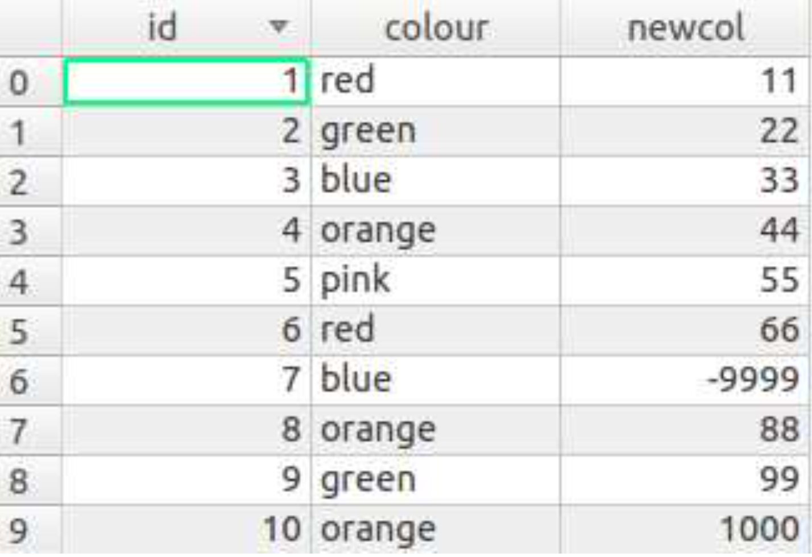
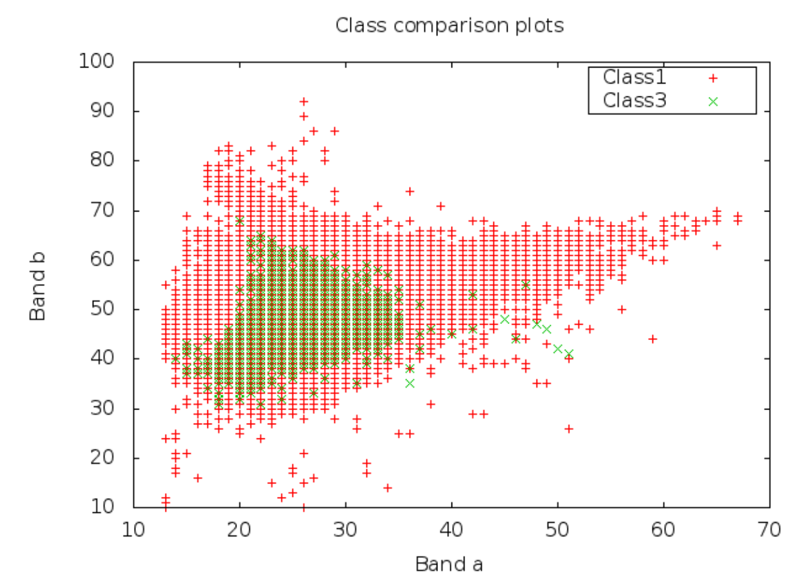
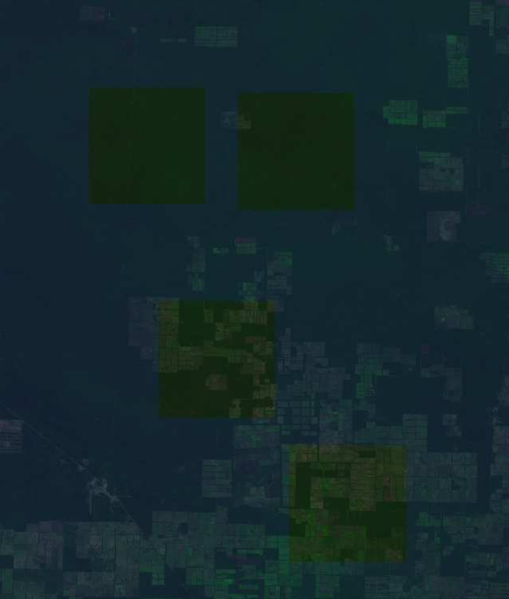
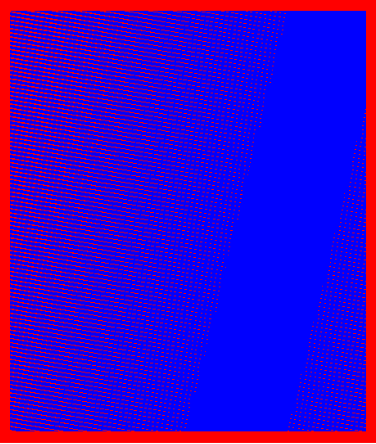

Open Foris Geospatial Toolkit 
=============================

.. note::

    Version 1.25.4 October 2014

Introduction
------------

About this manual
^^^^^^^^^^^^^^^^^

The user manual is developed to help getting into spatial analysis using the Open Foris Geospatial Toolkit. It gives basic explanations of how OFGT functions. It is not attempted to explain the theoretical background on how to do geo-spatial analysis using remote sensing or GIS, but rather will guide you through hands-on examples for each tool, next to some general areas, such as the installation. Further, the manual will link to relevant man pages and other documentation.
In addition, the user manual is written in a way that it can be understood by people who are experienced Windows or Mac users, but have not used Linux or OFGT much before. Sources and documentation for OFGT can be obtained here: http://openforis.org/tools/geospatial-toolkit.html

What is OFGT?
^^^^^^^^^^^^^

OFGT - Open Foris Geospatial Toolkit is a a collection of prototype command- line utilities for processing of geographical data. The tools can be divided into stand-alone programs and scripts and they have been tested mainly in Ubuntu Linux environment although can be used with other linux distros, Mac OS, and MS Windows (Cywgin) as well. Most of the stand-alone programs use GDAL libraries and many of the scripts rely heavily on GDAL command-line utilities.
The OFGT project started under the Open Foris Initiative to develop, share and support software tools and methods for multi-purpose forest assessment, monitoring and reporting http://openforis.org. The Initiative develops and supports innovative, easy-to-use tools needed to produce reliable, timely infor- mation on the state of forest resources and their uses. The command-line tools aim to simplify the complex process of transforming raw satellite imagery for automatic image processing to produce valuable information. These tools contain radiometric harmonisation, image segmentation and image arithmetic, as well as image statistics, feature extraction and other image processing analysis.
Overview of OFGT versions currently available:

-   OFGT 1.25.4 - continuously updated
-   OFGT 1.0 -
 
The great potential of OFGT
^^^^^^^^^^^^^^^^^^^^^^^^^^^

The toolkit comes to its own when dealing with large data sets:
-   The **processing itself takes a fraction** of time than with conventional software.
-   **Automatised data processing makes applications repeatable**, which is of high advantage for many projects.
-   All tools and methods developed under the Initiative are open-source. 

First time users
^^^^^^^^^^^^^^^^

First time users, the terminal is your friend: The Open Foris Geospatial Toolkit tutorial is aiming to provide straight forward guidelines and examples to help first time users to familiarise themselves with the Open Foris Geospatial Toolkit. This includes the installation of Ubuntu, various geospatial tools and, in particular, the installation and application of the Open Foris Geospatial Toolkit. You do not need to be an expert, we just would like you to be curious to try things out. Do not be afraid of using the command-line! We know that the terminal window is for many users a barrier of being afraid ruining everything and having to start from scratch. These days the terminal is not exclusively for advanced computer enthusiasts. Give it a try and just start playing around following the tutorials and instructions you can find in the wiki.

License
^^^^^^^

Open Foris Geospatial Toolkit is released under GNU GPLv3 license.

Get Info
^^^^^^^^

You can check the current version info with the following command:

.. code-block:: console 

    sudo oft−info . bash

OFGT - Tools documentation
--------------------------

GENERAL TOOLS
^^^^^^^^^^^^^

CsvToPolygon.py
"""""""""""""""

NAME
####

CsvToPolygon.py - converts CSV file from GExml2csv.bash into a shapefile

OFGT VERSION
############

1.25.4

SYNOPSIS
########

.. code-block:: console

    CsvToPolygon.py CsvToPolygon.py <input.csv><output.shp>

DESCRIPTION
###########

CsvToPolygon.py is written in Python and creates shapefile polygons from a text file.

The program is modified form the one by Chris Garrard: `<http://www.gis.usu.edu/~chrisg/python/2009/lectures/ospy_hw2a.py>`_

The input is a text file of the following format: 

-   :code:`Polygon id`
-   :code:`land cover class`
-   :code:`land cover subclass`
-   :code:`tree cover class`
-   :code:`resolution of the image` in GE (Google Earth)
-   :code:`year and month of image in GE`

.. warning::

    After the ”:” mark there are corner coordinates in WGS84 system.
    
This input data can be output from another script, :code:`GExml2csv.bash` and originally derives from a training data collection tool created for GE.
  
EXAMPLE
#######

For this exercise following tools are used: CsvToPolygon.py Open your working directory using:

.. code-block:: console 

    cd ~

An example of the beginning of input data is following:

.. csv-table::

    106,OWL,OWL Open,2,Coarse,"2002/1:-5.47450324983224 32.54081338469396,-5.47450324983224 32.5417154317423,-5.47540856036825 32.5417154317423,-5.47540856036825 32.54081338469396"
    107,Grassland,Grassland Bushed,1,Coarse,"2002/1:-5.47456561893842 32.63108751846197,-5.47456561893842 32.63198971163985,-5.47547080384603 32.63198971163985,-5.47547080384603 32.63108751846197"
    108,Bushland,Bushland Thicket,2,Medium,"2002/10:-5.47461439045748 32.72136258245697,-5.47461439045748 32.72226491949511,-5.47551944746972 32.72226491949511,-5.47551944746972 32.72136258245697"

This is how you run the command:

.. code-block:: console

    python CsvToPolygon.py inputdata.csv output.shp

genericCsvToPolygon.py
""""""""""""""""""""""

NAME
####

GenericCsvToPolygon.py - Program for creating polygons from text files

OFGT VERSION
############

1.25.4

SYNOPSIS 
########

.. code-block:: console

    genericCsvToPolygon.py genericCsvToPolygon.py <input.csv><output.shp>

DESCRIPTION
###########

GenericCsvToPolygon.py is a program for creating polygons from text
files.

-   The input file is a text file of the following format: :code:`Polygon id:corner coordinates in WGS84 system`
-   Coordinate pairs are separated from others with a space and x,y with a comma

.. note::
    
    The program is modified form the one by Chris Garrard: `<http://www.gis.usu.edu/~chrisg/python/2009/lectures/ospy_hw2a.py>`_

.. seealso::

    This input data is output from another script, :code:`genericGEkml2csv.bash` and originally comes from Google Earth (self-digitized polygon kml’s).

EXAMPLE
#######

The input file is a text file of the following format: 
-   :code:`Polygon id:corner coordinates in WGS84 system`

.. code-block::

    Bushland1 :38.99408253760913 , −11.04146530113384 ,0 
        38.99380823486723 , −11.04205402821617 ,0 
        38.99380826389991 , −11.04206992654894 ,0 
        38.99382544867113 , −11.04261044223288 ,0 
        38.9938254776416 , −11.04262634062336 ,0 
        38.99415014990515 , −11.04300732377466 ,0 
        38.9941664064954 , −11.04303909164155 ,0 
        38.99466885692982 , −11.04319717791531 ,0 
        38.99473365203311 , −11.04319706202726 ,0 
        38.99479844656671 , −11.0431969461398 ,0 
        38.99515464117336 , −11.04310091874687 ,0 
        38.99518697983437 , −11.04306906417552 ,0

.. code-block::
    
    bushland2 :39.00340243948988 , −11.04234996851613 ,0 
    39.00296537982829 , −11.04267663255115 ,0 
    39.00290506714792 , −11.04270636631092 ,0 
    39.00271044958266 , −11.04355103802362 ,0 
    39.00271058813281 , −11.04362510127527 ,0 
    39.00308922316352 , −11.04433543402553 ,0 
    39.0031345553759 , −11.04436497858972 ,0 
    39.00316485086498 , −11.04442417551431 ,0 
    39.00373863444808 , −11.04457127447502 ,0 
    39.00378391140981 , −11.04457119324793 ,0
  
Then run the actual command:

.. code-block:: console

    genericCsvToPolygon.py input.csv output.shp

The output shp is in geographic WGS84, but does not carry that information. You can transform it e.g. into UTM 36S WGS84 with the following command:

.. code-block:: console

    ogr2ogr −s srs EPSG:4326 −t srs EPSG:32736 proj_output.shp output.shp

Where EPSG:4326 stands for WGS84 (source system) and EPSG:32736 for UTM 36S WGS84 (target system). You can select any target system and find the EPSG code, see `<http://spatialreference.org/ref/epsg/>`_.

EXAMPLE
#######

For this exercise following tools are used: :code:`genericCsvToPolygon.py`, :code:`genericGEkml2csv.bash`, :code:`ogr2ogr`

.. code-block:: console

    ogr2ogr −s srs EPSG:4326 −t srs EPSG:32736 proj_output.shp output.shp
   
This script performs conversion from a set of generic .kml format polygons created in Google Earth (GE) into one combined textfile. This textfile can then be converted into a shapefile using script :code:`genericCsvToPolygon.py`.

-   How to create polygons in Google Earth and save them as .kml files
-   Then open your working directory using 
    
    .. code-block:: console 
        
        cd ~

The procedure is:

1.  Put the kml’s into one folder
2.  Launch :code:`genericGEkml2csv.bash` in that kml-folder. This creates a csv file ”output.csv”
    
    .. code-block:: console
        
        genericGEkml2csv.bash

3.  Launch :code:`genericCsvToPolygon.py` in the same folder, with parameters as follows:
    
    .. code-block:: console
        
        genericCsvToPolygon.py output.csv output.shp

The shapefile name can be as you wish (e.g. settlements168063.shp). The shapefile is in geographic WGS84, but does not carry that information. You can transform it e.g. into UTM 36S WGS84 with the following command:

.. code-block:: console

    ogr2ogr −s srs EPSG:4326 −t srs EPSG:32736 proj_output.shp output.shp

Where EPSG:4326 stands for WGS84 (source system) and EPSG:32736 for UTM 36S WGS84 (target system). You can select any target system and find the EPSG code, see `<http://spatialreference.org/ref/epsg/>`_
   
genericGEkml2csv.bash
"""""""""""""""""""""

NAME
####

genericGEkml2csv.bash - converts separate kml files from Google Earth into one CSV file.

OFGT VERSION
############

1.25.4

SYNOPSIS
########

.. code-block:: console
    
    genericGEkml2csv.bash

DESCRIPTION
###########

genericGEkml2csv.bash converts separate kml files from Google Earth (GE) into one CSV file.

This script performs conversion from a set of generic .kml format polygons created in GE into one combined textfile.

.. note::

    All kml files need to be in one folder from where the script needs to be launched

.. seealso::

    The output textfile of :code:`genericGEkml2csv.bash` can then be converted into a shapefile using script :code:`genericCsvToPolygon.py`.

EXAMPLE
#######

1.  Put all kml files into one folder
2.  Launch :code:`genericGEkml2csv.bash` in that kml-folder. This creates a csv file ”output.csv”
    
    .. code-block:: console
    
        genericGEkml2csv.bash //no need to define input output

    Look into your working directory and see if output.csv was created. Take a closer look at its first lines:
    
    .. code-block:: console
    
        head output.csv
           
3.  Conversion of output.csv into a shapefile: Launch :code:`genericCsvToPolygon.py` in the same folder, with parameters as follows:
    
    .. code-block:: console
        
        genericCsvToPolygon.py output.csv output.shp

    The shp name can be as you wish (e.g. settlements168063.shp). 

4.  The shapefile is in geographic WGS84, but does not carry that information. You can transform it e.g. into UTM 36S WGS84 with the following command:

    .. code-block:: console

        ogr2ogr −s srs EPSG:4326 −t srs EPSG:32736 proj_output.shp output.shp

    Where EPSG:4326 stands for WGS84 (source system) and EPSG:32736 for UTM 36S WGS84 (target system). You can select any target system and find the EPSG code, see `<http://spatialreference.org/ref/epsg/>`_

GExml2csv.bash
""""""""""""""

NAME
####

GExml2csv.bash - converts xml files from Google Earth training data collection tool into one CSV file.

OFGT VERSION
############

1.25.4

SYNOPSIS
########

.. code-block:: console

    GExml2csv.bash

DESCRIPTION
###########

:code:`GExml2csv.bash` converts single files originating from Google Earth (GE) training data collection tool into a combined CSV file.

.. note::

    The script is to be launched in a directory containing the target xml’s

EXAMPLE
#######

For this exercise following tools are used: :code:`GExml2csv.bash`

Open your working directory where you stored you xml files using

.. code-block:: console 

    cd ~

Then simply run following command:

.. code-block:: console

    GExml2csv.bash

oft-addattr.py
""""""""""""""

NAME
####

oft-addattr.py - adds one integer attribute in a shape file. 

OFGT VERSION
############

1.25.4

SYNOPSIS
########

.. code-block:: console

    oft-addattr.py <shapefile><JoinAttrName><NewAttrName><textfile>

DESCRIPTION
###########

:code:`oft-addattr.py` adds one integer attribute in a shape file. It reads a space separated text file and uses the first and second columns to construct a lookup table which is used to add a new attribute in an existing shapefile. Each time the value in the first column is found in the JoinAttributeName field of the shapefile, the value in the second column is added in the field NewAttrName. In case the corresponding value is not present in the textfile, the NewAttrName value for that record becomes -9999.

.. danger::

    The values need to be in integer!

EXAMPLE
#######

For this exercise following tools are used: :code:`oft-addattr.py`

Open your working directory using

.. code-block:: console 

    cd ~

The first lines of the attribute table of :code:`landuse.shp` look like this:

.. code-block:: 
    
    1 red
    2 green
    3 orange 
    5 pink
    6 red
    7 blue
    8 orange 
    9 green 
    10 orange

.. note::

    In this exercise we create a space separated text file as a lookup table. You can create it in any text editor, such as gedit or kate and save the file as lookup.txt in your working directory.

The first column contains the ID linking the lookup table to your shapefile and the second column contains the values you want to add to the new column of your shapefile.

.. code-block::
   
    1 11
    2 22
    3 33 4 44 5 55 6 66 8 88
    9 99
    10 1000

Now run the script in the command line.

Each time the value in the first column of :code:`lookup.txt` is found in the JoinAttributeName of the :code:`landuse.shp`, field in our case called **id**. The value in the second column is added in the field NewAttrName, here called **newcol**. 

.. code-block:: console

    oft−addattr . py landuse.shp id newcol lookup.txt

.. danger::

    The values need to be in integer!  

-   Load :code:`landuse.shp` in QGIS and look at your attribute table. You should now find the new column called newcol with it values.
-   Take a look at the ID 7. The newcol value in :code:`landuse.shp` is -9999. This is due to the fact that there was no value 7 in the first column of the lookup table. In that case the corresponding value is not present in the lookuptable, therefore the newcol value for that record becomes -9999.

    
    Attribute table of :code:`landuse.shp` containing the new column called newcol with values

How to change the data type in QGIS ?
#####################################

Add plugin Table Manager:

1.  Click on the top bar’Plugins’ ->click ’Fetch Python Plugins’.
2.  Type in the filter ’Manager’ ->then you should find ’Table Manager - Manages the attribute table structure’.
3.  Install it. Close and re-open QGIS.
4.  On top bar click ’Plugin’ ->click ’Manage Plugins’ ->tick box for ’Table Manager’.
5.  On top bar click ’Plugin’ ->you should now see ’Table’ some- where under ’Manage Plugins’, click it and the option ’Table Manager’ can be chosen.
6.  From there you can edit your attribute table, add a new colum and choose the data type.
 
oft-addpct.py 
"""""""""""""

NAME
####

oft-addpct.py - adds pseudo color table to an image. 

OFGT VERSION
############

1.25.4

SYNOPSIS 
########

.. code-block:: console 

    oft-addpct.py <inputfile><outputfile>

DESCRIPTION
###########

:code:`oft-addpct.py` adds a pseudo color table to an image keeps the original values of the image, but ensures that classes are shown in pre-defined colors, no matter which application is used to open the image.
After defining the first line, the command will ask for the text file containing the color table:
Give LUT file name: <colortable>
Where:

-   <inputfile> is an image file
-   <outputfile> is an image file (if it is the same as <inputfile>, <inputfile>will be overwritten)
-   <colortable> is a text file with 4 or 5 columns containing the color table in the following format:
    -   1st column: class value
    -   2nd - 4th column: RGB values
    -   optional: 5th column for alpha, if not set, it is assumed to be 255

.. danger::

    The <colortable> must NOT contain any empty lines!
 
.. tip::

    see `Wikipedia <https://en.wikipedia.org/wiki/RGBA_color_model>`_ for more information on RGBA color space. 
    
The <colortable> could look like this:

.. code-block::

    1 103 51 1 255 
    2 254 0 0 255 
    3 0 0 254 255
    4 0 255 0 255

EXAMPLE
#######

For this exercise following tools are used: :code:`oft-addpct.py`

Create the colortable for the file :code:`images/forestc.tif`. If you do not know which classes are present in :code:`images/forestc.tif`, you could use :code:`oft-stat` with i:code:`mages/forestc.tif` both as input and mask file. The first column of the mask file shows all present classes (besides 0). Create a text file called :code:`txt/coltable.txt`, with the first column indicating all possible classes. It could look like this:

.. code-block::

    1 0 0 0 0
    44 122 122 0 255 
    33 103 51 1 255
    55 4 253 255 255 
    22 122 0 122 255 
    11 255 0 0 255
    4 122 122 122 255 
    3 255 255 0 255
    2 200 200 200 255
    6 0 255 0 255

.. danger::

    Make sure that the text file does not contain any empty lines.

Run the following command: 

.. code-block:: console

    oft−addpct.py images/forestc.tif results/forestcolor.tif 
    
The command will ask you about the colortable file:

.. code-block:: console

    Give LUT file name

Enter the path to your color table file and hit enter:

.. code-block:: console

    txt/coltable . txt

You can visualize the result in QGIS:

.. code-block:: console

    qgis results/forestcolor.tif

.. figure:: ../img/cli/ofgt/oft-addpct.png
    :width: 50%
    :alt: color added to an image
    
    Example of using oft-addpct.py to define the colour table.

oft-admin-mask.bash
"""""""""""""""""""

NAME
####

oft-admin-mask.bash - this script prepares a mask of administrative areas within a satellite image.

OFGT VERSION
############

1.25.4

SYNOPSIS 
########

.. code-block:: console

    oft-admin-mask.bash <mask for Landsat image><administrative area image>[ID of wanted administrative area]

DESCRIPTION
###########

-   If no ID is given the script just clips and re-projects (if needed) the admin image to match the Landsat image mask
-   If an ID is given, the admin area with this ID is added to the base mask and other areas are set to 0
-   The input administrative image does not need to be of the same size and projection (script utilises :code:`oft-clip.pl` for clipping and re- projecting)

EXAMPLE
#######

For this exercise following tools are used: :code:`oft-admin-mask.bash`, :code:`oft-shptif.bash`.

Open your working directory using

.. code-block:: console
    
    cd ~

In a first step we need to prepare an image with administrative areas using :code:`oft-shptif.bash`. For exercise purpose we simply use :code:`landuse.shp` as an input for hypothetical admin areas.

.. code-block:: console

    oft−shptif.bash landuse.shp landsat_t1.tif landuse_raster.tif landuse
   
Let’s run :code:`oft-admin-mask.bash` now using :code:`landuse_raster.tif`. 

.. note:: 

    The output is automatically called :code:`landsat_t1_adm.tif`.

.. code-block:: console

    oft−admin−mask.bash landsat_t1.tif landuse_raster.tif

Verify in QGIS using a contrast enhancement if the pixel values of :code:`landsat_t1_adm.tif` are correctly processed.

oft-bb 
""""""

NAME
####

oft-bb - is a a bounding box calculator t. 

OFGT VERSION
############

1.25.4

SYNOPSIS
########

.. code-block:: console

    oft-bb [-um maskfile] <inputfile><value>

DESCRIPTION
###########

:code:`oft-bb` studies every pixel of the input file and reports minimum and maximum pixels coordinates of pixels having the given value. The minimum coordinates are 1,1. 

-   <inputfile> is an image file
-   <value> is the value you want to query
-   :code:`-um` use mask file. It will consider only pixels which have mask value > 0

EXAMPLE
#######

For this exercise following tools are used: :code:`oft-bb`, :code:`gdal_translate`

Open your working directory using:

.. code-block:: console
    
    cd ~

Find the bounding box of the Forest tree cover file :code:`forestc.tif` with value ”33”

.. code-block:: console

    oft−bb images/forestc.tif 33

It should provide the following result :

.. code-block::
    
    Band 1 BB (xmin ,ymin ,xmax,ymax) is 1408 1740 1713 1964

You can visualize the result by subsetting the image to these extents using :code:`gdal_translate`

.. code-block:: console

    gdal_translate -srcwin 1408 1740 305 224 images/forestc.tif results/bb_33. tif
   
The parameters for the size of the box are calculated as xmax-xmin and ymax-ymin

Visualize the results in QGIS:

.. code-block:: console

    qgis images/forestc.tif results/bb_33.tif

.. figure:: ../img/cli/ofgt/oft-bb.png
    :width: 50%
    :alt: bounding box for 33 value

    Example of using oft-bb output bb 33.tif.

oft-classvalues-compare.bash
""""""""""""""""""""""""""""

.. warning:: 

    To be tested

NAME
####

oft-classvalues-compare.bash - creates comparison plots of classes based on result of previous script oft-classvalues-plot.bash.

OFGT VERSION
############

1.25.4

SYNOPSIS
########

.. code-block:: console

    oft-classvalues-compare.bash <class1><class2> oft-classvalues-compare.bash <class1><class2>[class3] [class4] [class5]

DESCRIPTION
###########

:code:`oft-classvalues-compare.bash` This script is meant to be used after script :code:`oft-classvalues-plot.bash`. It plots 2-5 classes in the same figure and the distinction of classwise point clouds can be evaluated.

It is launched in the folder containing classwise plots and text files produced by the above mentioned script.

OPTION
######

Additional classes that can be plotted in the same figure:

-   [class3]
-   [class4]
-   [class5]

.. seealso::

    Look at oft-classvalues-plot.bash, which computes input data for this tool

EXAMPLE
#######
 
For this exercise following tools are used: :code:`oft-classvalues-plot.bash` - Input data deriving from exercise :code:`oft-classvalues-plot.bash`

Change your working directory to the one of the previous exercise :code:`oft-classvalues-plot.bash`: 
.. code-block:: console
    
    cd ~

Use :code:`oft-classvalues-compare` to create a comparison plot of **band2** and **band3**.
Output to be found in folder :code:`plots_LT52_CUB00.tif_bands_3_4` created after running :code:`oft-classvalues-plot.bash`.

.. code-block:: console 

    oft−classvalues −compare . bash 1 3

    Comparaison bewteen band 1 and 3

Now compare **band1**, **band2** and **band3**:

.. code-block:: console

    oft−classvalues −compare . bash 1 2 3

.. figure:: ../img/cli/ofgt/compare_1_2_3.png
    :width: 50%

    Comparaison bewteen band 1 to 3

oft-classvalues-plot.bash
"""""""""""""""""""""""""

.. warning::
    
    To be tested

NAME
####

oft-classvalues-plot.bash - creates scatterplots of pixels within train- ing classes (given in a shapefile).

OFGT VERSION
############

1.25.4

SYNOPSIS
########

.. code-block:: console

    oft-classvalues-plot.bash <input image><shapefile basename> <shapefile class fieldname><image band for x-axis><image band for y-axis>

DESCRIPTION
###########

:code:`oft-classvalues-plot.bash` creates scatterplots of image grey values in different classes of training data. Also figures of class means and standard deviations are provided.

-   Training areas need to be in shapefiles.
-   The figures of class means and std’s for both required bands are created in the launching folder (.png format).
-   It also puts the class means and standard deviations into text files.
-   Pixel-by-pixel values are stored in a separate text file.
-   The pixel plots are created in a folder named plots imagename band1 band2.

They are for all classes, .png image files. And same as text files.

.. note::

    Make sure that you have installed GNUPLOT.

.. seealso::

    A further script :code:`oft-classvalues-compare.bash` can then be used to compare up to 5 classes in one view.
 
EXAMPLE
#######

For this exercise following tools are used: :code:`oft-classvalues-plot.bash` 
Input data: download for this exercise the Landsat imagery landsat :code:`t1.tif` and the shapefile: :code:`landuse.shp`

Open your working directory using:

.. code-block:: console
    
    cd ~

Run :code:`oft-classvalues-plot.bash` with input: satellite image ∥ shapefile ∥ Attribute column for ID in this case **name** | **band3** | **band4**; Input image: :code:`landsat_t1.tif`, input shapefile: :code:`landuse.shp`.

.. note::

    the output is automatically processed.

.. code-block:: console

    oft−classvalues−plot.bash landsat_t1.tif landuse name 3 4

**Output:**

1.  :code:`pixelvalueslandsat_t1.tif_bands_3_4.txt`: 
    
    .. code-block:: console 
    
        head pixelvalueslandsat_t1.tif_bands_3_4.txt

    .. csv-table::
        :header: Pixel ID, X , Y , class (from attribute name), pixelvalue_bandnr3, pixelvalue bandnr4

        1.00, 771870.00, −2402010.00, 6.00, 22.00, 47.00
        2.00, 771900.00, −2402010.00, 6.00, 22.00, 53.00 
        3.00, 771930.00, −2402010.00, 6.00, 23.00, 55.00 
        4.00, 771960.00, −2402010.00, 6.00, 22.00, 55.00
        5.00, 771990.00, −2402010.00, 6.00, 21.00, 53.00

2.  :code:`classvalues_landsat_t1.tif_band_3.txt`:

    .. code-block:: console
    
        head classvalues_landsat_t1.tif_band_3_._txt

    .. csv-table::
        :header: classvalue, bandnr3 , std

        7, 27.224344, 2.480986 
        13, 28.945946, 1.679205 
        8, 28.140811, 2.322499 
        9, 29.036641, 2.258223 
        12, 27.879464, 1.288049 
        11, 27.423695, 1.199933

3.  :code:`classvalues_landsat_t1.tif_band_4.txt`

    .. code-block:: console
    
        head classvalues_landsat_t1.tif_band_3.txt

    .. csv-table:: 
        :header: classvalue, bandnr4 , std

        7, 48.176611, 2.622561 
        13, 45.385749, 1.525189 
        8, 49.842482, 2.397968 
        9, 52.786260, 3.513642
        12, 49.943452, 2.232350
        11, 48.779116, 1.172885

4.  Folder plots :code:`landsat_t1.tif` bands 3 4 contains the classes to be used for :code:`oft-classvalues-compare.bash`.

oft-combine-masks.bash
""""""""""""""""""""""

NAME
####

oft-combine-masks.bash - combines several masks (raster and shape- files) to one mask file

OFGT VERSION
############

1.25.4

SYNOPSIS
########

.. code-block:: console

    oft-combine-masks.bash <input1><input2>.... <nodata> oft-combine-masks.bash <input1><input2>.... <nodata>[EPSG code]

DESCRIPTION
###########

:code:`oft-combine-masks.bash` is a UNIX bash script that allows the user to use both mask images and mask shapefiles as input and the script combines them into one mask file.

-   The first inputfile is the base and it must be an image not shapefile - The following input files will be written on only if there is nodata (user-defined value)
-   The extent is defined by the first input image
-   If the projection is not given by the user, all files are assumed to be in same projection
-   Concerning the shapefiles, the last field is assumed to be the one containing the mask values
-   At least 2 files and nodata value are needed

OPTION
######

The projection can be defined by the user using the [EPSG code] option.
 
EXAMPLE
#######
- For this exercise following tools are used: :code:`oft-combine-masks.bash`, :code:`oft-calc`, :code:`gdal_rasterize`.
Open your working directory using:

.. code-block:: console
    
    cd ~

**STEP 1: CREATE MASKS**

To run :code:`oft-combine-masks.bash` we need to create some mask files. To do so, we burn the attribute values of the column mask from the shapefile :code:`landuse.shp` into the raster :code:`forestc.tif`:

.. code-block:: console

    gdal rasterize −b 1 −a mask −l landuse landuse.shp forestc.tif forest.tif

Verify in QGIS if your pixel values of :code:`forestc.tif` match the polygon values of :code:`landuse.shp`.

.. tips::

    if the raster output is black, click on it’s Properties ->Style ->Colour Map and chose Pseudo Colour

.. figure:: ../img/cli/ofgt/oft-combine-mask_create_mask.png

    Left: Attribute table of :code:`landuse.shp`. Right: Zoom of output raster :code:`forestc.tif` in QGIS using the colourmap **Pseudocolour**.
     
:code:`Forestc.tif` is the base raster to create some masks files by extracting those pixels that contain values which were previously in the shapefile and then burned into the raster:

.. code-block:: console

    oft−calc forestc.tif mask1.tif
    1
    #1 55 = 0 1 ? //If the pixel values is 55 in forestc.tif , then give it in mask1.tif the value 1, otherwise 0

.. code-block:: console

    oft−calc forestc.tif mask2.tif
    1
    #1 11 = 0 2 ? //If the pixel values is 11 in forestc.tif , then give it in mask2.tif the value 2, otherwise 0

.. code-block:: console

    oft−calc forestc.tif mask3.tif
    1
    #1 33 = 0 3 ? //If the pixel values is 33 in forestc.tif , then give it in mask3.tif the value 3, otherwise 0

.. code-block:: console

    oft−calc forestc.tif mask4.tif
    1
    #1 44 = 0 4 ? //If the pixel values is 44 in forestc.tif , then give it in mask4.tif the value 4, otherwise 0

.. code-block:: console

    oft−calc forestc.tif mask5.tif
    1
    #1 22 = 0 5 ? //If the pixel values is 22 in forestc.tif , then give it in mask5.tif the value 5, otherwise 0

Again, check in QGIS if the masks contain the extracted value for the same location of the corresponding polygon in :code:`landuse.shp`.

In the final step we run the command :code:`oft-combine-masks.bash`. 

.. note::

    Output file is automatically processed called combined-mask.img

.. code-block:: console

 oft−combine−masks.bash mask1.tif mask2.tif mask3.tif mask4.tif mask5.tif 0

**STEP 2: COMBINE MASKS USING RASTER AND SHAPE-FILE**

Run :code:`oft-combine-masks.bash`: Input: :code:`mask1.tif`, :code:`mask2.tif`, :code:`mask3.tif`, :code:`mask4.tif`, :code:`mask5.tif` and the additional shapefile :code:`clouds.shp` In the shapefile the values of the last column are picked up for processing; output is automatically processed: combined-masks.img

.. tips::

    copy your combined-mask.img output from the first exercise as it will be overwritten running :code:`oft-combine-masks.bash` again.

.. code-block:: console

    combine_masks.bash mask1. tif mask2. tif mask3. tif mask4. tif mask5 .tif clouds.shp 0 //the 0 defines nodata values to be 0

Verify in QGIS if :code:`combined-masks.img` contains all mask values, and if the additional polygon of :code:`clouds.shp` has the values 99 (look into attribute table of clouds.shp under the last column).

.. figure:: ../img/cli/ofgt/oft-combine-mask_combined.png
    :width: 50%

    Combined masks including the larger polygon from clouds.shp.

oft-compare-overlap.bash
""""""""""""""""""""""""

.. warning::

    To be tested

NAME
####

oft-compare-overlap.bash - This script compares overlapping areas of 2 images and produces between-band correlations.

OFGT VERSION
############

1.25.4

SYNOPSIS
########

.. code-block:: console

    oft-compare-overlap.bash <image1.img><image2.img><mask1.img> <mask2.img><grid spacing>[EPSG:img1]

-   Give the spacing in metres (1000 = 1 km)
-   Give the last parameter in format EPSG:32637 (replace number with your own, this is for UTM 37 N)

DESCRIPTION
###########

-   Meant for evaluation of the brdf correction of 2 images, but other imagery can be compared as well
-   The second image is projected to the same projection as the first, if the projections differ
-   In that case, user gives the projection of first image ad EPGS code. And both images need to have a projection defined (although it differs)
-   Similar number of bands must exist
-   Masks must be given for both images to exclude cloud/shadow areas
-   They must be of same size and in same projection as their corresponding images
-   Only areas where mask has value 2 are used in comparison (you may give a mask full of 2 if needed)
-   User gives the spacing of the sampling points as well
 
EXAMPLE
#######

For this exercise following tools are used: :code:`oft-compare-overlap.bash`, :code:`oft-calc`, :code:`gdal_translate`, :code:`oft-trim-mask.bash`

Open your working directory using:

.. code-block:: console
    
    cd ~

Convert :code:`landsat_t1.tif` into 6 bands as both need to have same number of bands.

.. code-block:: console 

     gdal translate landsat_t1.tif landsat_t1_6bands.tif −b 1 −b 2 − b 3 −b 4 −b 5 −b 6

Create mask for :code:`landsat_t1_6bands.tif`:

.. code-block:: console

    oft−trim−mask.bash landsat_t1_6bands.tif

.. note::

    the mask value to be used is 2, so conversion of mask from value 1 to 2: input:

    .. code-block:: console
        
        oft−calc landsat_t1_6bands_mask.tif mask1.tif
        1
        #1 1 = 0 2 ?

Create mask for landsat_t2:

.. code-block:: console

    oft−trim−mask.bash landsat_t2.tif

Convert mask value to 2:

.. code-block:: console

    oft-calc landsat_t2_mask.tif mask2.tif
    1
    #1 1 = 0 2 ?

Run :code:`oft-compare-overlap.bash`:

.. code-block:: console

    oft-compare-overlap.bash landsat_t1_6bands.tif landsat_t2.tif mask1.tif mask2.tif 1000

Print the result on screen:

.. code-block:: console

    head img12mas12_sed.txt

.. csv-table::
    :delim: space

    329.00 732285.00 −2447885.00 100.00 3166.00 2.00 2.00 100.00 3166.00 2.00 2.00 100.00 3166.00 53.00 25.00 27.00 48.00 71.00 131.00 53.00 25.00 27.00 48.00 71.00 131.00 100.00 3166.00 66.00 60.00 66.00 88.00 98.00 69.00 66.00 60.00 66.00 88.00 98.00 69.00
    330.00 732285.00 −2446885.00 100.00 3133.00 2.00 2.00 100.00 3133.00 2.00 2.00 100.00 3133.00 54.00 25.00 27.00 48.00 71.00 128.00 54.00 25.00 27.00 48.00 71.00 128.00 100.00 3133.00 61.00 53.00 51.00 100.00 77.00 49.00 61.00 53.00 51.00 100.00 77.00 49.00
    331.00 732285.00 −2445885.00 100.00 3100.00 2.00 2.00 100.00 3100.00 2.00 2.00 100.00 3100.00 56.00 25.00 29.00 53.00 73.00 128.00 56.00 25.00 29.00 53.00 73.00 128.00 100.00 3100.00 67.00 61.00 66.00 95.00 89.00 65.00 67.00 61.00 66.00 95.00 89.00 65.00
    332.00 732285.00 −2444885.00 100.00 3066.00 2.00 2.00 100.00 3066.00 2.00 2.00 100.00 3066.00 46.00 19.00 17.00 40.00 41.00 124.00 46.00 19.00 17.00 40.00 41.00 124.00 100.00 3066.00 55.00 44.00 36.00 80.00 53.00 25.00 55.00 44.00 36.00 80.00 53.00 25.00 
    333.00 732285.00 −2443885.00 100.00 3033.00 2.00 2.00 100.00 3033.00 2.00 2.00 100.00 3033.00 46.00 20.00 18.00 39.00 45.00 124.00 46.00 20.00 18.00 39.00 45.00 124.00 100.00 3033.00 56.00 43.00 35.00 81.00 56.00 26.00 56.00 43.00 35.00 81.00 56.00 26.00
    334.00 732285.00 −2442885.00 100.00 3000.00 2.00 2.00 100.00 3000.00 2.00 2.00 100.00 3000.00 48.00 20.00 18.00 36.00 42.00 125.00 48.00 20.00 18.00 36.00 42.00 125.00 100.00 3000.00 55.00 43.00 35.00 77.00 54.00 27.00 55.00 43.00 35.00 77.00 54.00 27.00    

.. figure:: ../img/cli/ofgt/oft-compare-overlap.png
    :width: 50%
    
    Output of oft-compare-overlap.bash visualized in QGIS.

oft-crop.bash
"""""""""""""

NAME
####

oft-crop.bash - crops a raster image to the extent of a certain pixel value.

OFGT VERSION
############

1.25.4

SYNOPSIS
########

.. code-block:: console

    oft-crop.bash <input-img><output-img>[ value / -all ] [ nodata- value ]

OPTION
######

-   [ value / -all ]: [value] = is the value of the inputfile it should be cropped to -all = if image should be cropped to every unique pixel value; output will be named accordingly
-   [nodata-value]: for this value no cropping will be done; if not provided, it is assumed to be 0 (only applicable for option -all)

DESCRIPTION
###########

-   :code:`oft-crop.bash` crops a raster image to the extent of a certain pixel value. This can be useful when, for example, one wants to produce a separate raster image for every district of a country.
-   Input image is a raster image with unique pixel values for each region of interest.
-   In the output image, the value for the region of interest is kept. All other pixels are set to 0.
-   The user can choose to either:
    
    -   do the cropping for one single pixel value
    -   do the cropping for all occurring pixel values besides the nodata- value. The nodata-value can be specified with the [nodata] option. If not specified, it is assumed to be 0. In this case, output files will carry the value they have been cropped to in their name.

EXAMPLE
#######

For this exercise following tools are used: :code:`oft-crop.bash`, :code:`gdal_rasterize`.

Open your working directory using:

.. code-block:: console
    
    cd ~

You will need for this exercise the file :code:`landuse.shp`, digitized manually with QGIS. Then Create a raster file that has the landuse class attribute of the :code:`landuse.shp` file: 

.. code-block:: console 

     gdal rasterize −a newcol −l landuse −tr 30 30 shapefiles/landuse.shp results/landuse.tif

Extract one particular class (in that case the zone that has the label 2000):

.. code-block:: console

    oft−crop.bash results/landuse.tif results/lu class.tif 2000

oft-cuttile.pl
""""""""""""""

NAME
####

oft-cuttile.pl - Cuts image tiles on the basis of a given list of locations.

OFGT VERSION
############

1.25.4

SYNOPSIS
########

.. code-block:: console

    oft-cuttile.pl <coord list><CRS file><input dir><output basename>

OPTIONS
#######

-   <coord ist> is a text file containing the coordinates of the center of the tiles. It must arranged as :code:`id`, :code:`x`and :code:`y`
-   <CRS file> is a text file containing the projection definitions of the dataset in **PROJ4** format.
-   <input dir> is the directory containing the image. Image must be in geotiff format, extension must be **.TIF** with **capitals**.
-   <output basename>is the base name of the tiles that will be generated

DESCRIPTION
###########

:code:`oft-cuttile.pl` cuts image tiles on the basis of a given list of locations.

1.  Converts the point locations into the projection of the image
2.  Cuts a set of 20 km x 20 km tiles around the locations
3.  Converts the tiles to the coordinate system of the points (20 km x 20 km)

EXAMPLE
#######

For this exercise following tools are used: :code:`oft-cuttile.pl`, :code:`gdal_translate`, :code:`cs2cs`.

Open your working directory using:

.. code-block:: console
    
    cd ~

1.  First, we need to convert the imagery into **.TIF** format. You can use the :code:`gdal_translate` function to convert your input imagery from any gdal supported format to TIF using the option [-of GTiff]

    .. code-block:: console

         gdal translate −of GTiff images/landsat_t1.tif results/landsat_t1.TIF

2.  In the next step we take a closer look at our additional input data :code:`coordinates.txt` and :code:`proj.txt`
    
    -   :code:`coordinates.txt` is a space separated text file of 3 columns: :code:`ID`, :code:`X` and :code:`Y`.
        
        .. code-bloc:: console
        
            gedit results/coordinates.txt
        
        Then copy paste the following list and save your file.

        .. code-block::

            1 767360 −2415219
            2 755310 −2378377 
            3 781072 −2379346 
            4 789936 −2440150

    -   :code:`proj.txt` must contain one line with the projection definition of the tiles coordinates and one line with the projection definition of the imagery. Here it is UTM zone 20, for both, with the following proj4 format:
        
        .. code-block:: 
        
            +init=epsg:32620 +proj=utm +zone=20 +datum=WGS84 +units=m + no defs +ellps=WGS84

        Create the file:
        
        .. code-block:: console 
            
            gedit results/proj.txt

        Paste the projection definition twice, as two separate lines and save.

        .. code-block::

            +init=epsg:32620 +proj=utm +zone=20 +datum=WGS84 +units=m + no defs +ellps=WGS84
            +init=epsg:32620 +proj=utm +zone=20 +datum=WGS84 +units=m + no defs +ellps=WGS84
                   
    .. tips:: 
    
        If you do not have it, you can get the PROJ4 format of an image by using the function :code:`cs2cs`:

        .. code-block:: console

            cs2cs −v +i n i t=epsg:32620

    .. tips:: 
    
        If you don’t know the EPSG code of your image use gdalinfo for your imagery:
        
        .. code-block:: console
        
            gdalinfo landsat_t1.TIF

3.  Now we run the actual script to create the tiles in the terminal.
    
    .. code-block:: console
    
        cd results
        oft−cuttile.pl coordinates.txt proj.txt . Tiles

    
    The four tiles overlayed on base image, displayed with differing band composition to base imagery.
 
oft-filter
""""""""""

NAME
####

oft-filter - moving window filters 

OFGT VERSION
############

1.25.4

SYNOPSIS
########

.. code-block:: console

    oft-filter [-ot Byte/Int16/UInt16/UInt32/Int32/Float32/Float64/CInt16/CInt32 /CFloat32/CFloat64] [-h] [-x xdim] [-y xdim] [-c const] [-n nodata] [-f filter][-v] <-i inputfile><-i inputfile>

OPTIONS
#######

-   [-x dim] Window size in x-direction (default=3)
-   [-y dim] Window size in y-direction (default=3)
-   [-c const] Constant used to multiply the resulting value
-   [-n value] Input NoData value, ignored in calculation (Def. from infile)
-   [-v] Verbose
-   [-f filter] Type of statistics to be computed (default=1):
    
    0.  mean
    1.  standard deviation
    2.  variance
    3.  skewness
    4.  rank
    5.  coefficient of variation: 100 * std/mean

DESCRIPTION
###########

:code:`oft-filter` computes local statistics on values of a raster within the zones of a moving window.

1.  Converts the point locations into the projection of the image
2.  Cuts a set of 20 km x 20 km tiles around the locations
3.  Converts the tiles to the coordinate system of the points (20 km x 20 km)

EXAMPLE
#######

For this exercise following tools are used: :code:`oft-filter`

Open your working directory using:

.. code-block:: console
    
    cd ~

Create the standard deviation for the moving window using the default window size and default statistics (without defining -f). The output image is called std.tif:

.. code-block:: console

    oft−filter −i landsat_t1.tif −o std.tif

Now we go through an example calculating the coefficient of variation (100*std/mean) using the option -f 5:

.. code-block:: console
    oft−filter −i landsat_t1.tif −o coe_var.tif −f 5

Calculation of the mean using the option -f 0:

.. code-block:: console
    
    oft−filter −i landsat_t1.tif −o mean.tif −f 0

Load your computed rasters in QGIS and verify your output statistics
using Identify Results.

.. figure:: ../img/cli/ofgt/oft-filter.png
    :width: 50%
    
    Example of the computed mean.tif

oft-gengrid.bash 
""""""""""""""""

NAME
####

oft-gengrid.bash - generates a systematic grid over a raster image. 

OFGT VERSION
############

1.25.4

SYNOPSIS
########

.. code-block:: console

    oft-gengrid.bash <input img><DX><DY><-output>

DESCRIPTION
###########

:code:`oft-gengrid.bash` generates a grid of points over an image (text file), with user-defined spacing in x and y directions. Output is a text file with the coordinates of the points. - Generates a text file with 3 entries for each point: ID Xcoord Ycoord - <input img> is a georeferenced input image

-   <DX> is the distance between the points in X direction 
-   <DY> is the distance between the points in Y direction

Steps: 

1.  Prints the average, RMSE and bias on screen.
2.  Saves original value, estimate and difference in an output file. If id or x and y are given, they are printed out as well.
3.  If the id is indicated in the command line, the id’s of 10 nearest neighbours are printed into the output file.

EXAMPLE
#######

For this exercise following tools are used: :code:`oft-gengrid.bash`

Open your working directory using:

.. code-block:: console
    
    cd ~

Run the command line for generating the grid of 1000 x 1000 m distance between the points in X and Y directions on the input image :code:`landsat_t1.tif` with an output text file consisting of three columns for :code:`ID`, :code:`X` and :code:`Y`:

.. code-block:: console 

    oft−gengrid.bash images/landsat_t1.tif 1000 1000 results/grid_points.txt

Look at the first ten lines of your result:

.. code-block:: console 

    head results/grid points.txt

.. csv-table::
    :delim: space

    1 730785 −2456134
    2 730785 −2455134
    3 730785 −2454134 
    4 730785 −2453134
    5 730785 −2452134
    6 730785 −2451134 
    7 730785 −2450134 
    8 730785 −2449134 
    9 730785 −2448134 
    10 730785 −2447134

Load the data in QGIS using ’Add Delimited Text Layer’ and see if it overlays on your Landsat image.

.. figure:: ../img/cli/ofgt/oft-gengrid.png
    :width: 50%

    Zoom of the result overlayed on the original Landsat image in QGIS.
  
oft-getcorners.bash
"""""""""""""""""""

NAME
####

oft-getcorners.bash - gets the coordinates of corners of a raster image or OGR vector layer .

OFGT VERSION
############

1.25.4

SYNOPSIS
########

.. code-block:: console

    oft-getcorners.bash <inputfile>[ -ul_lr /-min_max ]

OPTION
######

<inputfile> is a GDAL raster layer or OGR vector layer 

-   ul_lr = ulx uly lrx lry (default)
-   min_max = xmin ymin xmax ymax (ulx lry lrx uly)

DESCRIPTION
###########

:code:`oft-getcorners.bash` outputs the corner coordinates for a GDAL raster layer or OGR vector layer. The user can choose the order of the output:

-   ulx: upper left x-coordinate 
-   uly: upper left y-coordinate 
-   lrx: lower right x-coordinate 
-   lry: lower right y-coordinate

EXAMPLE
#######

For this exercise following tools are used: :code:`oft-getcorners.bash`

Open your working directory using

.. code-block:: console
    
    cd ~/OFGT−data

Run the :code:`oft-getcorners.bash`:

..code-block:: console

    oft−getcorners.bash images/landsat_t1.tif

You should get the following output:

.. code-block::

    Not an OGR vector layer
    Using GDAL raster layer
    Output in order ulx uly lrx lry
    729285.000 −2352885.000 819285.000 −2457885.000

oft-polygonize.bash
""""""""""""""""""" 

NAME
####

oft-polygonize.bash - a wrapper for gdal polygonize. 

OFGT VERSION
############

1.25.4

SYNOPSIS
########

.. code-block:: console

    oft-polygonize.bash <input.img><output.shp>

EXAMPLE
#######

For this exercise following tools are used: :code:`oft-polygonize.bash`

Open your working directory using

.. code-block:: console
    
    cd ~/OFGT−data

Let’s run :code:`oft-polygonize.bash` using the input image :code:`landsat_t1.tif` to create the output :code:`oft-polygonize.shp`

.. code-block:: console

    oft−polygonize.bash landsat_t1.tif oft−polygonize.shp

Take a look at your shapefile in QGIS on go on propertiesof the .shp ->Labels ->tick Display Labels, set Field Containing Label to DN ->Press OK. The DN of each polygon in :code:`oft-polygonize.shp` should be the same as the pixel value of :code:`landsat_t1.tif` for the same location.

.. figure:: ../img/cli/ofgt/oft-polygonize.png
    :width: 50%

    Zoomed view of oft-polygonize.shp

oft-sample-within-polys.bash
""""""""""""""""""""""""""""

NAME
####

oft-sample-within-polys.bash - samples pixels within polygons and generates training data for k-nn.

OFGT VERSION
############

1.25.4

SYNOPSIS
########
.. code-block:: console

    oft-sample-within-polys.bash <image><shapefile basename> <shapefile class fieldname><size of sample>[-sample only]

DESCRIPTION
###########

:code:`oft-sample-within-polys.bash` samples pixel values from an image within areas determined by training data polygons (shapefile).
Output is named sample shapefile basename.txt

Specifications:

-   Sample size (nbr of pixels) is given by the user
-   The sample is distributed within classes in relation to class frequencies
-   Output is a text file to be used e.g. in k-nn
-   A histogram is also printed out, sample size per class is shown in last column
-   The image and the shapefile need to be in the same projection

OPTIONS
#######
 
-   [-sample only]
-   It is possible to pick a new sample by running the script with option -sample only (do not delete greyvals shapefile basename.txt if you are going to re-run)
-   At this point the image and the shapefile need to be in the same projection

.. seealso::

    Also look at :code:`oft-knn`

EXAMPLE
#######

For this exercise following tools are used: :code:`oft-oft-sample-within-polys.bash`
Open your working directory using:

.. code-block:: console
    
    cd ~

Now run the script in the command line within input-raster :code:`landsat_t1.tif` and input-shapefile :code:`landuse.shp`; ’name’ refers to the shapefile ID. If you look at the attribute table of :code:`landuse.shp` you see, that you could also use the column **id**. Here we chose name to make it more transparent. 100 is the sample size chosen for this exercise.

.. note:: 
    In the commmand line the extension .shp of the shapefile is not included!

.. code-block:: console

    oft−sample−within−polys.bash landsat_t1.tif

Output are three text files:

-   greyvalues :code:`greyvals_landuse.txt`
-   histogram :code:`histogramlanduse.txt`
-   sample output :code:`sample_landuse.txt`

Here you can see an extract of sample :code:`landuse.txt`: 

.. csv-table::
    :delim: space
    :header: pixel id, x, y, class, band1, band2, band3, band4, band5, band6, band7

    10557.00 772650.00 −2404770.00 5.00 53.00 26.00 28.00 54.00 81.00 131.00 39.00
    94788.00 773490.00 −2431680.00 1.00 51.00 24.00 25.00 45.00 65.00 127.00 33.00
    201536.00 774750.00 −2439390.00 1.00 54.00 25.00 27.00 50.00 71.00 130.00 35.00
    88531.00 771450.00 −2431110.00 1.00 47.00 21.00 18.00 37.00 48.00 126.00 21.00
    123374.00 774150.00 −2433990.00 1.00 54.00 24.00 30.00 35.00 75.00 132.00 42.00

oft-shptif.bash
"""""""""""""""

NAME
####

oft-shptif.bash - Rasterizes a shapefile to the resolution of a refer- ence image

OFGT VERSION
############

1.25.4

SYNOPSIS
########

.. code-block:: console

    oft-shptif.bash <shapefile><raster reference><raster output>[fieldname] 
    
input files:

-   shapefile that is supposed to be rasterized
-   reference raster image - the shapefile will be rasterized to the same extent and resolution of this image

OPTION
######

-   [fieldname]: the fieldname of the attribute of the shapefile that is supposed to be rasterized
-   If no fieldname is specified, every polygon will be assigned an arbitrary, but unique ID.

EXAMPLE
#######

For this exercise following tools are used: :code:`oft-shptif.bash`.
Open your working directory using:

.. code-block:: console
    
    cd ~

We are going to rasterize the shapefile :code:`landuse.shp` with :code:`landsat_t1.tif` as a reference image. We are interested in the landuse specified in the shapefile, so we choose landuse as field name.

Run oft-shptif.bash:

.. code-block:: console

        oft−shptif.bash shapefile/landuse.shp images/landsat_t1.tif results/raster_landuse.tif landuse
   
Open the output :code:`results/raster_landuse.tif` in QGIS, or use it for further calculations. For all areas without landuse information in the shapefile, value 0 will be recorded in the output image.

oft-sigshp.bash
"""""""""""""""

NAME
####

oft-sigshp.bash - creates a signature file of an image based on train- ing area polygons.

OFGT VERSION
############

1.25.4

SYNOPSIS
########

.. code-block:: console

    oft-sigshp.bash <image><shapefile basename><shapefile id fieldname><shapefile coverclass fieldname><output sigfile>[image projection EPSG][shp projection EPSG]

DESCRIPTION
###########

:code:`oft-sigshp.bash` creates a signature file of an image, e.g. Landsat, based on training area polygons in shapefile format. This file can be used in knn-classification with stand alone program oft-nn. 

.. danger::

    do not put .shp into the second parameter (basename)!

-   The training areas and the image must be in the same projection **OR** you may give the projections in the command line as EPSG codes.
-   If the projections are not defined (for both or one of the inputs), or the program does not recognize it, the script will warn. This is not dangerous if the files really are similarly aligned.
-   The ID’s must fit into a 16-bit Unsigned image ( 65500).
-   The class values may be either numerical or verbal (e.g. ”bushland”)

Minimum parameters needed:

-   imagefile 
-   shapefile
-   field name storing ids in shape
-   field name storing numeric class values in shape 
-   ouput signaturefilename
  
OPTIONS
#######

Parameters:

-   projection of image file 
-   projection of shapefile

.. seealso::

    This script can also be used after :code:`oft-nn`.

EXAMPLE
#######

For this exercise following tools are used: :code:`oft-sigshp.bash`

Open your working directory using

.. code-block:: console
    
    cd ~

The script :code:`oft-sigshp.bash` is able to create a signature file for both data types, numerical and factorial, depending on the stored data in your shapefile. In the next steps we will lead you through an example exercises for each data type:

.. figure:: ../img/cli/ofgt/poly20_attribute.png
    :width: 50%

    Attribute table of polyN20.shp

creating signature file with numerical values
+++++++++++++++++++++++++++++++++++++++++++++

First, we run in the command line :code:`oft-sigshp.bash` with the input raster :code:`landsat_t1.tif` and your input shapefile :code:`landuse.shp`. **id** stands for the shapefile id fieldname; **newcol** refers to the shapefile cover-class fieldname. If you look at the attribute table of your :code:`landuse.shp` you will see that under **newcol**, numerical data is stored. Output: :code:`sig_newcol.txt`.

.. danger::

    the extension .shp of your shapefile is not included in the command line - only the basename!
    
Run in terminal:

.. code-block:: console 

     oft−sigshp.bash landsat_t1.tif landuse id newcol sig_newcol.txt EPSG:32620 EPSG:32620

Lets take a look at the first lines of our output :code:`signewcol.txt`: 

.. csv-table::
    :delim: space
    :header: ID, newcol, band1, band2, band3, band4, band5, band6, band7

    1 11 52.097317 23.696463 24.919711 45.321753 65.427785 129.033459 32.060358
    2 22 54.157159 25.348832 28.176561 48.805278 72.468158 129.166550 34.397944
    4 44 53.864419 25.231642 27.932243 51.411361 71.957973 129.559346 33.277298
    5 55 54.367835 25.734659 28.453136 53.725893 74.190155 130.886716 36.174309
    6 66 50.987633 23.044892 23.452312 52.655091 65.861426 128.754701 29.121125
    7 −9999 52.926014 24.353222 27.224344 48.176611 77.276850 132.054893 38.276850
    8 88 54.133652 25.214797 28.140811 49.842482 74.985680 131.004773 37.408115
    9 99 54.772519 25.961832 29.036641 52.786260 78.035115 130.658015 39.607634
    10 1000 51.588723 23.134328 24.255390 45.487562 68.208955 130.310116 33.121061
    11 1111 53.236948 24.644578 27.423695 48.779116 68.943775 131.594378 33.905622
 
creating signature file with factorial values
+++++++++++++++++++++++++++++++++++++++++++++

Let's run the script using the id column called colour, which stores factorial values. Output: :code:`sig_colour.txt`. Run in terminal:

.. code-block:: console

    oft−sigshp.bash landsat_t1.tif landuse id colour sig_colour.txt EPSG:32620 EPSG:32620

Again let’s take a closer look at the first lines of the output file :code:`sig_colour.txt`:

.. code-block:: console

    head sig_colour.txt

.. csv-table::
    :delim: space
    :header:  ID, factorial, band1, band2, band3, band4, band5, band6, band7
    
    1 red 52.097317 23.696463 24.919711 45.321753 65.427785 129.033459 32.060358
    2 green 54.157159 25.348832 28.176561 48.805278 72.468158 129.166550 34.397944
    4 orange 53.864419 25.231642 27.932243 51.411361 71.957973 129.559346 33.277298
    5 pink 54.367835 25.734659 28.453136 53.725893 74.190155 130.886716 36.174309
    6 red 50.987633 23.044892 23.452312 52.655091 65.861426 128.754701 29.121125
    7 blue 52.926014 24.353222 27.224344 48.176611 77.276850 132.054893 38.276850
    8 orange 54.133652 25.214797 28.140811 49.842482 74.985680 131.004773 37.408115
    9 green 54.772519 25.961832 29.036641 52.786260 78.035115 130.658015 39.607634
    0 orange 51.588723 23.134328 24.255390 45.487562 68.208955 130.310116 33.121061
    11 red 53.236948 24.644578 27.423695 48.779116 68.943775 131.594378 33.905622

.. note:: 

    In comparison to the output of :code:`sig_newcol.txt` we can now see that col2 of :code:`sig_colour.txt` contains the factorial data.
 
PointsToSquares.py
""""""""""""""""""

NAME
####

PointsToSquares.py - converts XY-locations into 100 x 100 m squares in a kml-file.

OFGT VERSION
############

1.25.4

SYNOPSIS
########

.. code-block:: console

    PointsToSquares.py <infile><outfile><UTM zone number><ID><X- field><Y-field>

DESCRIPTION
###########

:code:`PointsToSquares.py` Conversion of user-defined plot centre points in a text file into squares of 100 x 100 m in kml format. These squares are training data collection locations, meant to be used with a specific tool made for Google Earth.
Input textfile projection needs to be UTM South WGS84 zones. Output kml is in latlon WGS84.

EXAMPLE
#######

For this exercise following tools are used: :code:`PointsToSquares.py`, :code:`gdalinfo`.

Either use your own .txt file consisting of three columns: :code:`ID`, :code:`X-field` and :code:`Y-field` or Generate it by using :code:`oft-gengrid.bash`

Open your working directory using:

.. code-block:: console
    
    cd ~

.. note:: 

    In this exercise we use the .txt file derived from :code:`oft-gengrid.bash` called :code:`training.txt`.

.. tips::

    Note that the projection is UTM South WGS84 zones. In our case it is UTM Zone 20S.

    How to find out? Before running :code:`oft-gengrid.bash`, check the projection of the input image (:code:`landsat_t1.tif` ), which is the base to calculate :code:`training.txt` using:

    .. code-block:: console

        gdalinfo landsat_t1.tif

After generating :code:`training.txt` run the command line for calculating your points to 100 x 100x meter squares, creating an kml outputfile called :code:`Points2Squares_training.kml`:

.. code-block:: console

    PointsToSquares.py training.txt Points2Squares_training.kml 20 1 2 3

IMAGE MANIPULATION
^^^^^^^^^^^^^^^^^^

multifillerThermal.bash
"""""""""""""""""""""""

NAME
####

multifillerThermal.bash - is a script which utilizes several Landsat scenes to build a multi-temporal image composite using the warmest pixel -method.

OFGT VERSION
############

1.25.4

SYNOPSIS
########

.. code-block:: console

    multifillerThermal.bash <anchor><filler1><filler2>... <filler n>

DESCRIPTION
###########

The aim is to have one good image so called anchor with as few problematic areas as possible and then another which is from same season (as close a date as possible) and has clouds in different locations so called filler.

EXAMPLE
#######

For this exercise following tools are used: :code:`multifillerThermal.bash`

Open your working directory using

.. code-block:: console
    
    cd ~

Then run:

.. code-block:: console 

    multifillerThermal.bash anchor.tif filler.tif
            
oft-calc
""""""""

NAME
####

oft-calc - is a raster image calculator.

OFGT VERSION
############

1.25.4

SYNOPSIS
######## 

.. code-block:: console

    oft-calc <input><output>[-um maskfile] [-inv] [-of format] [-Z/M/Q/C/L/X/M] oft-calc <input><output>[-ot Byte/Int16/UInt16/UInt32/Int32/Float32/Float64/ CInt16/CInt32/CFloat32/CFloat64]

DESCRIPTION
###########

:code:`oft-calc` based on an input raster file, oft-calc creates an output raster file as result of a simple calculation between the original bands. The bands used for the calculation must be all stacked in the input raster file.

After defining the first line, following parameters will be asked: 

1.  Number of output bands
2.  Input postfix equations

Band 1: The equation for output band 1 has to be specified. The input bands are referred to with :code:`#`. The implemented operators between input bands include:

-   :code:`+` addition
-   :code:`−` subtraction
-   :code:`/` division
-   :code:`∗` multiplication
-   :code:`=` equals to
-   :code:`<` less than
-   :code:`>` larger than
-   :code:`!` not equal to
-   :code:`?` if clause
-   :code:`M` maximum of two values m minimum of two values
-   :code:`m` minimum of two values
-   :code:`B` bit level operator
-   :code:`e` natural logarithm
-   :code:`c` pixel column coordinate
-   :code:`r` pixel row coordinate
-   :code:`ˆ` power
-   :code:`e` natural logarithm
-   :code:`x` base−e exponential function

OPTION
######

Parameters:

-   :code:`-inv` the notation of the equations has changed in version 2.0. In case you want to use the old notations, please use the :code:`-inv` option. 
-   :code:`-of` format. Any GDAL output format can be specified. If not specified, output format will be tif.
-   :code:`-ot` output data type. If not specified, output data type will be the same as input data type. -[-ot Byte/Int16/UInt16/UInt32/Int32/Float32/Float64] - output data type
-   [Z/M/Q/C/L/X/M] - try to speed up the processing by reading **n** lines at the time (Z=2000 M=1000 Q=500 L=50 X=10)
-   :code:`-um` mask. If a raster file is provided as a mask, only pixels with value different than 0 in the mask will be used for the calculation.

.. note::

    The notation of the equations has changed in version 2.0. In case you want to use the old notations, please use the :code:`-inv` option.

EXAMPLE
#######

For this exercise following tools are used: :code:`oft-calc`

OPERATORS
+++++++++

1.  Addition
    Simple band addition: band1 + band2

    .. code-block::
        
        oft−calc in_image out_image //hit return after defining this line
        2  //this number defines the number of bands your out_image will have; hit return again
        #1 #2 + //type your clause and hit return . Now out_image should be in process !

2.  Division band1 / band2

    .. code-block:: 

        oft-calc in_image out_image
        2
        #1 #2 /

3.  Equals to
    If pixel value of band1 equals 0 then set it to 0, otherwise to 1

    .. code-block:: 
    
        oft−calc in_image out_image
        1 // if(?) band1 = 0 (#1 0 =) then 0 otherwise 1 (1 0) 
        #1 0 = 1 0 ?

4.  Boolean
    You can also use boolean "larger than" operator to determine if #1 >#2
    
    .. code-block:: 
    
        oft−calc in_image out_image
        2
        #1 #2 >

5.  The usage of the IF clause
    if band1 ¿ 50, output=1 else output=0. This also creates a simple mask containing 1 for pixels of interest and 0 for background

    .. code-block:: 
    
        oft−calc in_image out_image
        1
        #1 50 > 0 1 ? //if(’’?’’) band1 > 50 (’’#1 50 >’’) then 1
        // otherwise 0 (’’0 1’’) if band1 + band2 = 2, output=1 else output=0

    .. code-block::
    
        oft−calc in_image out_image
        1
        #1 #2+2=01? //if(’’?’’) band1+band2 (’’#1#2+’’)
        // = 2 (’’2 =’’) then 1 otherwise 0 (’’0 1’’) if band1 > 50 or band2 > 50 , output=1 else output=0

    .. code-block:: 
   
        oft−calc in_image out_image
        1
        #1 50 > #2 50 > 0 1 ? 1 ? //if band1 > 50 (’’#1 50 >’’)
        // then 1 (’’1 ?’’) otherwise if band2 > 50 (’’#2 50 >’’) 
        // then 1 otherwise 0 (’’0 1 ?’’)

APPLICATIONS
++++++++++++

1.  NDVI
    Calculate the NDVI for your Landsat image (band3 = Red band, band4 = NIR Band)

    .. code-block:: 

        oft−calc −ot Float32 in_image out_image
        1
        #4 #3 − #4 #3 + / //(b4−b3) / (b4+b3)

    .. note::
    
        the band4 in the input layerstack image should be the NIR band and the band 3, the Red band. Note also that the output data type should be specified as Float32 in order to have output values from -1 to 1. :code:`oft-ndvi.bash` also creates a NDVI image using (NIR-VIS) / (NIR + VIS).

2.  NBR - Normalised Burn Ratio
    NBR highlights areas that have burned using Landsat TM. Calculate the NBR for your Landsat image:

    .. code-block:: 
    
        oft−calc in_image out_image
        1
        #4 #7 − #4 #7 + / //(b4−b7) / (b4+b7)

3.  dNBR
    In addition, the differnence NBR (dNBR) technique is a form of Change Detection which is used to index the severity of a fire
    Calculate the differenced (or delta) dNBR for NBR prefire - NBR postfire:
    
    .. note::
    
        as you can’t have two separate input files, one for NBR prefire and a second for NBR postfire, you need to combine the two output bands into one file before applying the equation (band 1 (#1) containing information on NBR prefire and band 2 (#2) containing info on NBR postfire):

    .. code-block::
    
        oft−calc in_image out_image
        1
        #1 #2 − //band 1 (#1) contains info on NBR prefire and
        // band 2 (#2) contains NBR postfire

4.  Average of bands
    Compute an average of bands 1,2 and 3 of an image:
    
    .. code-block::

        oft−calc in_image out_image
        1
        #1 #2 + #3 + 3 / // band1 + band 2 (#1 #2 +) + band3 (#3 +) divided by 3 (3 /)

5.  Build a mask from LEDAPS QA layer
    Bit level operators: does the first bit of band 2 equals to 1?
    
    .. code-block::
    
        oft−calc in_image out_image
        1
        1 #2 B

    to build a mask from LEDAPS QA layer:
    
    .. code-block::

         1 #1 B 0 2 #1 B 4 #1 B + 8 #1 B + 9 #1 B + 12 #1 B + < 2 1 ? 1?

    which becomes
    
    .. code-block::

        1 #1 B // if bit one of band 1 equals to 1 
        0 // constant
        2 #1B // if bit 2 of band1 equals to 1
        4 #1B // if bit 4 of band1 equals to 1
        + // sum up the previous two terms
        8 #1 B // if bit 8 of band1 equals to 1
        + // sum up the previous two terms
        12 #1 B // if bit 12 of band1 equals to 1
        + // sum up the previous two terms
        < // if previous term is smaller than
        2 // output 2 (id clause false)
        1 // output 1 (if clause true)
        ? // if 
        1 // output 1 (if clause true)
        ? // if

    Now, what happens in practice, is the following:

    1)  Check bit 1 and record 0 if its is false and 1 if it is true
    2)  Check bits 2,4,8,9 and 12 and return their sum
    3)  if output of 2) is larger than zero (second line above) return 1 else return 2
    4)  if output of 1) is 1 return 1 else return output of 3)

6.  Creating a mask file
    Create a simple mask containing 1 for pixels of interest and 0 for background:
    The equation in words: if your pixel value equals 0 then set it to 0, otherwise to 1

    .. code-block::
    
        oft−calc in_image out_image
        1 //note that here we want to define our mask called out_image to consist of 1 band 
        #1 0 = 1 0 ?

7.  Including a mask file

    .. code-block:: 

        oft−calc −um in mask in_image out_image //here the option
            // −um defining the mask file is added to the command
        2
        #1 #2 +

oft-chdet.bash
""""""""""""""

NAME
####

oft-chdet.bash - automated change detection. 

OFGT VERSION
############

1.25.4

SYNOPSIS
######## 

.. code-block:: console

    oft-chdet.bash <input1><input2><output><nodata value>[threshold]

-   <input1> Input raster 1 (with extension).
-   <input2> Input raster 2 (with extension).
-   <output> A raster consisting of binary values (0 or 1) indicating pixels of likely change between the two dates. Values of 1 indicate change. Values of 0 indicate no-change.
-   <nodata value> Value indicating no-data within the image.
-   [threshold] Default 0.99. Specifies the threshold value of the cumulative frequency distribution (of the resulting Chi-square layer...see Reference below) above which pixels are identified as changed. Higher threshold values indicate more stringent limits for detecting changes and, thus, produce less changed area than lower thresholds. Threshold values must be specified as a proportion using 0.XX notation.

DESCRIPTION
###########

This tool performs automated change detection between 2 input images. The script uses the Iteratively Re-weighted Multivariate Alteration Detection (MAD) algorithm (Canty and Nielsen, 2008). Input imagery must have the same format, extent, resolution, number of bands and type of data.

REFERENCE
#########

M. J. Canty and A. A. Nielsen (2008), Automatic radiometric nor- malization of multitemporal satellite imagery with the iteratively re-weighted MAD transformation RSE 112(3), 1025-1036.

EXAMPLE
#######

To automatically find changes between a landsat image from year 2000 and 2005 using a threshold of 0.85:

.. code-block:: console

    oft−chdet.bash landsat00.tif landsat05.tif change00_05.tif 0 0.85

For this exercise following tools are used: :code:`oft-chdet.bash`
Identify changed areas between year 2000 and 2012 using Landsat imagery using :code:`landsat_t1.tif` and :code:`landsat_t2.tif`.

Open your working directory using

.. code-block:: console
    
    cd ~

Unpack the data. Now we run :code:`oft-chdet.bash` to do the automated change detection using the input Landsat data:

.. code-block:: console

    oft−chdet.bash landsat_t1.tif landsat_t2.tif change_0012.tif 0 0.85

Output includes the following:

-   A file beginning with imad-[name of outfile].tif. This file contains the raw results of the IMAD process, one for each input band and the chi-squared layer (see Reference).
-   The specified output file: This file contains 1’s and 0’s; 1’s indicate areas of change and 0’s indicate areas of no change.
   
oft-clip.pl
"""""""""""

NAME
####

oft-clip.pl - subsets an input image using the extent, pixels size and projection of a reference image.

OFGT VERSION
############

1.25.4

SYNOPSIS
######## 

.. code-block:: console 

    oft-clip.pl <reference><input><output>

DESCRIPTION
###########

The straight forward tool :code:`oft-clip.pl` subsets an input image using the extension, pixel size and projection of the reference image.

EXAMPLE
#######

For this exercise following tools are used: :code:`oft-clip.pl`
Open your working directory using

.. code-block:: console
    
    cd ~

Reproject, clip and resample the MODIS image (resolution 230 m, lat/long) to the projection, extent and pixel size of the Landsat tile (resolution 30m, UTM 35)

.. code-block:: console

    oft−clip.pl images/landsat.tif images/vcf−2010.tif results/vcf−clip.tif

Visualize the results in QGIS

.. code-block:: console
    qgis images/landsat_t1.tif results/vcf−clip.tif
        
oft-combine-images.bash
"""""""""""""""""""""""

NAME
####

oft-combine-images.bash - combines 2 images into one. 

OFGT VERSION
############

1.25.4

SYNOPSIS
######## 

.. code-block:: console

    oft-combine-images.bash <-a first image><-b second image><-m first image mask><-s second mask>

-   :code:`-a` First image = Better image, whose area is used whenever possible 
-   :code:`-b` Second image = Image to be used elsewhere
-   :code:`-m` First image mask = 0/1 mask indicating bad areas on first image with 0
-   :code:`-s` Second mask = 0/1 mask indicating bad areas on second image with 0

DESCRIPTION
###########

-   Can be used to merge same-day Landsat images (adjacent) or two gapfill results (stack)
-   Takes as input the images and their masks
-   Masks for same-day can be prepared with :code:`oft-trim-mask.bash` and for gapfill with :code:`oft-prepare-images-for-gapfill.bash`
-   All ok areas are taken from image 1, and image 2 is used elsewhere - Also produces a mask that indicates ok areas of the resulting combined image with 1
-   All material needs to be in same projection - Works with 6 or 7 band images

EXAMPLE
#######

For this exercise following tools are used: :code:`oft-combine-images.bash`, :code:`gdal_translate`, :code:`trim`

Open your working directory using:

.. code-block:: console
    
    cd ~

In a first step we need to adjust the nr of bands of :code:`landsat_t1.tif`
(7 bands) to the nr of bands of our second image (6 bands):

.. code-block:: console

    gdal translate landsat_t1.tif landsat_t1_6bands.tif −b 1 −b 2 −b 3−b 4−b 5−b 6

Then we need to prepare our mask files for each landsat image using :code:`oft-trim`:

.. code-block:: console

    oft−trim−mask.bash landsat_t1.tif
    oft−trim−mask.bash landsat_t2.tif

Now we can run :code:`oft-combine-images.bash`. The output is automatically processed, in this case it is called stack :code:`landsat_t1_6bands_landsat_t2.tif`

.. code-block:: console

    oft−combine−images.bash −a landsat_t1_6bands.tif −b landsat_t2.tif −m landsat_t1_mask.tif −s landsat_t2_mask.tif

oft-gapfill
"""""""""""

NAME
####

oft-gapfill - regression based gap and cloud filler. 

OFGT VERSION
############

1.25.4

SYNOPSIS
######## 

.. code-block:: 
    oft-gapfill <-um maskfile><input><output>[-la nbrLargeAreaWin- dows] [-nolocal] [-smooth] [-pm] [-da] [-sd sampling density] [-ws WindowSize]

DESCRIPTION
###########

:code:`oft-gapfill` fills the gaps in an input image using locally built regression models. The models can be built:

1.  separately for every gap pixel using a local model built using its adjacent pixels
2.  for a given number of Large Area subsets
3.  using both of these methods

In the case 2), the option :code:`-la` followed by the number of requested Large Area (LA) subsets in X direction should be given. The total number of LA subsets is the square of the given parameter. If the user wants to use only Large Area models, the option :code:`-nolocal` should be used.

Maskfile, inputfile and outputfile are all required inputs. They may be in any of the formats understood by GDAL.

The input image is a stack of the Anchor image and the Filler image. The output values for Anchor are computed using Filler and the model. The input image bands should be organized as follows:
 
-   band 1 to nbr bands/2 = Anchor image
-   bands nbr bands/2 + 1 to nbr bands = Filler image

The mask file shows the locations of the gaps, areas which are suitable for collecting training data, and areas which should not be processed. The mask values are as follows:

0.  do nothing (image margins)
1.  fill these pixels (unusable data in anchor , good data in filler)
2.  Collect training data for regression model (good data in both images)
3.  Do nothing, i.e., use the original values (2 cases: good in anchor , bad in filler OR non−good in both images)

The program performs 2 passes over the image: 

1.  collect the data to build the model
2.  fill the gaps with Large Area models.

OPTIONS
#######

-   :code:`-la` (nbrLargeAreaWindows) = number of LA windows in X direc- tion. The total number of LA windows will be the square of this parameter.
-   :code:`-da` (do4allpixels) = use to built model to predict output value for every pixel of the anchor using the built models and the values of the Filler.
-   :code:`-sd` (sampling density) = sampling density used to build the LargeArea model. Value two, for example, would force the algorithm to collect every other valid pixel within the scene to be used in building the model.
-   :code:`-ws` (WindowSize) = size of the neighbourhood from which the data for local model construction is collected

.. note::

    The input image can be produced from 2 image stacks (for in- stance, 2 Erdas imagine composites consisting of 7 bands). The script stack2images.bash produces the composite. It can also be produced from HDF-images that are stored in folders. The script :code:`stack2images_hdf.bash` is for that purpose.
   
The model may be very sensitive to outliers. Therefore it is impor- tant that the mask value 2 is present only in location where both Anchor and Filler have valid data.

.. danger::

    The stack and the mask must have been reprojected to the same geographical window and they do must have the same number of rows and cols

EXAMPLE
#######

For this exercise following tools are used: :code:`oft-gapfill`, :code:`gdal_translate`, :code:`oft-stack`, :code:`oft-calc`

Open your working directory using:

.. code-block:: console
    
    cd ~

As :code:`oft-gapfill` only allows even number of bands, first, we need to adjust the number of bands of :code:`landsat_t1.tif` (7 bands) :code:`landsat_t2.tif` (6 bands):

.. code-block:: console 

    gdal translate landsat t1 . tif landsat t1 6bands . tif −b 1 −b 2 −b 3 −b 4 −b 5 −b 6

:code:`oft-gapfill` takes as input an image stack of the **anchor** (:code:`landsat_t2.tif`) and the **filler** (:code:`landsat_t1.tif`):

.. code-block:: console

    oft−stack −o stack.tif landsat_t2.tif landsat_t1_6bands.tif

Gapfilling with mask of the scan-line using a simple mask created with :code:`oft-calc` in two steps following these rules:

-   if band1 or band6 are 0 put 1 (fill)
-   if band7 or band12 are 0 put 3 (do nothing)
-   else put 2 (collect training data for regression models) 

**Step 1:**

.. code-block::

    oft−calc stack.tif tmp.tif
    #1 0 = #6 0 = + 0 > 2 1 ? 
    #7 0 = #12 0 = + 0 > 2 3 ?

**Step 2:**

.. code-block:: 

    oft−calc stack.tif tmp.tif
    #1 0 = #6 0 = + 0 > 2 1 ? 
    #7 0 = #12 0 = + 0 > 2 3 ?

Now, use :code:`oft-gapfill` to fill the areas indicated as ”1” in the mask: Output automatically processed: :code:`filled_la1_sd2_simplemask.tif`

.. figure:: ../img/cli/ofgt/oft-gapfill_original.png
    :width: 50%
    
    Original Landsat image.

.. figure:: ../img/cli/ofgt/oft-gapfill.png
    :width: 50%
    
    Landsat imager after gap fill

oft-ndvi.bash
"""""""""""""

NAME
####

oft-ndvi.bash - computes ndvi images. 

OFGT VERSION
############

1.25.4

SYNOPSIS
######## 

.. code-block:: console

    oft-ndvi.bash <input><output><R band><NIR band> <input><output><R band><NIR band>[mask]

DESCRIPTION
###########

:code:`oft-ndvi.bash` creates an NDVI image using (NIR-VIS) / (NIR + VIS).

Input data is an image stack. User gives the location of Red and NIR band (in regular Landsat TM/ETM 3 and 4). The Number of bands is not restricted.

OPTION
######

- :code:`[mask]` include a mask image into this process by using this option

EXAMPLE
#######

For this exercise following tools are used: :code:`oft-ndvi.bash`

Open your working directory using

.. code-block:: console
    
    cd ~

Run the command line for calculating the NDVI for your satellite image where :code:`landsat_t1.tif` is your input image and NDVI :code:`landsat_t1.tif` will be your NDVI output image. The numbers :code:`3` and :code:`4` refer to the band numbers for the VIS and NIR bands.

.. code-block:: console

    oft−ndvi.bash landsat_t1.tif ../results/NDVI landsat_t1.tif 3 4

LoadNDVI :code:`landsat_t1.tif` in QGIS and Check that all pixels of your NDVI image have the expected values between -1 and 1.

Here is an example of how the result looks like:

.. figure:: ../img/cli/ofgt/oft-ndvi.png
    :width: 50%

    Zoomed view of the original Landsat image.

.. figure:: ../img/cli/ofgt/oft-ndvi_freak-out.png
    :width: 50%

    Zoomed view of the NDVI-result using the ’freak out’ colour map in QGIS.

oft-prepare-images-for-gapfill.bash
"""""""""""""""""""""""""""""""""""

NAME
####

oft-prepare-images-for-gapfill.bash - prepares images and masks for oft-gapfill

OFGT VERSION
############

1.25.4

SYNOPSIS
######## 

.. code-block:: console

    oft-prepare-images-for-gapfill.bash <-a anchor><-f filler><-m an- chor mask><-s second mask (filler)>[-n ndvi threshold]

-   :code:`-a` Anchor = Better image, whose gaps are to be filled
-   :code:`-f` Filler = Filler image
-   :code:`-m` Anchor mask = 0/1 mask indicating bad areas on anchor image with 0
-   :code:`-s` Second mask = 0/1 mask indicating bad areas on filler image with 0

OPTIONS
#######

-   :code:`-n` ndvi threshold = If images differ a lot, NDVI can be used to select only vegetated areas for mask

.. tips::

    Values like 0.4 or 0.5 are useful at some location on the world, check your particular situation yourself!

DESCRIPTION
###########

:code:`oft-prepare-images-for-gapfill.bash`:

-   Takes the anchor and filler images as input
-   Also their 0/1 masks indicating clouds and gaps are needed
-   NDVI can be used to threshold areas with low vegetation off from the models
-   At this point, bands 3 and 4 are used for NDVI computation
-   Otherwise, nbr of bands is not fixed, but must be equal in the input images
-   All material needs to be in same projection

EXAMPLE
#######

For this exercise following tools are used: :code:`oft-prepare-images-for-gapfill.bash`.
Open your working directory using:

.. code-block:: console 

    cd ~

As :code:`landsat_t1.tif` and :code:`landsat_t2.tif` differ in their number of bands we need to exclude band 7 from :code:`landsat_t1.tif` by carrying out following procedure:

.. code-block:: console

    gdal translate landsat_t1.tif landsat_t1_6bands.tif −b 1 −b 2 −b 3 −b 4 −b 5 −b 6

Let’s run :code:`oft-prepare-images-for-gapfill.bash` using following input:

.. code-block:: console

    oft−prepare−images−for−gapfill.bash −a landsat_t1_6bands.tif −f landsat_t2.tif −m landsat_t1_mask.tif −s landsat_t2_mask.tif

Two output images mask are automatically processed: :code:`gapmask_landsat_t1_6bands_landsat_t2.tif` and :code:`goodarea_mask_landsat_t1_6bands_landsat_t2.tif`.

    
    :code:`gapmask_landsat_t1_6bands_landsat_t2.tif`

.. figure:: ../img/cli/ofgt/oft-goodarea.png
    :width: 50%

    :code:`goodarea_mask_landsat_t1_6bands_landsat_t2.tif`

oft-reclass
"""""""""""

NAME
####

oft-reclass - is a reclassification program. 

OFGT VERSION
############

1.25.4

SYNOPSIS
########

.. code-block:: console
    
    oft-reclass [OPTIONS] <inpufile>

DESCRIPTION
###########

:code:`oft-reclass` changes pixel values to alterenative values given in a text file.
The maxval parameter is used to allocate memory for the reclassification table. If it is not given in the command line, it will be asked interactively.
The reclassification text file should consist of records with input value (column 1) and one or more space separated output values. Thus, the structure could be:

.. code-block::

    1 255 255 255
    2 0 0 0
    3 125 100 16 
    4 0 0 112

The program asks, how many output values the user wants to produce for each input band. With the given example reclassification file, the user could produce a 3 band RGB image from a single band input file.

OPTIONS
#######

-   :code:`−um` <maskfile>
-   :code:`−oi` <output image>
-   :code:`−maxval` <maximum pixel value in infile>

EXAMPLE
#######

For this exercise following tools are used: :code:`oft-reclass`

For this exercise we use a single band image :code:`images/forestc.tif` and a segmented image :code:`images/segments.tif` which you can also create
yourself using code:`oft-seg`.

Open your working directory using

.. code-block:: console
    
    cd ~

Example 1
+++++++++

First you need to create a text file called input :code:`reclass.txt` that should look like this:

.. code-block::

    1 255 255 255
    2 0 100 0
    3 125 100 16 
    4 0 0 112
    5 0 225 0
    6 225 0 0
    99 200 0 200

Now we run :code:`oft-reclass` with Input: :code:`image/forestc.tif` and :code:`text/input_reclass.txt`; Output: code:`results/reclassforestc.img`:

.. code-block:: console

    oft−reclass −oi results/reclassforestc.img txt/input_reclass.txt images/forestc.tif

Then tool will ask you then for further information:

.. code-block:: console 

    Input reclass file name?: txt/input_reclass.txt 
    Nbr of out bands per input channel?: 3
    Col of input value ?: 1
    Col of output value 1: 2 
    Col of output value 2: 3 
    Col of output value 3: 4
    NODATA value?: 0

- Open QGIS and load your the original imagery :code:`image/forestc.tif` (Colour map: **Pseudocolour**) and the result :code:`results/reclassforestc.img`. Click with the **Identify Features** Tool over the the different classes and see how they have changed after the reclassification:

.. figure:: ../img/cli/ofgt/oft-reclass_original.png
    :width: 50%
    
    Original input image :code:`forestc.tif`.

.. figure:: ../img/cli/ofgt/oft-reclass.png
    :width: 50%
    
    Reclassified output raster :code:`reclassforestc.img`.

Example 2
+++++++++

Lets run :code:`oft-reclass` again with a different input image: Input: :code:`landsat_t1_min50.tif`, input :code:`reclass.txt`; Output: :code:`reclass_min50.img`:

.. code-block:: console

    oft−reclass −oi reclass_min50.img input_reclass.txt landsat_t1_min50.tif

Again the tool will ask you for further information:

.. code-block:: console 

    Input reclass file name?: input_reclass.txt 
    Nbr of out bands per input channel?: 3
    Col of input value ?: 1
    Col of output value 1: 2
    Col of output value 2: 3 
    Col of output value 3: 4
    NODATA value?: 0

- Open QGIS and load your result image :code:`reclass_min50.img` and zoom into the top left corner. You can see that the original classes 1-6 and 99 of :code:`landsat_t1_min50.tif` were reclassified the way we defined it in the lookup table input :code:`reclass.txt`.

.. figure:: ../img/cli/ofgt/oft-reclass_ex2.png
    :width: 50%

    Zoom into the top left corner of our final result :code:`reclass_min50.img`.

oft-shrink
""""""""""

NAME
####

oft-shrink - to be combined with :code:`oft-trim`.

oft-stack
"""""""""

NAME
####

oft-stack - Create a muti-band image stack. 

OFGT VERSION
############

1.25.4

SYNOPSIS
########

.. code-block:: console

    oft-stack [-ot Byte/Int16/UInt16/UInt32/Int32/Float32/Float64/CInt16/CInt32/ CFloat32/CFloat64] [-um <maskfile>] <-o outputfile><inputfiles> 
    
-   :code:`−o` outputfile − The name of the output file to be created ( include extension)
-   inputfiles − A set of input files (include extension) , each separated by a space.

DESCRIPTION
###########

:code:`oft-stack` builds image stack from input files in the order of appearance.

-   The output format of the first input file is used.
-   The images need to have exactly the same size (rows x cols)

:code:`oft-stack` builds an image stack from input files in the order of appearance. By default, the output format and type of the first input file is used.

.. note::

    The images need to have exactly the same size (rows x cols)

OPTIONS
#######

-   :code:`−ot` The output image type. By default, the first input image type is used.
-   :code:`−um` A mask file used to restrict the extent of the processing.

EXAMPLE
#######

To create a 6-band stack of Landsat data from individual input rasters in .TIF format using wildcard:

.. ocde-block:: console

    oft−stack −o landsat7band . tif landsat ∗. tif

For this exercise following tools are used: :code:`oft-stack`

Open your working directory using:

.. code-block:: console
    
    cd ~

Now we run :code:`oft-stack` using two input images :code:`landsat_t1.tif` and :code:`landsat_t2.tif` to create the output stack image called :code:`stack.tif`:

.. code-block:: console

    oft−stack −o stack.tif landsat_t1.tif landsat_t2.tif

Take a closer look at your output in QGIS and you will see that :code:`stack.tif` has 13 bands (:code:`landsat_t1.tif` contains 7 bands and :code:`landsat_t2.tif` 6 bands). Or print the raster information on your screen by typing in your terminal:

.. code-block:: console

    gdalinfo stack.tif
                       
oft-trim
""""""""

NAME
####

oft-trim - erosion filter producing binary output. 

OFGT VERSION
############

1.25.4

SYNOPSIS
########

.. code-block:: console

    oft-trim [-ws WindowSize] [-origval] -um <maskfile><inputfile><outfile>

DESCRIPTION
###########

:code:`oft-trim` analyses the content of the spatial neighbourhood of each pixel. If all the pixels within the window are less or equal to zero, output is zero. Else, output is one.

OPTIONS
#######

-   :code:`-um` maskfile
-   :code:`-ws` window size 
-   :code:`-origval` original value

EXAMPLE
#######

For this exercise following tools are used: :code:`oft-trim`

Open your working directory using

.. code-block:: console
    
    cd ~

Lets run :code:`oft-trim` with the input file :code:`landsat_t1.tif` with the option :code:`-ws` set to 3 to create the output file :code:`trim.tif`:

.. code-block:: console

    oft−trim −ws 3 landsat_t1.tif trim.tif

.. tips::
    
    Verify in QGIS that all the values of your output image are all trimmed to 1

oft-trim-maks.bash
""""""""""""""""""

NAME
####

oft-trim-maks.bash - This script makes a 0/1 mask of a 6 or 7 band (Landsat) image.

OFGT VERSION
############

1.25.4

SYNOPSIS
########

.. code-block:: console

    oft-trim-maks.bash oft-trim-maks.bash <image> 
    
DESCRIPTION
########### 

:code:`oft-trim-maks.bash`:

-   detects the margins and Landsat 7 missing scanlines, and trims the edges
-   accepts 6 or 7 band image
-   all values ¡= 0 are considered nodata

.. note::
    
    The output of oft-trim-maks.bash can be furhter used for :code:`oft-combine-images.bash`

EXAMPLE
#######

For this exercise following tools are used: :code:`oft-trim-mask.bash`

Open your working directory using

.. code-block:: console
    
    cd ~

Lets run :code:`oft-trim-mask.bash` using :code:`landsat_t2.tif`. Automatically processed output: :code:`landsat_t2_mask.tif`:

.. code-block:: console

    oft−trim−mask.bash landsat_t2.tif

Verify in QGIS your our result if the mask pixel values are 1 or 0.

.. figure:: ../img/cli/ofgt/oft-trim-mask_original.png
    :width: 50%
    
    Original image :code:`landsat_t2.tif` with visible gaps in QGIS

.. figure:: ../img/cli/ofgt/oft-trim-mask.png
    :width: 50%

    Output :code:`landsat_t2_mask.tif` using the Pseudo-colour colour map in QGIS

STATISTICS
7.36 oft-ascstat.awk
NAME
####
oft-ascstat.awk - computes basic statistics for a space separated text file.
OFGT VERSION
############
1.25.4
SYNOPSIS
######## oft-ascstat.awk oft-ascstat.awk <input file textgreater
DESCRIPTION
###########
oft-ascstat.awk computes basic statistics for a given input file or stdin.
Please not that the data must be provided as space separated!
EXAMPLE
#######
1.For this exercise following tools are used: oft-ascstat.awk 2. Open your working directory using
.. code-block:: console
    
    cd ~
3. The script oft-ascstat.awk computes basic statistics for our space separate input file sample landuse.txt:
head sample landuse . txt
User Manual 106
              10557.00 772650.00 −2404770.00 5.00 53.00 26.00 28.00 54.00
 81.00 131.00 39.00
94788.00 773490.00 −2431680.00 1.00 51.00 24.00 25.00 45.00
65.00 127.00 33.00
 
 201536.00 774750.00 −2439390.00 1.00 54.00 25.00 27.00 50.00 71.00 130.00 35.00
88531.00 771450.00 −2431110.00 1.00 47.00 21.00 18.00 37.00
 48.00 126.00 21.00
123374.00 774150.00 −2433990.00 1.00 54.00 24.00 30.00 35.00
75.00 132.00 42.00
97345.00 776220.00 −2431950.00 1.00 52.00 23.00 24.00 42.00
60.00 131.00 30.00
 199041.00 773190.00 −2439120.00 1.00 51.00 23.00 23.00 52.00
 58.00 130.00 28.00
144276.00 775860.00 −2435400.00 1.00 49.00 22.00 21.00 45.00
 59.00 125.00 30.00
180961.00 772680.00 −2437890.00 1.00 49.00 21.00 21.00 36.00
61.00 126.00 28.00
185386.00 772410.00 −2438190.00 1.00 49.00 21.00 18.00 43.00
 51.00 126.00 22.00
  Explanation of the columns: pixel id x y class band1 band2 band3 band4 band5 band6 band7
4. Lets run oft-ascstat.awk oft−ascstat .awk sample landuse . txt
Result is printed on screen:
        Col Min Max Avg Std
 1 4923 220664.0 116318.43 6345.83
 2 736440 787020.0 771921.0 798.10
 3 −2448000 −2403090 −2431097.6 1035.67
 4 1.0 25.0
5 44.00 69.0
6 19.0 37.0
7 16.0 48.0
8 34.0 62.0
2.844444 0.519269 53.455556 0.491606 24.82 0.383203 27.02 0.691350 46.74 0.711611
 9 42.0 103.0 69.455 1.450889 10 124.0 136.0 129.43 0.252272
  Explanation of the columns same as before: pixel id x y class band1 band2 band3 band4 band5 band6 band7
And of course the interesting lines are line 4-11.
User Manual 107
 
7.37 oft-avg NAME
####
oft-avg - computes zone/segment averages and standard deviations. OFGT VERSION
############
1.25.4
SYNOPSIS
######## oft-avg
oft-avg -i <input>-o <output>-um <maskfile>
oft-avg -i <input>-o <output>-um <maskfile>[-std]
oft-avg -i <input>-o <output>[-ot Byte/Int16/UInt16/UInt32/Int32 /Float32/Float64] [-h help]
DESCRIPTION
###########
- oft-avg computes zone/segment averages and standard deviations. - It produces two output files: an output image and a text file.
- You need to give at least the input image file (-i option), the output
image (-o) and the maskfile (-um).
- In the output image, each pixel gets assigned the average/standard
deviation for the zone/segment it belonged to.
- The output format in the text file is: ID number pixels avgband1
...avgbandN.
OPTION
Parameters:
[-std] - The program computes and prints out also the std’s (as extra bands in the output image and extra columns in the text file) [-ot Byte/Int16/UInt16/UInt32/Int32/Float32/Float64] - output data type
[-h help]
User Manual 108
 
NOTE
For the benefit of users that are running scripts using the older version based on order of datafiles instead of options -i, -o and -um, the program can still be used that way
EXAMPLE
#######
For this exercise following tools are used: oft-avg 1. Open your working directory using
.. code-block:: console
    
    cd ~
2. Now we run oft-avg with input: images/landsat_t1.tif, output: results/oftavg.tif, mask: images/segments.tif
The output text file will be named as the output image plus ”.txt” (in this case oftavg.tif.txt).
3. Print the first 10 lines of the output text file in terminal:
head results/oftavg . tif . txt
        oft−avg −i images/landsat_t1.tif −o results/oftavg.tif −um
 images/segments . t i f
          1 135 49.051852 20.081481 18.370370 36.785185 46.674074
 126.059259 20.192593
 2 54 49.351852 20.370370 18.407407 37.500000 46.555556
 125.925926 19.870370
3 76 48.578947 19.828947 17.710526 36.657895 43.881579
125.907895 18.881579
4 194 49.005155 20.077320 18.268041 37.530928 46.000000
 125.670103 19.721649
5 221 49.090498 20.176471 18.574661 37.542986 47.565611
125.728507 20.339367
 6 82 48.878049 20.304878 18.695122 37.243902 48.097561 125.597561 20.780488
7 53 48.886792 20.056604 18.339623 37.207547 45.698113
 125.698113 19.396226
8 120 48.991667 20.216667 18.583333 36.908333 47.200000
126.041667 20.283333
9 154 48.980519 19.993506 18.389610 32.474026 45.000000
125.987013 20.337662
 10 150 49.540000 20.220000 18.853333 32.260000 47.233333
 125.973333 21.433333
   User Manual 109

Explanation of values for each column:
- Col1: ID (value for zone/segment)
- Col2: Number of pixels
- Col3 - col9: Average value of band1, band2, ... band7
4. Open the output file results/oftavg.tif in QGIS. Use Identify Features that can be chosen form the top bar and click on the image. The window Identify Results should pop up and with the average value for each band for that zone/segment:
Band1 49
Band2 21
Band3 20
Band4 41
Band5 50
Band6 126
Band7 22
5. If you also choose to output standard deviations, the format of the output files will be as follows:
- text file:
• Col1: ID (value for zone/segment)
• Col2: Number of pixels
• Col3 - col9: Average value of band1, band2, ... band7
• Col10 - col16: Standard deviation of band1, band2, ... band7
- raster image file:
• band1 - band7: average for band1, band2, ... band7
• band8 - band14: standard deviation for band1, band2, ... band7
User Manual 110
 
7.38 oft-countpix.pl
NAME
####
oft-countpix.pl - counts number of pixel with, below or above a specific value.
OFGT VERSION
############
1.25.4
SYNOPSIS
######## oft-countpix.pl
oft-countpix.pl <input><value>[-b/-v/-a [band]]
<input>is a raster image
<value>is an real number. If not precised, oft-countpix.pl gives the total number of pixels. If value is below the min or above the max of the image, a warning is given
OPTION
-v = count all pixels with value value (default) -b = count all pixels below value
-a = count all pixels above value
[band] = number of the band. Default is Band 1
DESCRIPTION
###########
oft-countpix.pl counts the number of pixels within an image with (default), below or above (options) a specific value .
EXAMPLE
#######
For this exercise following tools are used: oft-avg Open your working directory using
.. code-block:: console
    
    cd ~
User Manual 111
      
Usage of oft-countpix.pl using the input image forestc.tif with pixel value of 33
Usage of oft-countpix.pl using the input image :code:`landsat_t1.tif` with value 50, counting all pixels below, in band 4
oft−countpix.pl images/landsat_t1.tif 50 −b 4
   ft−countpix.pl images/forestc.tif 33
 oft−countpix.pl images/forestc.tif 33 −a
        User Manual 112

7.39 oft-crossvalidate
NAME
####
oft-crossvalidate - computes RMSE and bias estimates for k-nn via leave-one-out cross-validation.
OFGT VERSION
############
1.25.4
SYNOPSIS
######## oft-crossvalidate
oft-crossvalidate <-i datafile><-k val><-v col><-bands val> oft-crossvalidate <-i datafile><-k val><-v col><-bands val>[-dw {1/2/3}] [-x col] [-y col] [-id col] [-norm] [-mindist val] [-maxdist val] [-dem col thres] [-lu col]
DESCRIPTION
###########
oft-crossvalidate is a Program for carrying out a leave-one-out cross-
validation using nearest neighbour estimation.
- You need to give at least the datafile, number of neighbours (k),
the column for your variable and nbr of bands.
- Bands must be located after all other variables.
- Program is terminated if the spatial neighbourhood restriction
leaves too few (less than k) potential neighbours
- A possible order of data is: id, variable, x-coordinate, y-coordinate,
feature1...featureN.
- Values must be separated with a space or tab.
- Prints the average, RMSE and bias on screen.
- Saves original value, estimate and difference in an output file. If id
or x and y are given, they are printed out as well.
- If the id is indicated in the command line, the id’s of 10 nearest
neighbours are printed into the output file.
User Manual 113
 
OPTION
Parameters:
- [-dw] - weight the nearest neighbour data with 1=equal (default),
2=inverse distance, 3=squared inv. distance weights. - [-x] - column for x-coordinate
- [-y] - column for y-coordinate
- [-id] - column for id
- [-norm] - normalize the image features (default is no normalization - [-mindist] - use a minimum spatial distance (e.g. 1000). Obser- vations closer than that, based on the x and y-coordinates are not
allowed as neighbours (default is no restriction)
- [-maxdist] - use a maximum spatial distance (e.g. 50000). Obser-
vations outside that radius are not allowed as neighbours (default is
no restriction)
- [-dem] - column and threshold value (e.g. 1000) for restriction of
neighbours in vertical direction (default is no restriction)
- [-lu] - column used for stratification of the data. If given, separate RMSEs are computed for each class indicated in the column (default
is no stratification)
EXAMPLE
#######
1. Input data: download for this exercise sample landuse.txt. You might have created it already in exercise oft-sample-within- polys.bash.
2. Open your working directory using
.. code-block:: console
    
    cd ~
3. The script oft-crossvalidate prints the average, RMSE and bias on screen using the input data file sample landuse.txt. Lets take a closer look at the input file (space or tab separate):
head sample landuse . txt
User Manual 114
             
 10557.00 772650.00 −2404770.00 5.00 53.00 26.00 28.00 54.00 81.00 131.00 39.00
94788.00 773490.00 −2431680.00 1.00 51.00 24.00 25.00 45.00
 65.00 127.00 33.00
201536.00 774750.00 −2439390.00 1.00 54.00 25.00 27.00 50.00
71.00 130.00 35.00
88531.00 771450.00 −2431110.00 1.00 47.00 21.00 18.00 37.00
48.00 126.00 21.00
 123374.00 774150.00 −2433990.00 1.00 54.00 24.00 30.00 35.00
 75.00 132.00 42.00
97345.00 776220.00 −2431950.00 1.00 52.00 23.00 24.00 42.00
 60.00 131.00 30.00
199041.00 773190.00 −2439120.00 1.00 51.00 23.00 23.00 52.00
58.00 130.00 28.00
144276.00 775860.00 −2435400.00 1.00 49.00 22.00 21.00 45.00
 59.00 125.00 30.00
180961.00 772680.00 −2437890.00 1.00 49.00 21.00 21.00 36.00
61.00 126.00 28.00
185386.00 772410.00 −2438190.00 1.00 49.00 21.00 18.00 43.00
 51.00 126.00 22.00
  Explanation of the columns: pixel id x y class band1 band2 band3 band4 band5 band6 band7
4. Lets run oft-crossvalidate defining our inputfile with -i in front, number of neighbours -k 10, -v defines the column of the variable we want use - only to exemplify the tool we use column 1 containing the IDs as our input data has no additional column with values,
-bands defines the number of bands, -x defines to look up the x coordinates in column 2 and -y defines to look up the y coordinates in column 3:
Result is printed on screen:
Further, and output file sample landuse.txt out is created:
head sample landuse out
User Manual 115
   oft−crossvalidate −i sample landuse . txt −k 10 −v 1 −bands 7 −x
 2 −y 3
     k =10 normalize=0
RMSE= 62255.181 Bias= 1367.027
 Avg = 116318.433
        
   772650.000 773490.000 774750.000 771450.000 774150.000 776220.000
−2404770.000 −2431680.000 −2439390.000 −2431110.000 −2433990.000 −2431950.000
10557.00
94788.00 201536.00 88531.00 123374.00 97345.00
103566.30 128938.00 110055.80 127395.30 102471.90 123907.80
−93009.30 −34150.00 91480.20 −38864.30 20902.10 −26562.80
 773190.000 775860.000 772680.000 772410.000
−2439120.000 −2435400.000 −2437890.000 −2438190.000
199041.00 144276.00 180961.00 185386.00
105271.30 130783.50 127426.40 126411.20
93769.70 13492.50 53534.60 58974.80
  Explanation of the columns: x, y, pixel id, estimate, difference (col3 - col4).
 User Manual 116

7.40 oft-extr NAME
####
oft-extr - extracts pixel values from an image into a text file. OFGT VERSION
############
1.25.4
SYNOPSIS
######## oft-extr
oft-extr [-nomd] [-mm] [-avg] [-var] [-ws n] [-o outfile] <pointfile>-um <maskfile>
DESCRIPTION
###########
- oft-extr computes zone/segment averages and standard deviations. - It produces two output files: an output image and a text file.
- You need to give at least the input image file (-i option), the output
image (-o) and the maskfile (-um).
- In the output image, each pixel gets assigned the average/standard
deviation for the zone/segment it belonged to.
- The output format in the text file is: ID number pixels avgband1
...avgbandN.
OPTION
-nomd = do not print metadata
-mm = extract min and max values
-avg = extract average values
-var = extract variances
-ws n = size (n) of extraction window (odd) -o outfile = output file name
Please note that the default behaviour is to extract window’s center pixel values.
User Manual 117
 
EXAMPLE
#######
For this exercise following tools are used: oft-extr 1. Open your working directory using
.. code-block:: console
    
    cd ~
1. Let’s run oft-extr using the input image :code:`landsat_t1.tif` with the point text file training.txt. Output: extr.txt with no extra option:
oft−extr −o extr . txt txt/training . txt images/landsat t1 . tif You will be asked
Now we take a closer look at our result:
head extr . txt
             X−coord. column in input file?: 2 Y−coord. column in input file?: 3
          1.00 730785.00 −2456134.00 50.00 3441.00 52.00
24.00 24.00 51.00 65.00
128.00
3408.00 82.00
29.00
2.00 730785.00 −2455134.00
59.00 27.00 34.00
50.00 47.00
 132.00 46.00
 3.00 730785.00 −2454134.00 50.00 3374.00
 57.00 28.00 33.00 50.00 82.00
 131.00 44.00
4.00 730785.00 −2453134.00 50.00 3341.00
55.00 26.00 29.00 52.00 72.00 129.00 34.00
 5.00 730785.00 −2452134.00 50.00 3308.00 60.00 28.00 35.00 54.00 87.00 129.00 45.00
 6.00 730785.00 −2451134.00 50.00 3274.00 47.00 19.00 18.00 37.00 47.00 124.00 20.00
 7.00 730785.00 −2450134.00 46.00 19.00 17.00 123.00 18.00
8.00 730785.00 −2449134.00 59.00 28.00 33.00
50.00 38.00
50.00 60.00
3241.00 44.00
3208.00 84.00
 129.00 43.00
 User Manual 118

 9.00 730785.00 −2448134.00 50.00 3174.00 66.00 34.00 42.00 57.00 98.00 130.00 56.00
 10.00 730785.00 −2447134.00 50.00 3141.00 52.00 23.00 21.00 53.00 61.00 127.00 27.00
  Explanation of values for each column: - Col1: pixel ID
- Col2: x-coordinates
- Col3: y-coordinates
- Col4: pixel col coordinate
- Col5: pixel row coordinate
- Col6 - Col7: center pixel value for bands 1-7
2. Exercise using option -mm and -ws:
oft−extr−ws3−mm−oextrmm.txt training.txt landsatt1.tif head extr mm.txt
             1.00 730785.00 −2456134.00
50.00 51.00
24.00
3441.00 52.00
29.00
50.00
23.00
24.00
24.00
65.00
128.00
46.00 64.00
 128.00 28.00 53.00 70.00
52.00 24.00 25.00 32.00
50.00 3408.00 59.00
129.00 2.00 730785.00 −2455134.00
 27.00 34.00 46.00 56.00
131.00 44.00
27.00
47.00 59.00
33.00
82.00 31.00
132.00
46.00 80.00
39.00
 49.00 90.00 132.00 3.00 730785.00 −2454134.00
53.00 50.00
50.00 58.00
3374.00 57.00
28.00 33.00 44.00 54.00
130.00 41.00
27.00
29.00
82.00 29.00
131.00
48.00 77.00
36.00
 52.00 82.00 131.00 44.00
 4.00 730785.00 −2453134.00 50.00 3341.00 55.00 26.00 29.00 52.00 72.00 129.00
 34.00 128.00
52.00 80.00
24.00
27.00
48.00 27.00
3308.00
68.00 32.00
60.00
31.00 5.00 730785.00 −2452134.00
58.00 50.00
54.00
129.00
41.00
 28.00 35.00 54.00 87.00 129.00
 User Manual 119

 45.00 129.00
60.00
56.00 90.00
36.00
27.00 129.00
60.00
31.00 51.00 76.00 30.00 37.00
48.00
 6.00 730785.00 −2451134.00 19.00 18.00
50.00 37.00
17.00 21.00
3274.00 47.00
20.00 45.00 124.00 18.00
38.00 48.00
19.00 125.00
49.00
47.00 20.00
124.00
37.00 45.00
19.00
 7.00 730785.00 −2450134.00 50.00 3241.00 46.00
 18.00
46.00
19.00
17.00
19.00
17.00
38.00
44.00 123.00
37.00 40.00
 123.00 17.00 39.00 46.00
124.00
49.00 20.00 18.00 21.00
  Explanation of values for each column: - Col1: pixel ID
- Col2: x-coordinates
- Col3: y-coordinates
- Col4: pixel x coordinated
- Col5: pixel y coordinates
- Col6 - Col12: min values for bands 1-7
- Col13 - Col19: max values for bands 1-7
- Col20 - Col26: center pixel values for bands 1-7
3. Exercise using option -csv and -ws:
   oft−extr −ws 3 −csv −o extr 3 . txt training . txt landsat t1 . tif head extr 3 . txt
     1.000000 ,730785.000000 , −2456134.000000 ,50.000000 ,3441.000000 ,... 2.000000 ,730785.000000 , −2455134.000000 ,50.000000 ,3408.000000 ,... 3.000000 ,730785.000000 , −2454134.000000 ,50.000000 ,3374.000000 ,...
 4.000000 ,730785.000000 , −2453134.000000 ,50.000000 ,3341.000000 ,... 5.000000 ,730785.000000 , −2452134.000000 ,50.000000 ,3308.000000 ,... 6.000000 ,730785.000000 , −2451134.000000 ,50.000000 ,3274.000000 ,.
   User Manual 120

7.41 oft-his NAME
####
oft-his - computes image histogram by segments. OFGT VERSION
############
1.25.4
SYNOPSIS
######## oft-his
oft-his -i <infile>-o <outfile>
oft-his -i <infile>-o <outfile>[-um maskfile] [-hr/-compact][-maxval val]
OPTIONS
−i = specify input image file
−o = specify output text file
−um = specify mask file
−hr = use human readable output format −compact = use compact output format −maxval = give maximum input value
−h = print out more help
DESCRIPTION
###########
- oft-his extracts histograms for the different bands of an input image to an output text file.
- You need to give at least the input image file -i option and the output file -o
- Typically, you also give a mask file -um. Each mask value gets own histogram, except 0 which is treated as nodata
- If no mask file is given, a common histogram is computed for whole image
- Maximum input value needs to be given to allocate enough memory for the histogram table. If the maxval parameter is not given in the command line, it will be asked. For example, for a 8 Bit Landsat image, the maximum value parameter would be 255. - The output format is: mask value, frequency of mask value and number of band.
User Manual 121
       
The rest of the columns values are frequencies for each image pixel value.
NOTES
For the benefit of users running scripts using the older version based on order of datafiles instead of options -i, -o and -um, the program can still be used that way.
Example with typical parameter setting:
The output file will contain nbr bands lines for every input mask value. The output format is: mask value, frequency of mask value and number of band; the rest of the columns values are frequencies for each image pixel values. For example, in the following output:
   oft−his −i input.img −o histogram.txt −um mask.img −hr −maxval 255
     1 657846 1 0 0 0 0 0 0 0 0 0 0 0 0 1 0 0 0 0 0 0 0 0 0 0 0 0 0 0 0 0 0 0 0 0 0 0 0 0 0 0 0 0 0 0 0 0 0 1 5 205 2166 10162
 29145 70813 136848 145398 117541 82955 40937 14060 4255 1618 707 345 208 140 103 83 48 42 15 17 13 6 3 2 0 3 1 0 0 0 0 0 0
 000000000000000000000000000000
 0000000000000000000000000000000 000000000000000000000000000000 0000000000000000000000000000000 000000000000000000000000000000
00000000000000000000
  1. 1 = Mask value
2. 657846 = Frequency of mask value 1
3. 1 = Number of band
4. 0 = frequency of value 0 in input image 5. 0 = frequency of value 1 in input image 6. 0 = frequency of value 2 in input image
User Manual 122
 
7. 0 = frequency of value 3 in input image 8. .
9. .
10. .
- An alternative output format is provided by the -compact option 1 657846 1 12 1 46 1 47 5 48 205 49 2166 50 10162 51 29145 52 70813 53 136848 54 145398 55 117541 56 82955 57 40937 58 14060 59 4255 60 1618 61 707 62 345 63 208 64 140 65 103 66 83 67 48 68 42 69 15 70 17 71 13 72 6 73 3 74 2 76 3 77 1
- where first three values are
1. 1 = Mask value
2. 657846 = Frequency of mask value 1 3. 1 = Number of band
- After that, the output consists of value-frequency pairs. That is, entry
12 1 means that 1 pixel of value 12 was found within the region determined by mask value 1. Accordingly, we can see that also single pixels with values 46 was found and that the number of pixels with value 47 was five.
- In practical applications, the output needs to be converted into more readable format and usable information. For example, one could be interested in the median Landsat DN value within the mask. When using -hr option to produce the output the median could be computed using awk and the following equation:
Note: that here we exclude background value (0) from the compu- tation.
User Manual 123
   awk ’{obs point = ($2 − $4)/2} {if (NR == 1) {for(i=5 ; i< NF ; i++) {sum=sum+$i; if(sum>= obs point) {print i−4; exit}}}}
’ his1 . txt
   
EXERCISE
- For this exercise following tools are used: oft-his - Open your working directory using
.. code-block:: console
    
    cd ~
1. oft-his
Lets run a oft-his with Input: :code:`landsat_t1.tif`, Ouptut: histogram.txt, when asked set the maximum input value to 255:
oft−his −i landsat t1 . tif −o histogram . txt
head histogram . txt
Extraction of histogram.txt - output is all in one line:
                  1 10500000 0 0 0 0 0 0 0 0 0 0 0 0 0 0 0 0 0 0 0 0 1 0 0 0 0 0 0 1 1 2 1 1 4 2 3 5 2 5 8 7 5 176 1576 12371 114959 758774
1773981 2035039 1918290 1222961 558651 332962 287434 320286 311067 217529 180595 138396 93221 57114 38722 32169 25924
 18311 12510 9783 7020 5022 3874 3116 2294 1647 1193 848 632 408 284 185 163 134 72 73 41 16 11 8 10 4 5 7 10 4 6 2 2 0 2 1230122210101111011311012100020
 121010
  2. oft-his with option -hr for readability (one line per band
2.1 Lets run a oft-his with Input: :code:`landsat_t1.tif`, Ouptut: histogram hr.txt, again, the maximum input value to 255
oft−his −i landsat_t1.tif −o histogram−hr.txt −hr head histogram−hr . txt
Extraction of histogram hr.txt- output is 7 lines (for each band one), which makes it more readable
User Manual 124
             1 10500000 1 0 0 0 0 0 0 0 0 0 0 0 0 0 0 0 0 0 0 0 0 1 0 0 0 0 0 0 1 1 2 1 1 4 2 3 5 2 5 8 7 5 176 1576 12371 114959 758774 1773981 2035039 1918290 1222961 558651 332962 287434 320286
311067 217529 180595 138396 93221 57114 38722 32169 25924
 18311 12510 9783 7020 5022 3874 3116 2294 1647 1193 848 632
 408 284 185 163 134 72 73 41 16 11 8 10 4 5 7 10 4 6 2 2 0 2
 
 1230122210101111011311012100020 121010000011000010010000100010 0000000200110000101000100000010
 000000010000000001010000000000 0100000000000000000000000001000
000002
1 10500000 2 0 1 1 0 3 2 0 2 3 2 3 0 3 3 2 26 646 8742 191086
 2508329 4562947 718031 338584 429870 487321 333295 255746
 231077 161926 99078 52656 37538 26630 15925 11265 8864 6682 4744 3055 2146 1396 847 494 320 232 190 105 60 29 16 12 6 6 2
 330531302010100121000000011010 000010000
  Explanation:
- 1 = Image value - 10500000 = Frequency of image value 1 - 0 =
Number of band - 0 = frequency of value 1 in input image - 0 = frequency of value 2 in input image - 0 = frequency of value 3 in input image - ... - 1 = frequency of value 20 in input image //1 pixel with value 20 - ... - 4 = frequency of value 32 in input image //4 pixels with value 32
2.2 Calculation of median Landsat DN value using AWK
For this we are using the output histogramm hr.txt from 2.1 as the input:
The output is printed in the terminal: in our case the median DN values is 48.
3. oft-his with option -compact
Lets run a oft-his with Input: :code:`landsat_t1.tif`, Ouptut: histogram compact.txt, again, the maximum input value to 255
oft−his −i landsat t1 . t i f −o histogram compact . txt −compact head histogram compact . txt
User Manual 125
   awk ’{obs point = ($2 − $4)/2} {if (NR == 1) {for(i=5 ; i< NF ; i++) {sum=sum+$i; if(sum>= obs point) {print i−4; exit}}}}’
 histogram hr . txt
             
Extraction of histogram compact.txt - output is 7 lines (for each band one), which makes it more readable
   1 10500000 1 20 1 27 1 28 1 29 2 30 1 31 1 32 4 33 2 34 3 35 5
 36 2 37 5 38 8 39 7 40 5 41 176 42 1576 43 12371 44 114959 45
 758774 46 1773981 47 2035039 48 1918290 49 1222961 50 558651
51 332962 52 287434 53 320286 54 311067 55 217529 56 180595 57 138396 58 93221 59 57114 60 38722 61 32169 62 25924 63 18311 64 12510 65 9783 66 7020 67 5022 68 3874 69 3116 70
 2294 71 1647 72 1193 73 848 74 632 75 408 76 284 77 185 78 163 79 134 80 72 81 73 82 41 83 16 84 11 85 8 86 10 87 4 88 5 89 7 90 10 91 4 92 6 93 2 94 2 96 2 97 1 98 2 99 3 101 1 102
 2 103 2 104 2 105 1 107 1 109 1 110 1 111 1 112 1 114 1 115
 1 116 3 117 1 118 1 120 1 121 2 122 1 126 2 128 1 129 2 130 1 132 1 138 1 139 1 144 1 147 1 152 1 156 1 165 2 168 1 169 1
 174 1 176 1 180 1 187 1 196 1 206 1 208 1 220 1 246 1 255 2
1 10500000 2 1 1 2 1 4 3 5 2 7 2 8 3 9 2 10 3 12 3 13 3 14 2 15 26 16 646 17 8742 18 191086 19 2508329 20 4562947 21 718031 22 338584 23 429870 24 487321 25 333295 26 255746 27 231077
 28 161926 29 99078 30 52656 31
  Explanation:
1. 1 = image value
2. 10500000 = Frequency of image value 1 3. 1 = Number of band
After that, the output consists of value-frequency pairs. More detailed: the pair 20 1 means that 1 pixel of value 20 was found within the region determined by image value 1. Also a single pixel with value 27 was found and the number of pixels with value 28 was again 1.
 User Manual 126

7.42 oft-mm
NAME
####
oft-mm - computes minimum and maximum values for each band of the input file .
OFGT VERSION
############
1.25.4
SYNOPSIS
######## oft-mm
oft-mm [-um maskfile] <input>
DESCRIPTION
###########
For the input image, the command provides inline minimum and maximum values per band.
OPTION
[um maskfile] - zero values in the maskfile will be excluded in the calculation (maskfile extent must match inputfile extent)
EXAMPLE
#######
o f t −mm i n p u t . t i f
EXERCISE
For this exercise following tools are used: oft-mm, grep 1. Open your working directory using
.. code-block:: console
    
    cd ~
2. Now we run oft-mm with input: images/landsat_t1.tif oft−mm images/landsat−t1.tif
3. The output will be printed in the terminal:
User Manual 127
                  argc 2
 Driver : GTiff/GeoTIFF Size is 3000, 3500 Corner Coordinates :
 
 Upper Lower Upper
Left (729285.000 , −2352885.000) Left (729285.000 , −2457885.000) Right (819285.000 , −2352885.000)
 Lower Right (819285.000 , −2457885.000) Center (774285.000 , −2405385.000)
Done
Band 1 min = 20.000000
Band 1 max = 255.000000
 Band 2 min = 1.000000
 Band 2 max = 255.000000 Band 3 min = 1.000000
 Band 3 max = 208.000000 Band 4 min = 8.000000 Band 4 max = 255.000000 Band 5 min = 5.000000
 Band 5 max = 255.000000 Band 6 min = 112.000000 Band 6 max = 195.000000 Band 7 min = 1.000000
 Band 7 max = 255.000000 DoneClose
  4. If you are only interested in the min and max values for a certain band, you can use the grep command. Example for band 1:
oft−mm images/landsat_t1.tif |grep ”Band 1”
        Band 1 min = 20.000000 Band 1 max = 255.000000
   User Manual 128

7.43 oft-segstat
NAME
####
oft-segstat - output segments shape and spectral statistics in a text file.
OFGT VERSION
############
1.25.4
SYNOPSIS
########
oft-segstat
oft-segstat <maskfile><input><output>
oft-segstat [-std] [-shape] <maskfile><input><output>
DESCRIPTION
###########
oft-segstat Extracts segment level shape (size, bounding box, # edge pixels) and spectral (averages and standard deviations) to a text file.
- Mask file is an image consisting of pixels with integer values. Pixels having value 0 are not processed. For all other mask values the statistics are reported separately.
The output: The basic usage outputs the following space separated columns:
OPTIONS
-std = adds standard deviations for all input bands in the end of each record. -shape = changes the output format to follwoing:
User Manual 129
   1 Segment ID
2 Size
3 − (3+n) Segment averages pixel values for all n input image
bands
     1 Segment ID
 2 Size
 3 # of neighbours 4 xmin
 
 5 xmax 6 ymin 7 ymax
 8 # edge pixels
9 − (9 + n) Segment averages pixel values for all n input image
bands
  OTHERS
This script can also be used after oft-seg.
EXERCISE
For this exercise following tools are used: oft-segstat For this exer- cise we use the Landsat imagery :code:`landsat_t1.tif`, :code:`landuse.shp`. Further you need to run oft-seg in a first step to calculated the segmentation file :code:`landsat_t1.tif`.
2. Open your working directory using
.. code-block:: console
    
    cd ~
1. oft-segstat
- Now we run oft-segstat with Input: :code:`landsat_t1.tif`, landsat t1 min50.tif ; Output: segstats.txt:
oft−segstat landsat t1 min50 . tif landsat t1 . tif segstats . txt
The tool will ask you now to define the NoData value which we will
set to 0:
- Lets take a look at the first 10 lines of our result segstats.txt:
head segstats . txt
User Manual 130
             Please give NODATA value : 0 //in this step you only need to type the number 0
          49 60 49.183333 20.366667 18.883333 36.800000 47.866667 126.500000 20.700000
89 56 47.714286 20.053571 18.428571 37.125000 49.035714
 125.571429 20.660714
 26 132 49.310606 20.295455 18.651515 35.840909 46.863636 126.833333 20.257576
 
 220 54 51.203704 22.629630 23.666667 38.592593 58.777778 131.370370 28.685185
231 132 56.416667 27.325758 34.606061 43.409091 82.636364
 134.871212 45.454545
236 55 46.200000 19.272727 16.290909 41.963636 39.927273
124.654545 15.000000
7 53 48.886792 20.056604 18.339623 37.207547 45.698113
125.698113 19.396226
 52 105 49.580952 20.866667 19.666667 38.161905 53.990476
 126.361905 22.847619
114 51 46.960784 19.470588 16.235294 41.294118 37.725490
 124.764706 15.039216
138 55 45.690909 19.272727 16.054545 40.672727 40.036364
123.563636 14.909091
  Explanation of the values of each column:
- Col1: Segment ID
- Col2: Size
- Col3 - Coln: Segment average pixel values of band3 - bandn
2. oft-segstat including -std
- Lets run oft-segstat including the option of adding the stan-
dard deviation: Input: :code:`landsat_t1.tif`, landsat t1 min50.tif ; Output: segstats std.txt:
- Again, lets take a look at the first 10 lines of our result segstats std.txt: head segstats std . txt
   oft−segstat −std landsat t1 min50 . tif landsat t1 . tif segstats std . txt
          49 60 49.183333 20.366667 18.883333 36.800000 47.866667 126.500000 20.700000 0.000000 0.000000 0.000000 0.000000 0.000000 0.000000 0.000000
89 56 47.714286 20.053571 18.428571 37.125000 49.035714 125.571429 20.660714 0.000000 0.000000 0.000000 0.000000
 0.000000 0.000000 0.000000
 26 132 49.310606 20.295455 18.651515 35.840909 46.863636 126.833333 20.257576 0.000000 0.000000 0.000000 0.000000
 0.000000 0.000000 0.000000
220 54 51.203704 22.629630 23.666667 38.592593 58.777778
131.370370 28.685185 0.000000 0.000000 0.000000 0.000000 0.000000 0.000000 0.000000
 User Manual 131

 231 132 56.416667 27.325758 34.606061 43.409091 82.636364 134.871212 45.454545 0.000000 0.000000 0.000000 0.000000 0.000000 0.000000 0.000000
 236 55 46.200000 19.272727 16.290909 41.963636 39.927273 124.654545 15.000000 0.000000 0.000000 0.000000 0.000000 0.000000 0.000000 0.000000
7 53 48.886792 20.056604 18.339623 37.207547 45.698113 125.698113 19.396226 0.000000 0.000000 0.000000 0.000000
 0.000000 0.000000 0.000000
 52 105 49.580952 20.866667 19.666667 38.161905 53.990476 126.361905 22.847619 0.000000 0.000000 0.000000 0.000000
 0.000000 0.000000 0.000000
114 51 46.960784 19.470588 16.235294 41.294118 37.725490
124.764706 15.039216 0.000000 0.000000 0.000000 0.000000 0.000000 0.000000 0.000000
 138 55 45.690909 19.272727 16.054545 40.672727 40.036364 123.563636 14.909091 0.000000 0.000000 0.000000 0.000000 0.000000 0.000000 0.000000
  Explanation of the values of each column:
- Col1: Segment ID
- Col2: Size
- Col3 - Col9: Segment average pixel values of band3 - band9 - Col10 - Col16: standard deviation value for each band
3. oft-segstat including option -shape
- For this exercise we want to create in a first step a mask file that is needed to define which pixels of the satellite image will be included in the calculation. In this case we exclude all pixels that were 0. Input: :code:`landsat_t1.tif`, Output: landsat t1 mask.tif :
1
#1 0 = 1 0 ?
- Now we run the segmentation statistic not with the segmenta- tion file we created before using oft-seg, but using a shapefile instead: Input: :code:`landuse.shp`, landsat t1 mask.tif, :code:`landsat_t1.tif` Out- put: segstats shp.txt
User Manual 132
   oft−calc landsat t1 . t i f LT52 CUB00 mask . t i f // create mask same dimension same location
      oft−segstat −shape landuse landsat t1 mask . tif landsat t1 . tif
 segstats shp . txt
   
- Again, lets take a look at our result segstats shp.txt: head segstats shp . txt
Explanation of the values of each column:
        1 10500000 0 0 2999 0 3499 6000 48.742120 21.032891 19.848100 41.126436 50.192329 126.019212 21.810292
     Col1 : Segment ID
 Col2 : Size
 Col3 : #of neighbours Col4 : xmin
Col5 : xmax
Col6 : ymin
Col7 : ymax
 Col8 : # edge pixels
Col9: Segment average pixel values of band1 Col10: Segment average pixel value of band2
 Coln: Segment average pixels valued of bandn
   User Manual 133

7.44 oft-stat NAME
####
oft-stat - computes segment statistics in a text file. OFGT VERSION
############
1.25.4
SYNOPSIS
########
oft-stat
oft-stat -i <infile>-o <outfile>
oft-stat -i <infile>-o <outfile>[-um maskfile] [-mm] [-noavg] [- nostd] [-h help]
DESCRIPTION
###########
oft-stat extracts segment level image statistics into a text file.
- Computes image statistics at segment level and outputs a text file. - The output format in the text file is: ID #pixels avgband1 ...avg-
bandN stdband1 ...stdbandN
- You need to give at least the input image file (-i option) and the
output file (-o)
- Normally, you give also a maskfile (-um ¡maskfile¿) which is an
image consisting of pixels with integer values:
- Pixels having value 0 are not processed.
- For all other mask values the statistics are reported separately. - When the -um option is not used, statistics are a summary of all
pixels in the image
OPTIONS
-noavg = program does not compute the averages
-nostd = program does not compute the std’s
-mm = program computes and prints out also minimum and maxi-
mum
User Manual 134
 
-h = prints out help
NOTE
For benefit of users running scripts using the older version based on order of datafiles instead of options -i, -o and -um, the program can still be used that way.
EXAMPLE
#######
EXERCISE
- For this exercise following tools are used: oft-stat - Open your working directory using
.. code-block:: console
    
    cd ~
1. Now we run oft-stat with input: images/landsat-t1.tif, output: results/stats.txt :
oft−stat −i images/landsat t1 . tif −o results/stats . txt 2. Print the output in terminal:
less results/stats.txt
Explanation of values for each column: - Col1: ID
- Col2: Number of pixels
- Col3: Average value of band1
- Col4 - col9: Average value of band2 - band7
- Col10 - col16: Standard deviation of band1 - band7
3. Now we run oft-stat with input: images/landsat- 1.tif, output: results/stats mm.txt, and the option -mm to produce also minimum and maximum values:
User Manual 135
   oft−stat −i images/input.tif −o results/stats.txt −um images/ segments . t i f
                    1 10500000 48.742120 21.032891 19.848100 41.126436 50.192329
 126.019212 21.810292 3.532883 2.776924 5.170575 6.554972 13.140675 2.275625 8.220984
   
   oft−stat −i images/landsat_t1.tif −o results/stats mm.txt −mm 4. Print the output in terminal:
less results/stats.txt
Explanation of values for each column:
- Col1: ID (in this case one as no mask file has been given) - Col2: Number of pixels
- Col3: Minimum value of band1
- Col4 - col9: Minimum value of band2 - band7
- Col10 - col16: Maximum value of band1 - band7
- Col17 - col23: Average value of band1 - band7
- Col24 - col30: Standard deviation of band1 - band7
5. Now we run oft-stat with input: images/landsat_t1.tif, output: results/stats mask.txt; optional mask: images/segments.tif :
6. Print the first 10 lines of the output in terminal:
head results/stats mask.txt
          1 10500000 20.000000 1.000000 1.000000 8.000000 5.000000 112.000000 1.000000 255.000000 255.000000 208.000000
 255.000000 255.000000 195.000000 255.000000 48.742120
 21.032891 19.848100 41.126436 50.192329 126.019212 21.810292 3.532883 2.776924 5.170575 6.554972 13.140675 2.275625 8.220984
     oft−stat −i images/landsat−t1.tif −o results/stats mask.txt −um
 images/segments . t i f
          49 60 49.183333 20.366667 18.883333 36.800000 47.866667 126.500000 20.700000 0.929583 0.551321 0.640224 1.054450 1.890804 0.504219 1.046382
 89 56 47.714286 20.053571 18.428571 37.125000 49.035714 125.571429 20.660714 1.073893 0.553325 0.598700 1.280092 1.747354 0.499350 0.977507
26 132 49.310606 20.295455 18.651515 35.840909 46.863636
 126.833333 20.257576 0.989507 0.490188 0.552370 0.799136 1.763812 0.481199 1.088603
 220 54 51.203704 22.629630 23.666667 38.592593 58.777778
 131.370370 28.685185 2.870669 2.139444 4.374023 2.375333 9.681078 0.957518 6.804061
 User Manual 136

 231 132 56.416667 27.325758 34.606061 43.409091 82.636364 134.871212 45.454545 1.644058 1.207459 2.153490 1.689458 4.386434 2.786021 3.416090
 236 55 46.200000 19.272727 16.290909 41.963636 39.927273 124.654545 15.000000 1.145038 0.449467 0.533081 0.961550 0.939948 0.479899 0.769800
7 53 48.886792 20.056604 18.339623 37.207547 45.698113 125.698113 19.396226 1.049915 0.534037 0.586495 0.947841
 1.169893 0.463470 0.967543
 52 105 49.580952 20.866667 19.666667 38.161905 53.990476 126.361905 22.847619 0.988209 0.555855 0.780368 0.951960
 2.100802 0.482856 1.089998
114 51 46.960784 19.470588 16.235294 41.294118 37.725490
124.764706 15.039216 0.937247 0.542326 0.789639 0.807319 1.201306 0.428403 0.847603
 138 55 45.690909 19.272727 16.054545 40.672727 40.036364 123.563636 14.909091 1.051854 0.449467 0.890655 1.155575 1.439697 0.739460 0.866511
  The output is basically the same as in step 4. However, now average and standard deviation are not given for the whole image, but for each zone/segment value of the mask file (exception: value 0 that is not processed).
Explanation of values for each column:
- Col1: ID (in this case one as no mask file has been given) - Col2: Number of pixels
- Col3: Average value of band1
- Col4 - col9: Average value of band2 - band7
- Col10 - col16: Standard deviation of band1 - band7
7. Depending on the purpose, you can now try the different options: -mm if you want to compute minimum and maximum values as
well
-noavg if you do not want to output the average
-nostd if you do not want to compute the standard deviation.
The output will always be in the following order:
ID, number of pixels, [minimum if -mm is chosen], [maximum if
-mm is chosen], average, standard deviation.
If the input image has several bands, the parameters are given for all bands.
User Manual 137
 
CLASSIFICATION
7.45 oft-cluster.bash NAME
####
oft-cluster.bash - clusters raster images. OFGT VERSION
############
1.25.4
SYNOPSIS
######## oft-cluster.bash
oft-cluster.bash <input.img><output.img><nbr clusters><sampling density%> oft-cluster.bash <input.img><output.img><nbr clusters>...
...<sampling density%>[mask]
DESCRIPTION
###########
oft-cluster.bash clusters input image into a given number of clusters. The clustering process is as follows:
1) generate a systematic sample using the given sample density and covering the area of input.img. For more details, please have a look at oft-gengrid.bash
2) extract spectral (or other) information for every point of the grid using oft-extr
3) cluster the grid points into given number of clusters using k-means algorithm oft-kmeans
4) classify each image pixel in one of the generated clusters using NN classification with Euclidean distance in the feature space
The mask values are: 0 = do not classify
User Manual 138
  
1 = classify
OPTION
Parameters:
[mask] - use maskfile and process only areas having mask value >0
NOTES
If you’re using LEDAPS input, you can generate the mask using
trim ledaps.bash EXAMPLE
#######
This example will create an output image (50classes10percent.img) were every pixel has been assigned a class from 0 to 50 except the pixels of value 0 in the mask image.
EXERCISE
- For this exercise following tools are used: oft-cluster.bash, oft- clump, gdal polygonize to compute clusters and convert them into polygons.
- Open your working directory using
.. code-block:: console
    
    cd ~
1. oft-cluster.bash
Let’s run oft-cluster with Input: :code:`landsat_t1.tif` ; Output: cluster50.tif for 50 classes and 10 percent
Note: it takes some time computing, so be patient.
oft−cluster.bash andsat t1.tif cluster50.tif 50 10
Load the result in QGIS and see that all the pixel values are between 1 and 50 corresponding to the 50 classes we defined in the command line.
User Manual 139
   cluster .bash LT51650672009351JSA00 stack.img 50classes10percent . img 50 10 mask LT51650672009351JSA00 . img
             
 Figure 23: Cluster50.tif
2. oft-clump.bash
Now we will run oft-clump. This tool is meant for separating uniform regions in a class image. Get detailed information under oft-clump:
Input: cluster50.tif
Output: clump clus50.tif
oft−clump cluster50 . tif clump clus50 . tif
3. oft-cluster.bash
In the last step we want to create polygons using the Input: clump clus50.tif Output: clump clus50.shp
User Manual 140
        gdal polygonize .py clump clus50 . tif −f ”ESRI Shapefile” clump clus50 . shp
   
  Figure 24: Left: Zoom into the cluster image Cluster50.tif. Right: Corresponding zoom into the shapefile clump clus50.shp.
 User Manual 141

7.46 oft-kmeans NAME
####
oft-kmeans - for kmeans clustering OFGT VERSION
############
1.25.4
SYNOPSIS
######## oft-kmeans
oft-kmeans -i <infile>-o <outfile>
oft-kmeans -i <infile>-o <outfile>[OPTIONS]
DESCRIPTION
###########
oft-kmeans carries out unsupervised classification with k-means al-
gorithm.
- By default, the program asks user to input two parameters:
1. input text file
2. number of classes
The input text file is a collection of signatures from the input file.
- It contains at minimum the greyvalues of each band
- It can be done with oft-gengrid.bash and oft-extr
- The program uses it to establish the cluster centres and pro-
ceeds by assigning each pixel the Class ID of the closest cluster centre. **The proximity of the cluster centres is computed using Euclidean distance in the spectral feature space.
- If the -auto option is used, the program divides the data automati- cally and the number of clusters is not requested.
- If the -aw option is used, the programs asks user to provide weight for each of the input bands.
OPTIONS
- [-ot] - { Byte/Int16/UInt16/UInt32/Int32/Float32/Float64} - [-um] - specify mask band
User Manual 142
 
- [-auto] - automated division of data - [-aw] - ask weights for input bands - [-h] - print out more help
NOTES
For the benefit of users running scripts using the older version based on order of files instead of option -i, the program can still be used that way.
EXAMPLE
#######
- For this exercise following tools are used: oft-kmeans, oft-gengrid.bash, oft-extr
- Open your working directory using
.. code-block:: console
    
    cd ~
- The exercise is divided into two step: first we prepare the input signature text file which is need for textitoft-kmeans, then we will run the classification tool itself:
1. Creation of input signature text file
- We want to generate a grid of points over our image :code:`landsat_t1.tif` using oft-gengrid.bash with user-defined spacing in x and y direc- tions, in this case 5000 x 5000 m distance between the points in X and Y directions. The output file gengrid.txt contains information on the created grid: ID x y
oft−gengrid.bash landsat_t1.tif 5000 5000 gengrid.txt head gengrid . txt
                  1 730785 −2456134 2 730785 −2451134
 3 730785 −2446134
 4 730785 −2441134 5 730785 −2436134
 6 730785 −2431134 7 730785 −2426134 8 730785 −2421134
 User Manual 143

 9 730785 −2416134 10 730785 −2411134
  - To extract the values from our input image :code:`landsat_t1.tif` f for those pixels that lay on our grid we created in the previous step we run oft-extr. Output: my extr.txt
oft−extr −o my extr . txt gengrid . txt landsat t1 . tif head my extr . txt
             1.00 730785.00 −2456134.00 50.00 3441.00 52.00 24.00 24.00
 51.00 65.00 128.00 29.00
2.00 730785.00 −2451134.00 50.00 3274.00 47.00 19.00 18.00
37.00 47.00 124.00 20.00
3.00 730785.00 −2446134.00 50.00 3108.00 52.00 23.00 22.00
 53.00 57.00 127.00 26.00
 4.00 730785.00 −2441134.00 50.00 2941.00 49.00 20.00 17.00 34.00 43.00 124.00 19.00
 5.00 730785.00 −2436134.00 50.00 2774.00 47.00 20.00 18.00 34.00 44.00 125.00 19.00
6.00 730785.00 −2431134.00 50.00 2608.00 51.00 21.00 20.00 36.00 51.00 128.00 23.00
 7.00 730785.00 −2426134.00 50.00 2441.00 62.00 29.00 38.00 53.00 85.00 136.00 45.00
8.00 730785.00 −2421134.00 50.00 2274.00 48.00 21.00 18.00 34.00 45.00 126.00 19.00
 9.00 730785.00 −2416134.00 50.00 2108.00 49.00 20.00 19.00 35.00 47.00 125.00 20.00
 10.00 730785.00 −2411134.00 50.00 1941.00 49.00 20.00 18.00
 35.00 45.00 125.00 18.00
  2. Unsupervised classification - oft-kmeans
- Now we run oft-kmeans with Input::code:`landsat_t1.tif` and Output:
my kmeans.tif
oft−kmeans −o my kmeans. tif −i landsat t1 . tif The program will ask you for:
- Load your result my kmeans.tif in QGIS:
User Manual 144
        Input signature file name?: my extr.txt
Number of clusters?: 25 //For this example we
 choose 25 clusters
   
 Figure 25: shows the classified image my kmeans.tif with pixel values between 1 and 25.
 User Manual 145

7.47 oft-nn - To be tested NAME
####
oft-nn - is a nearest neighbour classifier. OFGT VERSION
############
1.25.4
SYNOPSIS
########
oft-nn
oft-nn <-i input image><-o output image/-or output text file> oft-nn<-i input image><-o output image/-or output text file>[OPTIONS]
OPTIONS
−h = help
−ot {Byte/Int16/UInt16/UInt32/Int32/Float32/Float64/CInt16/
CInt32/CFloat32/CFloat64} = define output type
−um <maskfile> = only areas having mask value larger than 0 are
processed
−dem <demfile> = use given dem and vertical distance rules
prompted by the program
−hrules = use horizontal distance rules (prompted by the program
) to restrict the search in horizontal direction
−segme = use segments in the mask file . If this option is used ,
the processing is done at the segment level. −speed = approximate k−nn , asks for speed parameter .
Experimental .
−or <output txtfile> = save weights for training data records
for later calculations of large area statistics
−aw = ask weights for the input bands
−dw {1/2/3} = weight the nearest neighbor data with 1=equal , 2=
inverse distance , 3=inverse distance squared (default)
weights
−norm = normalize the image features and the training data
features to mean 0 and std 1 (default is no normalization). −lu <image> = use given land use image for stratification of the
reference data.
NOT IMPLEMENTED YET −adm <image> = use given administrative
borders to collect weights for field plots by
User Manual 146
           administrative unit (e.g. county). This enables you to compute statistics for each adm. unit separately .
   
DESCRIPTION
###########
oft-nn carries out nearest neighbour estimation or classification of
an image.
- oft-nn classifies or estimates an output value for every image anal-
ysis unit using given training data set and k nearest neighbour algorithm. Nearest neighbours are determined based on Euclidean distances in the feature space.
- In a classification, the output is the class having the largest sum of weights. In estimation, the output value is computed as straight or weighted average of the k nearest neighbours.
- You need to give at least the input image file (-i option) and the output image (-o option) OR the output text file (-or option)
- NOTE: the program will ask for the datafile, number and location of target variables, nbr of neighbours (k) and data type (continuous or class). Other parameters are asked when needed, if you use extra options specified under OPTIONS.
- Last columns of the training data set are used as the feature space. In other words, if the input image has four bands, last four columns of the training data set should correspond to the values for training observations.
- In cases of -dem or -lu you need to have a corresponding column in your field data text file (prompted by the program).
- In case of dem is used, we use absolute difference: if you want to reject observations >500 m above or below the target pixel, give 500
- In case of -norm, the normalization parameters are computed from the field data.
NOTE: you may also normalize your features (image and training data) BEFORE using oft-nn, Just be sure that the values come from the same distribution.
- In case of -or the output text file contains the target variable and collected weight for each training data observation.
 User Manual
147

- If the -lu option is given, only observations from the same land use category/class will be used for estimation.
EXERCISE
- For this exercise following tools are used: oft-nn, oft-sigshp.bash 1. You will need for this exercise the following data: textit:code:`landsat_t1.tif` and textit:code:`landuse.shp` which was digitized manually in QGIS
2. Create the signature file using oft-sigshp.bash
3. Take a look at the input signature file sig landuse.txt: more txt/sig landuse . txt
   .. code-block:: console
    
    cd ~/OFGT−Data
 oft−sigshp.bash images/landsat_t1.tif shapefiles/landuse id newcol txt/sig landuse . txt
          14 4 54.872263 26.561314 28.113869 58.320438 75.259854 129.021898 33.874453
 15 4 58.635842 29.131097 35.067535 50.379166 86.387111 131.054293 47.649746
 16 4 58.217101 29.102204 34.695057 54.351035 82.787575
 130.169673 43.795925
17 1 54.840000 25.463590 29.768205 43.720000 80.614359
132.413333 42.431795
18 2 54.172608 25.085366 28.419325 48.404315 74.633208
131.336773 37.128518
 19 3 55.198990 26.094949 30.674747 49.970707 76.598990 131.734343 36.209091
20 2 57.269874 26.903766 31.171548 42.291841 78.776151
 133.120293 41.883891
21 5 55.277745 26.597769 29.771580 56.949501 76.772754
128.934234 36.727540
 22 4 54.130526 24.966316 29.842105 42.627368 85.372632 134.662105 45.390526
23 4 54.960094 26.014085 28.808685 54.773474 75.338028 129.531690 34.167840
24 1 57.802077 27.928833 34.113622 48.773060 83.804520
 132.198839 43.640501
 25 3 58.298009 28.367690 33.835545 48.340315 82.241186 132.243467 45.336790
  Explanation of columns:
User Manual 148
   col 1: ID of the polygon
 col 2: landuse class of the polygon
 
 col 3−9: pixel values of band1−band7 of the Landsat imagery 4. Now run oft-nn with
oft−nn −i images/landsat t1 . tif −o results/my knn. tif Following variables will be asked:
5. Load your result my knn.tif in QGIS:
You can see the polygons labelled corresponding to their landuse- class on top of our result my knn.tif, of which the pixel values vary between 1-5 (eg 1.78283) as there are 5 landuse-classes (1,2,3,4,5).
          Input signature file name?: sig landuse . txt
 Number of k ?:5
Nbr of output variables ?:1
Cols of 1 output vars in sig file?
Output var 1: 2 //Here we define col2 where the information on
landuse−classes is stored in sig landuse . txt
 Class/Other = (0/1) ?: 1
   User Manual 149

 Figure 26: Result my knn.tif overlayed with :code:`landuse.shp`.
 User Manual 150

7.48 oft-nn-training-data.bash
NAME
####
oft-nn-training-data.bash - Script for preparing a training data text file for oft-nn analysis
OFGT VERSION
############
1.25.4
SYNOPSIS
######## oft-nn-training-data.bash
oft-nn-training-data.bash <-i image.tif><-f field data.txt><-x col><- y col>
oft-nn-training-data.bash <-i image.tif><-f field data.txt><-x col><- y col>[-m mask.tif] [-d dem] [-l lu]
-i = give the landsat image where grey values are to be picked for the field plot locations
-f = give the field data text file
-x = give the column where x-coordinate resides in the text file -y = give the column where y-coordinate resides in the text file
OPTIONS
-m = give a mask with values 0 and 1, where 0 tells that ”this location is not to be picked if a field plot falls here”
-d = give a digital elevation model file from which the elevations at field plot locations are to be added to the training data
-lu = give a land-use, land cover etc image file from which this information is to be added to the training data
DESCRIPTION
###########
- Picks field data in a text file based on the extent of given image - Image may contain 6 or 7 bands
- Extracts image values based on field data locations
User Manual 151
 
- If a mask is given, pixels with mask value 0 are dropped
- At this point the materials must to be in the same projection
- The text file is preserved as such. Image grey values are added to
the end of each row. If lu and/or dem are given, they appear between the original field data and grey values (lu before dem in case of both)
NOTES
Checking of the result is obligatory!!!!
EXAMPLE
#######
- For this exercise following tools are used: oft-nn-training-data.bash - Open your working directory using
.. code-block:: console
    
    cd ~
- The script oft-nn-training-data.bash extracts image values based on field data locations using input image :code:`landsat_t1.tif` and for the field data we are using training.txt.
Let’s take a closer look at our output values for nn head values for nn
        oft−nn−training−data.bash −i landsat_t1.tif −f training.txt −x 2 −y 3
          1 730785 −2456134 1.00 730785.00 −2456134.00 52.00 24.00 24.00
 51.00 65.00 128.00 29.00
 2 730785 −2455134 2.00 730785.00 −2455134.00 59.00 27.00 34.00 47.00 82.00 132.00 46.00
 3 730785 −2454134 3.00 730785.00 −2454134.00 57.00 28.00 33.00 50.00 82.00 131.00 44.00
4 730785 −2453134 4.00 730785.00 −2453134.00 55.00 26.00 29.00
 52.00 72.00 129.00 34.00
5 730785 −2452134 5.00 730785.00 −2452134.00 60.00 28.00 35.00
54.00 87.00 129.00 45.00
6 730785 −2451134 6.00 730785.00 −2451134.00 47.00 19.00 18.00
37.00 47.00 124.00 20.00
 7 730785 −2450134 7.00 730785.00 −2450134.00 46.00 19.00 17.00
 38.00 44.00 123.00 18.00
8 730785 −2449134 8.00 730785.00 −2449134.00 59.00 28.00 33.00
 60.00 84.00 129.00 43.00
9 730785 −2448134 9.00 730785.00 −2448134.00 66.00 34.00 42.00
57.00 98.00 130.00 56.00
 User Manual 152

 10 730785 −2447134 10.00 730785.00 −2447134.00 52.00 23.00 21.00 53.00 61.00 127.00 27.00
  - Explanation of values for each column: • Col1: pixel ID
• Col2: x-coordinates
• Col3: y-coordinates
• Col4: pixel ID
• Col5: x-coordinates
• Col6: y-coordinates
• Col7 - Col13: center pixel value for bands 1-7
 User Manual 153

7.49 oft-normalize.bash
NAME
####
oft-normalize.bash - Script for preparing a training data text file for oft-nn analysis
OFGT VERSION
############
1.25.4
SYNOPSIS
######## oft-normalize.bash
oft-normalize.bash <-i image>
oft-normalize.bash <-i image>[-t training data] [-f 1/2 ] [-m mask]
OPTIONS
-i image = give the Landsat image with 6 or 7 bands to be normalized -t training data = give a text file containing ground truth and image
bands (in last columns)
-f 1/2 = normalization will be based on the distribution present in
the image (1) or the training data file (2)
-m mask = give a mask file showing areas to be processed with 1
and others with 0
DESCRIPTION
###########
- Image grey values in both files are converted to mean 0 and std 1 based on the selected source of distribution (image or training data file)
- Procedure for converting each grey value on each band in the image and/or training data file is (value - average)/std
- It is possible to
• Normalize just the image based on it’s grey value distribution on each band
• Normalize also the training data text file using the same distri- bution or
User Manual 154
 
• Normalize both files using the grey value distribution obtained from the training data file
EXAMPLE
#######
- For this exercise following tools are used: oft-normalize.bash - Open your working directory using
.. code-block:: console
    
    cd ~
- Let’s run a simple exercise using :code:`landsat_t1.tif` as the only input: oft−normalize.bash −i landsat_t1.tif
Output: landsat t1 norm.tif and stat landsat t1.txt
- Now we run it including the training data option values for nn:
oft−normalize.bash −i landsat_t1.tif −f values for nn
                User Manual 155

7.50 oft-prepare-image-for-nn.bash
NAME
####
oft-prepare-image-for-nn.bash - for preparing a Landsat image for nn-analysis with oft-nn
OFGT VERSION
############
1.25.4
SYNOPSIS
######## oft-prepare-image-for-nn.bash oft-prepare-image-for-nn.bash <-i image> oft-prepare-image-for-nn.bash <-i image>[-b baseimage] [-p projec- tion] [-s shapefile] [-a attribute]
DESCRIPTION
###########
Re-projects and shifts an image if needed
Prepares a 0/1 mask of nodata in image, all values ¡= 0 are consid- ered nodata
- Image = Landsat image with 6 or 7 bands to be prepared for oft-nn - Baseimage = Image already in correct grid, meaning pixel size
and pixel locations - Target projection in EPSG, e.g. EPSG:32736 - Shapefile = additional mask areas to be added to the base mask, e.g. clouds - If target projection is given, also shapefile is re-projected - Attribute = name of attribute field to be used in shapefile. Field must contain 0 in regions to be masked off
EXAMPLE
#######
- For this exercise following tools are used: oft-prepare-image-for- nn.bash
2. Open your working directory using
.. code-block:: console
    
    cd ~
2. For this exercise we will use :code:`landsat_t1.tif` as image file and :code:`landsat_t2.tif` as the base image file, :code:`landuse.shp` is the input shape-
User Manual 156
      
file of which we define landuse as the attribute to be used:
3. The output image is automatically processed: landsat t1 mask.tif 4. Check in QGIS the values of your output-mask
Figure 27: Output of oft-prepare-image-for-nn.bash is landsat t1 mask.tif
User Manual 157
   oft−prepare−image−for−nn . bash −i landsat t1 . t i f −b landsat_t2 . tif −s landuse.shp −a landuse
    
7.51 oft-unique-mask-for-nn.bash
NAME
####
oft-unique-mask-for-nn.bash - creates a unique mask for oft-nn anal- ysis.
OFGT VERSION
############
1.25.4
SYNOPSIS
######## oft-unique-mask-for-nn.bash oft-unique-mask-for-nn.bash <-m mask of base image><-s mask of new image>
DESCRIPTION
###########
Unique means here, that same pixel is not classified from several images.
It is needed in 2 cases:
1. take an adjacent image into account or
2. use the new image to fill a cloud etc. on nn-classified base image
- As input you need a mask of the main image and a preliminary mask of the new image
- A preliminary mask for the new image can be run with oft-trim- mask.bash
- If you need to add clouds or water, do that before or after this unique mask script
- The new image must be in the same projection and gridding (pixel locations)
- In all masks, 0=do not use, 1=use
- To take several images into account, re-run
- Script produces also an accumulated mask, showing common ok
areas
User Manual 158
 
EXAMPLE
#######
- For this exercise following tools are used: oft-unique-mask-for- nn.bash
2. Open your working directory using
.. code-block:: console
    
    cd ~
2. For this exercise we will use mask.tif as mask of the base image (produced by oft-trim-mask.bash and landsat_t2 mask.tif as the mask of the new image:
oft−unique−mask−for−nn . bash −m mask . t i f −s landsat_t2 mask . t i f
          3. Two output images are automatically processed: landsat_t2 mask unique mask.tif and
landsat_t2 mask accumulated mask.tif
 Figure 28: Mask of base image: mask.tif
 User Manual
159

 Figure 29: Mask of new image: landsat_t2 mask.tif
Figure 30: Output: landsat_t2 mask unique mask.tif
  User Manual
160

SEGMENTATION
7.52 oft-clump NAME
####
oft-clump - connected component labeling. OFGT VERSION
############
1.25.4
SYNOPSIS
######## oft-clump
oft-clump <-i input><-o output>
oft-clump <-i input ><-o output>[-b band] [-um maskile] [-h help]
DESCRIPTION
###########
oft-clump Add spatial coherency to existing classes by combining
adjacent similar classified areas.
- Oft-clump is meant for separating uniform regions in a class imag - You may obtain such a class image by using e.g. oft-cluster.bash,
oft-kmeans or oft-nn.
- The program looks for similar and adjacent class values in the input
image and gives each area an own id.
OPTION
Parameters:
- [-b band] - use determined band of the image
- [- um maskfile] - use maskfile and process only areas having mask
value >0
- [-h help] - opens the help manual in the terminal
NOTES
User Manual 161
  
- For the benefit of users running the script using the older version, where the datafiles are based on the file order instead of options -i and -o, the program can still be used that way.
- After clumping: pixels with identical class values, but are not spatially connected, will have different id
EXAMPLE
#######
- For this exercise following tools are used: oft-clump - Open your working directory using
.. code-block:: console
    
    cd ~
- To run the oft-clump we use the Input: :code:`landsat_t1.tif`, Output: clump.tif :
oft−clump landsat t1 . tif clump. tif
           User Manual 162

7.53 oft-seg NAME
####
oft-seg - Image segmentation tool. OFGT VERSION
############
1.25.4
SYNOPSIS
######## oft-seg
oft-seg <input><output>
oft-seg <input><output>[OPTIONS]
OPTIONS
−aw = Ask input band weights .
−automax = Use automatically computed maximum distance threshold −4n = Describes the pixel connectivity . Default is −8n.
−automin = Use automatically computed minimum distance threshold −region = Use ”Segmentation with directed trees” −method for
initial segmentation
−th theshold = give a user defined threshold value for
abovementioned i n i t i a l segmentation
−ttest = use t−value based merging criteria
If -4n is indicated, the neighbourhood is reduced to consider only
top, bottom, left and right pixels.
Additional Options upon Execution
−Min. segment size ?: Minimum segment size in pixels .
−Min. spec . dist . btw segs ?: Not asked if −automin is specified
above .
−Max. spec. dist. btw segs?: Not asked if −automax is specified
above .
−Use size weighting ?: 0 indicates no size weighting , 1 indicates
use size weighting .
DESCRIPTION
###########
oft-seg region merging segmentation.
• oft-seg uses a simple iterative region merging algorithm to
User Manual 163
                  
merge each segment with its spectrally nearest adjacent seg- ment. The spectral distance (D) between the segments is computed using all input bands and Euclidean distance or t- value. In the latter case the t-value is computed using the equation for equal or unequal sample sizes, unequal variances.
• The algorithm is controlled by three parameters: minimum seg- ment size in pixels (MinSize), and minimum required (MinDist) and maximum allowed (MaxDist) spectral distances in the feature space. The conditional merging is done in two phases. First, all segments which are 1) smaller than MinSize and 2) have a neighbouring segment to which the spectral distance is <MaxDist are merged. This step is iterated until no such seg- ments exist. After that, all segments which have an adjacent segment with D <MinDist are merged with their spectrally nearest neighbour.
• In addition, the user can choose to weight the distance compu- tation with the size (pixels) of the neighbouring segment.
• The tool can also compute the MinDist and MaxDist thresholds automatically. To do that, use -automin and/or -automax options. Otherwise the tool will ask for user input.
• If you do not want to use MinDist or MaxDist parameters or size weighting, reply 0 when the parameter is asked.
• If the given MinSize is 0 and the program is being run without -region option, an image with unique labels for every pixel is produced. Otherwise using MinSize 0 will output initial
segments produced using the other method.
• If a mask is given, initial segments are read from the mask.
• To do a hierarchical segmentation, the user should run the first iteration without a mask. In the subsequent iterations the
User Manual 164
 
resulting output of the previous segmentation step should be fed to the process using -um option.
• In case the input image is large and computing resources are low, an alternative method can be used. The initial segmentation can be produced using oft-cluster.bash oft-clump and the final removal of undesired small segments with oft-seg.
NOTE
A further tool oft-segstat can then be used to extract segment level shape (size, bounding box, # edge pixels) and spectral statistics (averages and standard deviations) to a text file.
EXAMPLE
#######
- For this exercise following tools are used: oft-seg, gdal polygonize.py 1. Open your working directory using
.. code-block:: console
    
    cd ~
2. Now we run oft-seg to do the hierarchical segmentation with Input: :code:`landsat_t1.tif` ; Output: landsat t1 min50.tif
oft−seg landsat t1 . tif landsat t1 . tif min50 . tif
The tool will ask you now further details which we will define in this
exercise as followed:
3. In the next step we create a shapefile where pixels of the same value, with other words of the same segment, combined into one polygon. Input: landsat t1 min50.tif, Output: landsat t1 min50.shp
User Manual 165
             Please give NODATA value : 0
 Min. segment size ?: 50
Min. spec. dist. btw segs?: 0
 Max. spec. dist. btw segs?: 0 Use size weighting ?: 0
     gdal polygonize .py landsat t1 min50 . tif −f ”ESRI Shapefile”
 landsat t1 min50 . shp
   
4. Open your file landsat t1 min50.tif in QGIS and overlay it with
landsat t1 min50.shp
- Right click of the shapefile ->Properties ->Label ->tick display label and under Field containing label chose DN
- Right click of the shapefile ->Properties ->Style ->Transparency eg 50%
- Now zoom in and will see something similar to the image displayed, depending on the area you are zooming in, where each polygon refers to one segment and the displayed number is the corresponding ID.
Note: some segments have the same ID, but they still belong to the same segment as they are connect through neighbouring corner pixels.
5. The segmentation image landsat t1 min50.tif can be used in a further step for oft-segstat.
 User Manual 166

 Figure 32: The segmentation image landsat t1 min50.tif
 User Manual 167

PROJECTION
7.54 oft-getproj.bash NAME
####
oft-getproj.bash - fetches projection definition files for UTM zones. OFGT VERSION
############
1.25.4
SYNOPSIS
######## oft-getproj.bash
DESCRIPTION
###########
oft-getproj.bash fetches projection definition files for UTM zones: - Downloads OGC WKT projection definition files for user-defined
UTM S or N zones (in WGS84) from http://spatialreference.
org/ref/epsg/
- Creates directory ∼/ogcwkt if does not exist, otherwise uses the existing
- Copies the downloaded files there and can be viewed with a text editor
EXAMPLE
#######
- For this exercise following tools are used: oft-getproj.bash 1. Run the oft-getproj.bash for the UTM zone 20N
oft−getproj.bash 20N
2. Fetching the projection definition for several zones:
oft−getproj . bash 21N 22N 25N 31S
3. Change your working directory to:
cd  ̃/ ogcwkt
User Manual 168
                 
4. Here you can find the downloaded projection definition file for the UTM zone 20N (WGS84 UTM 20N.ogcwkt). Open it with any text editor program, such as gedit:
   PROJCS[”WGS 84 / UTM zone 20N”,GEOGCS[”WGS 84”,DATUM[”WGS 1984”,
 SPHEROID[”WGS 84”,6378137,298.257223563,AUTHORITY[”EPSG”,”
 7030”]] , AUTHORITY[”EPSG”,”6326”]] ,
 PRIMEM [ ” G r e e n w i c h ” , 0 , AUTHORITY[”EPSG”,”8901”]] ,
UNIT [ ” d e g r e e ” , 0 . 0 1 7 4 5 3 2 9 2 5 1 9 9 4 3 2 8 , AUTHORITY[”EPSG”,”9122”]] ,
 AUTHORITY[”EPSG”,”4326”]] , UNIT[”metre”,1,AUTHORITY[”EPSG”,”9001”]] , PROJECTION[”Transverse Mercator”] , PARAMETER[”latitude of origin”,0],
 PARAMETER[”central meridian”,−63], PARAMETER[”scale factor”,0.9996],
 PARAMETER[”false easting”,500000],
 PARAMETER[”false northing” ,0] , AUTHORITY[”EPSG” ,”32620”] ,
A X I S [ ” E a s t i n g ” , EAST ] , AXIS[”Northing” ,NORTH]]
   User Manual 169

 