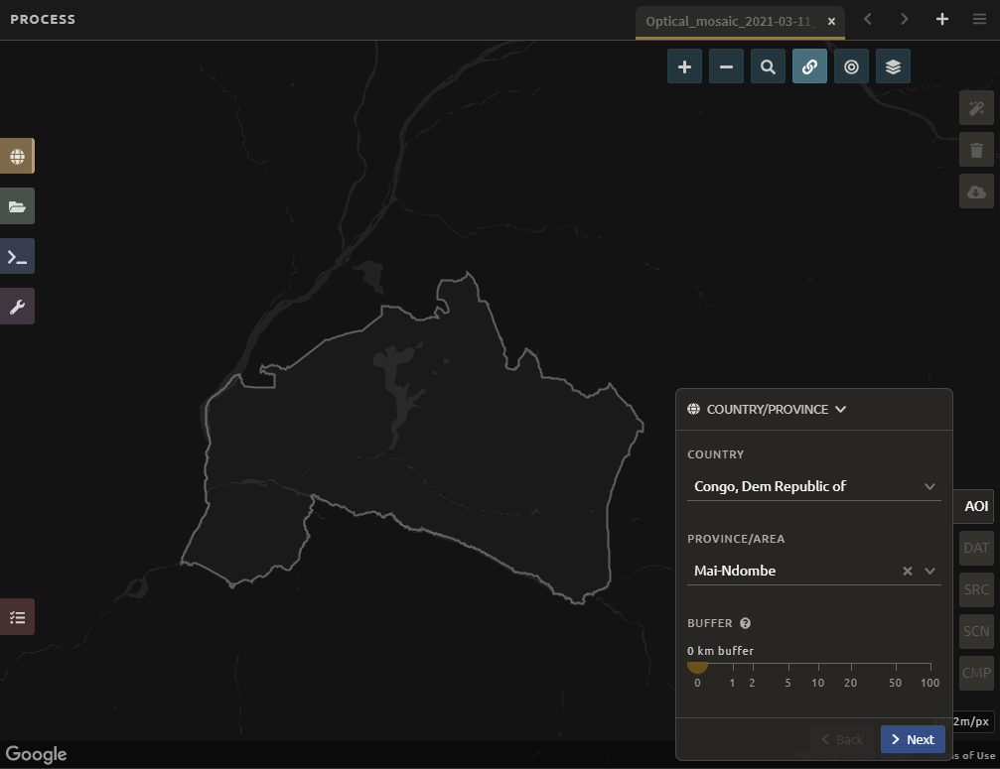
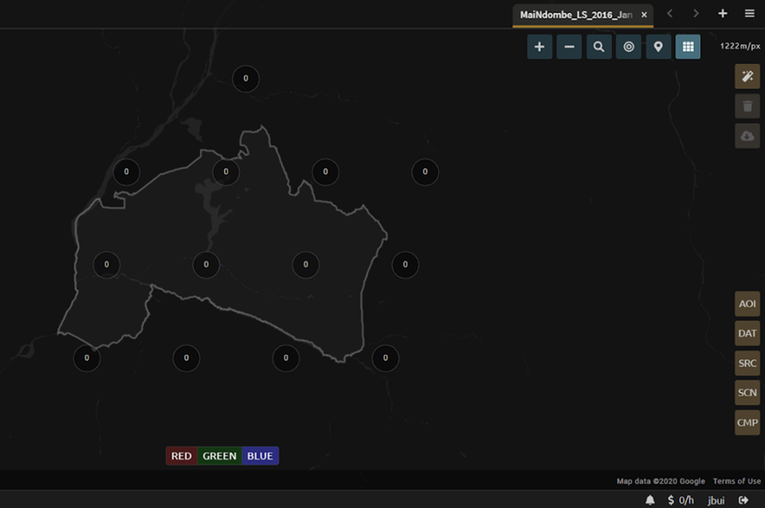
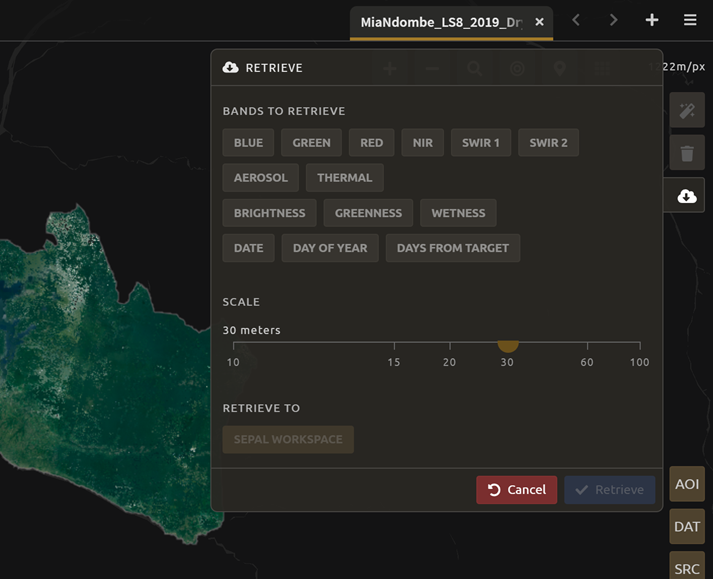

Perform area estimation analysis with SEPAL-CEO
===============================================

.. note::

    all thanks goes to `SIG-GIS <https://sig-gis.com>`_ for this documentation material. It can also be found on their own documentation `website <https://sepal-ceo.readthedocs.io/en/latest/intro.html>`_.

.. warning:: 

    To follow this tutorial, you need to:

    -   register to SEPAL
    -   register to GEE
    -   register to CEO

Introduction 
------------

Welcome to area estimation with SEPAL and CEO!

In this manual, you will learn how to perform area estimation for land use/land cover and two date change detection classifications. We will use sample-based approaches to area estimation. This approach is preferred over pixel-counting methods because all maps have errors. For example, maps derived from land cover land use classifications may have errors due to pixel mixing, or noise in the input data. Using pixel-counting methods will produce biased estimates of area, and you cannot tell whether these are overestimates or underestimates. Sample based approaches create unbiased estimates of area and the error associated with your map.

The goal of this manual is to teach you how to perform these tasks such that you can conduct your own area estimation for land use/land cover or change detection classifications.

In this manual, you will find four modules covering methods, and one module covering the documentation needed for replicating these methods. The modules are as follows:

* In Module 1, you will learn how to generate mosaics based on satellite imagery in SEPAL. You will learn how to build these mosaics by selecting different data sources and images based on dates and cloud cover.
* In Module 2, you will learn how to perform a land use/land cover image classification using random forest methods. You will learn how to define your land uses and land covers, collect training data, and run your model.
* In Module 3, you will learn how to perform image change detection. Building on skills from Module 1 and Module 2, you will define what change looks like, collect training data, and run your model. You will also learn about different tools to perform time series analysis.
* In Module 4, you will learn how to calculate a sample-based estimate of area and error. You will learn how to use stratified random sampling and verification image analysis in order to calculate area and error estimates based on the classification you create in Module 2. You will also learn about some key documentation steps in preparation for Module 5.
* In Module 5, you will learn about documenting and archiving your area estimation project. The information in this step is required for your project to be replicated by yourself or your colleagues in the future, either for additional areas or points in time.

These exercises include step-by-step directions and are built to facilitate learning through reading and by doing. This manual will be accompanied by short videos, which will visually illustrate the steps described in the text.

.. graphviz::

    digraph process {
           mosaic [label="Mosaic Image creation", href="#mosaic-generation-landsat-sentinel-2", shape=box];
           classif [label="Image classification", href="#", shape=box];
           change [label="Two dates cange detection", href="#", shape=box];
           sample [label="Sample based area and error", href="#", shape=box];
           doc [label="Documentation", href="#", shape=box];
           mosaic -> classif;
           mosaic -> change;
           classif -> sample;
           change -> sample;
           sample -> doc;
        }

Our primary tool for this Manual is the System for Earth Observation Data Access, Processing, & Analysis for Land Monitoring (SEPAL). SEPAL is a web based cloud computing platform that enables users to create image composites, process images, download files, create stratified sampling designs, and more all from your browser. SEPAL is a system for earth observations, data access, processing & analysis for land monitoring, which is a cloud-based computing software designed by the United Nation’s Food and Agricultural Organization (FAO) to aid in remote sensing applications in developing countries. SEPAL is part of the Open Foris suite of tools. Geoprocessing is possible via Jupyter, JavaScript, R, R Shiny apps, and Rstudio. SEPAL also integrates with Collect Earth Online (CEO) and the Google Earth Engine (GEE).

SEPAL provides a platform for users to access satellite imagery (Landsat and Sentinel-2) and perform change detection and land cover classifications using a set of easy-to-use tools. SEPAL was designed to be used in developing countries where internet access is limited and computers are often outdated and, thus, inefficient for processing satellite imagery. It achieves this by drawing on a cloud-based supercomputer, which enables users to process, store, and interpret large amounts of data. Many more advanced functions than what we will cover here are available in SEPAL for more advanced users.

We will also use two other tools that SEPAL integrates with: CEO and GEE. Collect Earth Online (CEO), is a free and open-source image viewing and interpretation tool, suitable for projects requiring information about land cover and/or land use. CEO enables simultaneous visual interpretations of satellite imagery, providing global coverage from MapBox and Bing Maps, a variety of satellite data sources from Google Earth Engine, and the ability to connect to your own Web Map Service (WMS) or Web Map Tile Service (WMTS). The full functionality is implemented online, no desktop installation is necessary. CEO allows institutions to create projects and leverage their teams to collect spatial data using remote sensing imagery. Use cases include historical and near-real-time interpretation of satellite imagery and data collection for land cover/land use model validation.

Google Earth Engine (GEE) combines a multi-petabyte catalog of satellite imagery and geospatial datasets with planetary-scale analysis capabilities and makes it available for scientists, researchers, and developers to detect changes, map trends, and quantify differences on the Earth's surface. The code portion of GEE (called Code Editor) is a web-based IDE for the Earth Engine JavaScript API. Code Editor features are designed to make developing complex geospatial workflows fast and easy. The Code Editor has the following elements: JavaScript code editor; a map display for visualizing geospatial datasets; an API reference documentation (Docs tab); Git-based Script Manager (Scripts tab); Console output (Console tab); Task Manager (Tasks tab) to handle long-running queries; Interactive map query (Inspector tab); search of the data archive or saved scripts; and geometry drawing tools.

.. seealso::

    You can find more information at these sites, among others:

    -   An older forest change detection manual for SEPAL: `Forest Cover Change Detection with SEPAL <https://drive.google.com/file/d/1kPE2wFNDqNpXycqTJfNUtZf9iWsQHcab/view?usp=sharing>`_
    -   Olofsson et al 2014: `FAO - SFM Tool Detail: Good practices for estimating area and assessing accuracy of land change <http://www.fao.org/sustainable-forest-management/toolbox/tools/tool-detail/en/c/411863/>`_
    -   CEO documentation: `https://collect.earth/support <https://collect.earth/support>`_
    -   GEE documentation: `Earth Engine Code Editor from Google Earth Engine <https://developers.google.com/earth-engine/guides/playground>`_
    -   REDD Compass: `Front Page - GFOI <https://reddcompass.org/frontpage>`_
    -   Reporting and Verification: `Reporting and Verification - GFOI <https://reddcompass.org/reporting-verification>`_

Project Planning Information
^^^^^^^^^^^^^^^^^^^^^^^^^^^^

Project planning and methods documentation play a key role in any remote sensing analysis project. While we use example projects in this Manual, in the future you may use these techniques for your own projects. We encourage you to think about the following items to ensure your resulting products will be relevant, and that your chosen methods are well documented and transparent.

1.  Descriptions and Objectives of the Project (State issues and information needs). Are you trying to conform to an IPCC Tier?

2.  Descriptions of the end user product (data, information, monitoring system or map that will be created by the project).  What type of information do you need? A map? An inventory? A change product? That is, do you need to know where different land cover types exist or do you just need an inventory of how much there is?

3.  How will success be defined for this project? Do you require specific accuracy or a certain level of detail in the final map product?

4.  Description of the project area / extent (national/subnational/specific forest/etc.)

5.  Description of the features/classes to be modeled or mapped.

    a.  Do you have a national definition of “forest”?
    b.  Are you aware of the IPCC guidelines for the recommended land use classes and how they will relate to mapping land cover?
    c.  Do you have key categories that will drive different analysis techniques?

6.  Considerations for measuring, reporting, and verifying your data.

    a.  Do you have a strategy; do you know what is required? Do you know where to get the required information? Looking ahead, are you on the right path (who are the decision makers that will inform these strategies?)
    b.  What field data will be required for classification and accuracy assessment?
    c.  Do you have an existing National Forest Monitoring System (NFMS) in place?

7.  Will you supplement your remote sensing project with existing data (local data on forest type, management intent, records of natural disturbance…)?

8.  Partnerships (vendors, agencies, bureaus, etc.)

Mosaic generation (Landsat & Sentinel 2)
----------------------------------------

SEPAL provides a robust interface for generating Landsat and Sentinel 2 mosaics. Mosaic creation is the first step for the image classification and two date change detection processes covered in **Modules 2 and 3** respectively. These mosaics can be downloaded locally or to your Google Drive.

In this tutorial, you will create a Landsat mosaic for the Mai Ndombe region of the Democratic Republic of the Congo, where REDD+ projects are currently underway.

.. note::

    **Objectives**

    -   Learn how to create an image mosaic
    -   Become familiar with a variety of options for selecting dates, sensors, mosaicking and download options.
    -   Create a cloud-free mosaic for 2016

.. warning::

    **Prerequisites**

    -   SEPAL account

Create a Landsat Mosaic
^^^^^^^^^^^^^^^^^^^^^^^

If SEPAL is not already open, click to open SEPAL in your browser: https://sepal.io/ and login.
Click on the :code:`Processing` tab.
Then, click on :code:`Optical Mosaic`.
When the Optical Mosaic tab opens, you will see an **Area of Interest** window in the lower right hand corner of your screen.

There are three ways to choose your area of interest. Bring up the menu by clicking the carrot to the right of the window label.

-   Select Country/Province (the default)
-   Select from EE table
-   Draw a polygon

.. figure:: ../img/cookbook/area_estimation/area_of_interest.png
   :alt: The Area of Interest menu
   :width: 350
   :align: center

We will use the :code:`Select a country/province` option.

In the list of countries that pops up, scroll down until you see the available options for **Congo, Dem Republic of**. Note there is also the Republic of Congo, which is not what we’re looking for.

.. note::
    
    Under Province/Area, notice that there are many different options.

Select :code:`Mai-Ndombe`.

.. tip::
    **Optional**: You can add a **Buffer** to your mosaic. This will include an area around the province of the specified size in your mosaic.

Click :code:`Next`.

In the :code:`Date` menu you can select the :code:`Year` you are interested in or click on :code:`More`.

-   This interface allows you to refine the dates or seasons you are interested in.
-   You can select a :code:`target date` (The date in which pixels in the mosaic should ideally come from), as well as adjust the start and end date flags.
-   You can also include additional seasons from the past or the future by adjusting the :code:`Past Seasons` and :code:`Future Seasons` slider. This will include additional years’ data of the same dates specified. For example, if you’re interested in August 2015, including one future season will also include data from August 2016. This is useful if you’re interested in a specific time of year but there is significant cloud cover.
-   For this exercise, let’s create imagery for the dry season of 2019.

    -   Select July 1 of 2019 as your target date (**2019-07-01**), and move your date flags to **May 1-September 30**.
    -   Click :code:`Apply`.

.. figure:: ../img/cookbook/area_estimation/date_menu.png
   :alt: The date menu.
   :align: center

Now select the :code:`Data Sources (SRC)` you’d like. Here, select the **Landsat L8 & L8 T2** option. The color of the label turns brown once it has been selected.Then click :code:`Done`.

-   **L8** began operating in 2012 and is continuing to collect data
-   **L7** began operating in 2001, but has a scan-line error that can be problematic for dates between 2005-present
-   **L4-5 TM,** collected data from July 1982-May 2012
-   **Sentinel 2 A+B** began operating in June 2015

Now SEPAL will load a preview of your data. By default it will show you where RGB band data is available. You can click on the RGB image at the bottom to choose from other combinations of bands or metadata.

-   When it is done, examine the preview to see how much data is available. For this example, coverage is good. However, in the future when you are creating your own mosaic, if there is not enough coverage of your area of interest, you will need to adjust your parameters.
-   To do so, notice the five tabs in the lower right. You can adjust the initial search parameters using the first three of these tabs. For example, Click on :code:`Dat` to expand the date range if you would like.
-   The last two tabs are for :code:`scene selection` and :code:`composite`, which are more advanced filtering steps. We’ll cover those now.

.. figure:: ../img/cookbook/area_estimation/mosaic_preview.png
   :alt: A preview of your mosaic.
   :align: center

We’re now going to go through the **scene selection process**. This allows you to change which specific images to include in your mosaic.

-   You can change the scenes that are selected using the :code:`SCN` button on the lower right of the screen. You can use all scenes or select which are prioritized. You can revert any changes by clicking on :code:`Use All Scenes` and then :code:`Apply`.
-   Change the **Scenes** by selecting **Select Scenes** with Priority: **Target Date**

.. figure:: ../img/cookbook/area_estimation/scene_selection.png
   :alt: Selecting scenes for your mosaic.
   :align: center

Click :code:`Apply`. The result should look like the below image.

.. note::

    Notice the collection of circles over the **Mai Ndombe** study area and that they are all populated with a zero. These represent the locations of scenes in the study area and the numbers of images per scene that are selected. The number is currently 0 because we haven’t selected the scenes yet.

    
Click the :code:`Auto-Select` button to auto-select some scenes.

.. figure:: ../img/cookbook/area_estimation/auto_select_scenes.png
    :alt: Arrow showing the button for auto selecting scenes.
    :width: 550
    :align: center

You may set a minimum and maximum number of images per scene area that will be selected. Increase the minimum to **2** and the maximum to **100**. Click :code:`Select Scenes`. If there is only one scene for an area, that will be the only one selected despite the minimum.

.. figure:: ../img/cookbook/area_estimation/auto_select_scenes_menu.png
    :alt: Menu for auto selecting scenes.
    :width: 350
    :align: center

You should now see imagery overlain with circles indicating how many scenes are selected.

.. figure:: ../img/cookbook/area_estimation/imagery_number_scenes.png
    :alt: Example of the imagery with the number of scenes selected
    :width: 450
    :align: center

You will notice that the circles that previously displayed a zero now display a variety of numbers. These numbers represent the number of Landsat images per scene that meet your specifications.

Hover your mouse over one of the circles to see the footprint (outline) of the Landsat scene that it represents. Click on that circle.

.. figure:: ../img/cookbook/area_estimation/select_scenes_interface.png
    :alt: The select scenes interface showing 0 available and 4 selected scenes
    :align: center

In the window that opens, you will see a list of selected scenes on the right side of the screen. These are the images that will be added to the mosaic. There are three pieces of information for each:

-   Satellite (e.g. L8, L7, L5 or L4)
-   Percent cloud cover
-   Number of days from the target date

To expand the Landsat image, hover over one of the images and click :code:`Preview`. Click on the image to close the zoomed in graphic and return to the list of scenes.
To remove a scene from the composite, click the :code:`Remove` button when you hover over the selected scene.

.. figure:: ../img/cookbook/area_estimation/remove_preview_scenes.png
    :alt: Removing or previewing selected scenes.
    :align: center

.. figure:: ../img/cookbook/area_estimation/scene_preview.png
    :alt: Scene preview screen.
    :align: center

On the left hand side, you will see **Available Scenes**, which are images that will not be included in the mosaic but can be added to it. If you have removed an image and would like to re-add it or if there are additional scenes you would like to add, hover over the image and click :code:`Add`.

-   Once you are satisfied with the selected imagery for a given area, click :code:`Close` in the bottom right corner.
-   You can then select different scenes (represented by the circles) and evaluate the imagery for each scene.

.. figure:: ../img/cookbook/area_estimation/select_scenes_1.png
    :alt: Select scenes screen showing one available scene and 3 selected scenes
    :width: 450
    :align: center

You can also change the composing method using the :code:`CMP` button on the lower right.

.. note::

    Notice that there are several additional options including shadow tolerance, haze tolerance, NDVI importance, cloud masking and cloud buffering.

For this exercise, we will leave these at their default settings. If you make changes, click :code:`Apply` after you’re done.

.. figure:: ../img/cookbook/area_estimation/composite.png
    :alt: The composite menu.
    :width: 350px
    :align: center

Now we’ll explore the :code:`Bands` dropdown. Click on the :code:`Red|Green|Blue` at the bottom of the page.

.. figure:: ../img/cookbook/area_estimation/arrow_bands.png
    :alt: Arrow pointing at the red, green, blue bands.
    :align: center

The below dropdown menu will appear.

-   Select the **NIR, RED, GREEN** band combination. This band combination displays vegetation as red, with darker reds indicating dense vegetation. Bare ground and urban areas appear grey or tan, while water appears black. NIR stands for near infrared.
-   Once selected, the preview will automatically show what the composite will look like.
-   Use the scroll wheel on your mouse to zoom in to the mosaic and then click and drag to pan around the image. This will help you assess the quality of the mosaic.

.. figure:: ../img/cookbook/area_estimation/bands_menu.png
    :alt: The band combinations menu.
    :width: 350px
    :align: center

The map now shows the complete mosaic that incorporates all of the user-defined settings. Here is an example, yours may look different depending on which scenes you chose.

.. figure:: ../img/cookbook/area_estimation/completed_mosaic.png
    :alt: The imagery preview with the completed mosaic shown.
    :width: 450
    :align: center

Using what you’ve learned, take some time to explore adjusting some of the input parameters and examine the influence on the output. Once you have a composite you are happy with, we will download the mosaic (instructions follow).

-   For example, if you have too many clouds in your mosaic, then you may want to adjust some of your settings or choose a different time of year when there is a lower likelihood of cloud cover.
-   The algorithm used to create this mosaic attempts to remove all cloud cover, but is not always successful in doing so. Portions of clouds often remain in the mosaic.

Name and Save your Recipe and Mosaic
^^^^^^^^^^^^^^^^^^^^^^^^^^^^^^^^^^^^

Now, we will name the ‘recipe’ for creating the mosaic and explore options for the recipe.

.. note::
    You will use this recipe when working with the classification or change detection tools, as well as when loading SEPAL mosaics into SEPAL’s Collect Earth Online.

.. tip::
    
    You can make the recipe easier to find by naming it. Click on the tab in the upper right and type in a new name. For this example use *MiaNdombe_LS8_2019_Dry.*

Now let's explore options for the recipe. Click on the three lines in the upper right hand corner.

-   You can **Save the recipe** (SEPAL will do this automatically on retrieval) so that it is available later.
-   You can also **Duplicate the recipe**. This is useful for creating two years of data, as we will do in Module 3.
-   Finally you can **Export the recipe**. This downloads a zip file with a JSON of your mosaic specifications.

Click on :code:`Save recipe….` This will also let you rename the mosaic if you choose.

.. figure:: ../img/cookbook/area_estimation/save_duplicate_export_recipe.png
    :alt: Save, duplicate, export recipe menu.
    :align: center

Now if you click on the three lines icon, you should see an additional option: **Revert to old revision...**

.. figure:: ../img/cookbook/area_estimation/revert_to_old_revision.png
    :alt: After saving the menu adds a revert to old revision option.
    :align: center

Clicking on this option brings up a list of auto-saved versions from SEPAL. You can use this to revert changes if you make a mistake.

.. tip::
    
    Now, when you open SEPAL and click the Search option, you will see a row with this name that contains the parameters you just set.

.. figure:: ../img/cookbook/area_estimation/revision_menu.png
    :alt: Revisions menu dropdown.
    :align: center

Finally, we will save the mosaic itself. This is called ‘retrieving’ the mosaic. This step is necessary to perform analysis on the imagery.
    
To download this imagery mosaic to your SEPAL account, click the :code:`Retrieve` button.

.. figure:: ../img/cookbook/area_estimation/retrieve.png
    :alt: The retrieve button.
    :align: center

A window will appear with the following options:

-   **Bands to Retrieve:** select the desired bands you would like to include in the download.

    -   Select the **Blue, Green, Red, NIR, SWIR 1 and SWIR 2** bands. These are visible spectrum and infrared data collected by Landsat.
    -   Other bands that are available include Aerosol, Thermal, Brightness, Greenness, and Wetness. More information on these can be found at: https://landsat.gsfc.nasa.gov/landsat-data-continuity-mission/.
    -   Metadata on Date, Day of Year, and Days from Target can also be selected.

-   **Scale:** the resolution of the mosaic. Landsat data is collected at 30m resolution, so we will leave the slider there.
-   **Retrieve to:** Sepal Workspace is the default option. Other options may appear depending on your permissions.

When you have the desired bands selected, click :code:`Retrieve`.

You will notice the :code:`Tasks` icon is now spinning. If you click on it, you will see the data retrieval is in process. This step will take some time.

.. figure:: ../img/cookbook/area_estimation/retrieval_task.png
   :alt: Retrieval task being carried out
   :align: center

.. note::
   This will take around **25 minutes** to finish downloading, however, you can move on to the next exercise without waiting for the download to finish.

**Congratulations! You have successfully completed this exercise. You now know how to create a Landsat mosaic using the many customizable parameters in SEPAL.**
