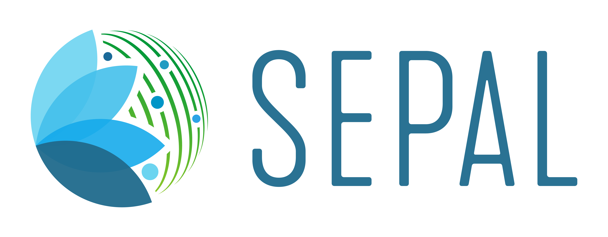
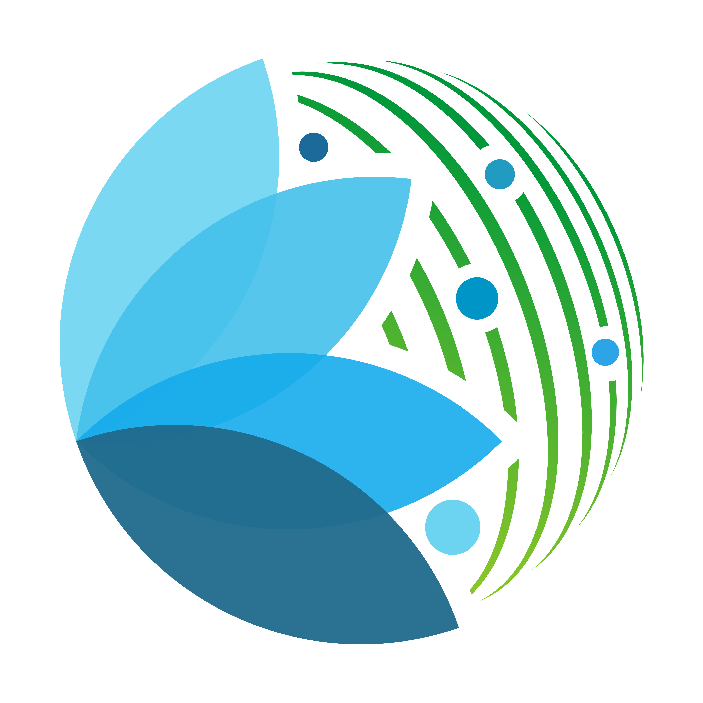

:html_theme.sidebar_secondary.remove:

.. image:: _images/sepal_dark.png
    :align: center
    :class: main-logo only-dark center only-big

.. The page title must be in rST for it to show in next/prev page buttons.
   Therefore we add a special style rule to only this page that hides h1 tags

.. raw:: html

    

SEPAL
=====

.. toctree::
   :maxdepth: 1
   :hidden:

   Getting started<setup/index>
   Cookbook<cookbook/index>
   Modules<modules/index>
   CLI<cli/index>
   Workflows<workflows/index>
   Features<feature/index>
    <team/index>

.. rst-class:: text-center font-weight-bold big-font

    System for earth observation, data access, processing, analysis for land monitoring

.. admonition:: presentation video
    :class: dropdown

    .. youtube:: niOUVE8N7wo
        :align: center

.. important::

    SEPAL is always improving. Our team members try their best to constantly update and improve the tools available inside the platform.

.. grid:: 1 2 2 3
    :gutter: 2

    .. grid-item-card:: :fas:`running` Register
        :link: setup/register.html

        Complete begginer with SEPAL ? start registering yourself to the platfrorm and start the fantastic journey of producing Earth Observation data from everywhere! It contains everything you need to start an account, download and get the basics of the platform.

    .. grid-item-card:: :fas:`plug` Connect to Earth Engine
        :link: setup/gee.html

        SEPAL uses the best of Google Earth Engine (GEE) and make it available for users without coding experience. To get the best of the platform you should connect your own free account. This page contains all you need to know to create a GEE account and how to link it with SEPAL.

    .. grid-item-card:: :fas:`book-open` Start a recipe
        :link: cookbook/index.html

        To run analysis SEPAL uses recipes. these recipes are the founding blocks of our processes. To learn how to use them and learn more about the different functionalities of the platform, follow this tutorials.

    .. grid-item-card:: :fas:`book-open` Start a modules
        :link: modules/index.html

        To run integrated workflows SEPAL uses applications. These modules are designed by the SEPAL team or other organization. To run specific tasks without relying on coding experience. To learn how to use them and learn more about the different functionalities follow this tutorials.

    .. grid-item-card:: :fas:`plug` Connect to NICFI PlanetLab imagery
        :link: setup/nicfi.html

        Through our partnership with NICFI and PlanetLab, SEPAL can use the very high resolution imagery from PlanetLab for its recipes and module. To use these images SEPAL need to be connected to your PLanet account. Follow these step to link our platform to the VHR imagery.

    .. grid-item-card:: :fas:`desktop` Use se.plan module
        :link: modules/dwn/seplan.html

        **se.plan** is a spatially explicit online tool designed to support forest restoration planning decisions by restoration stakeholders. if you're interested in using the application to compute your restoration index, follow our documentation.

About us
--------

.. rst-class:: text-center

    SEPAL is part of the `Open Foris <http://www.openforis.org>`_ suite of tools.
    SEPAL allows users to query and process satellite data quickly and efficiently, tailor their products for local needs, and produce sophisticated and relevant geospatial analyses quickly.
    Harnessing cloud-based supercomputers and modern geospatial data infrastructures (e.g. Google Earth Engine), SEPAL enables access and processing of historical satellite data as well as newer data from Landsat and higher-resolution data from Europe's Copernicus program.

    SEPAL is a cloud computing-based platform for autonomous land monitoring using remotely-sensed data. It is a combination of Google Earth Engine and open source software like ORFEO Toolbox, Python, Jupyter, GDAL, R, R Studio Server, R Shiny Server, SNAP Toolkit, and OpenForis Geospatial Toolkit. It allows users to access powerful cloud-computing resources to query, access and process satellite data quickly and efficiently for creating advanced analyses.

Funders
-------

.. rst-class:: text-center

    SEPAL is a project of the Forestry Department of the United Nations Food and Agriculture Organization (FAO) funded by the Government of Norway.

.. logos:: funders

Suporting institutions
----------------------

.. logos:: institutions

.. |trash-icon| raw:: html

    <i class="fa fa-trash"></i>
