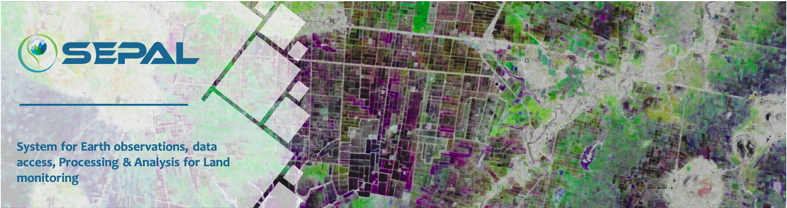

Welcome to SEPAL's documentation!
=================================

.. toctree::
   :maxdepth: 1
   :hidden:

   Getting started<setup/index>
   Cookbook<cookbook/index>
   Modules<modules/index>
   CLI<cli/index>
    <team/index>

SEPAL is part of the `Open Foris <http://www.openforis.org>`_ suite of tools. 
SEPAL allows users to query and process satellite data quickly and efficiently, tailor their products for local needs, and produce sophisticated and relevant geospatial analyses quickly. 
Harnessing cloud-based supercomputers and modern geospatial data infrastructures (e.g. Google Earth Engine), SEPAL enables access and processing of historical satellite data as well as newer data from Landsat and higher-resolution data from Europe's Copernicus programme.

.. image:: img/logos/openForis.png
    :target: http://www.openforis.org

You said SEPAL?
---------------

SEPAL is a cloud computing-based platform for autonomous land monitoring using remotely-sensed data. It is a combination of Google Earth Engine and open source softwares like ORFEO Toolbox, Python, Jupyter, GDAL, R, R Studio Server, R Shiny Server, SNAP Toolkit, and OpenForis Geospatial Toolkit. It allows users to access powerful cloud-computing resources to query, access and process satellite data quickly and efficiently for creating advanced analyses.

SEPAL is always improving. Our team members try their best to constantly update and improve the tools available inside the plateform.

SEPAL is a project of the Forestry Department of the United Nations Food and Agriculture Organization (FAO) funded by the Government of Norway.

If you want to start using Sepal, jump to the `Getting started <setup/index.html>`_ section!

Thanks to
---------

.. image:: img/logos/nicfi.png
    :target: https://www.nicfi.no

In partnership with 
-------------------

.. image:: img/logos/jrc.png
    :target: https://ec.europa.eu/jrc/en
    :height: 90

.. image:: img/logos/esa.png
    :target: https://www.esa.int
    :height: 70

.. image:: img/logos/eth.png
    :target: https://ethz.ch/en.html
    :height: 30

.. image:: img/logos/finland.png
    :target: https://um.fi/frontpage
    :height: 80

.. image:: img/logos/germany.png
    :target: https://www.bmu.de/en/
    :height: 110

.. image:: img/logos/gfoi.png
    :target: http://www.fao.org/gfoi/home/en/
    :height: 90

.. image:: img/logos/google.png
    :target: https://about.google/intl/en-US/
    :height: 80

.. image:: img/logos/jaxa.png
    :target: https://global.jaxa.jp
    :height: 80

.. image:: img/logos/jica.png
    :target: https://www.jica.go.jp/english/index.html
    :height: 80

.. image:: img/logos/nasa.png
    :target: https://www.nasa.gov
    :height: 80

.. image:: img/logos/kfw.png
    :target: https://www.kfw.de/kfw.de-2.html
    :height: 60

.. image:: img/logos/silvaCarbon.png
    :target: https://www.silvacarbon.org
    :height: 80

.. image:: img/logos/servir.png
    :target: https://www.servirglobal.net
    :height: 80

.. image:: img/logos/sig.png
    :target: https://sig-gis.com
    :height: 100

.. image:: img/logos/wageningen.png
    :target: https://www.wur.nl/en.htm
    :height: 110

.. image:: img/logos/worldBank.png
    :target: https://www.worldbank.org/en/home
    :height: 90

Indices and tables
==================

* :ref:`genindex`
* :ref:`modindex`
* :ref:`search`
