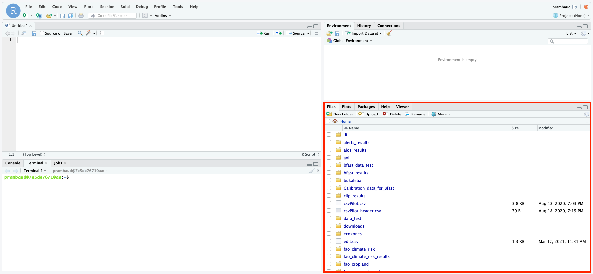

Exchange files with SEPAL
=========================

Use SEPAL's built-in tools and FTP solutions to exhange files
-------------------------------------------------------------

In this article, you can learn how to exchange files with SEPAL using:

-   Built-in tools, including:
    -   Jupytyr Notebook 
    -   Jupityrlab 
    -   RStudio 
    -   SEPAL file explorer
-   an FTP solution, specifically FileZilla®

Built-in tools 
--------------

To exchange files with SEPAL, there are several built-in tools you can use. 

.. note:: 

    Since SEPAL's built-in tools for uploading and downloading are limited, large amounts of data should be uploaded or downloaded using an FTP solution, such as FileZilla® (for more information, see the section "FTP solution" below).

Jupyter Notebook 
^^^^^^^^^^^^^^^^

In the SEPAL **Application** dashboard, open a new **Jupyter Notebook app**. The **Notebook** dashboard enables you to access files and directories on your system, which can be opened, created, deleted, renamed, downloaded, copied and shared.

Select **Upload** to upload a file from your computer to the platform.

Select **Download** to download a selected file to your computer.

.. note::

    **Download** is only available when you click on a single file (Note: folders can not be downloaded).

.. image:: ../_images/setup/filezilla/jupyter-notebook-dashboard.png

Jupyterlab
^^^^^^^^^^

In the SEPAL interface **Dashboard**, open a new **Jupyterlab app**. 

Use the **File browser** and **File menu** to access files and directories on your system, which can be opened, created, deleted, renamed, downloaded, copied and shared.

Upload files to the **File browser** directory by dragging and dropping, or by selecting **Upload files** at the top of the **File browser**:

.. youtube:: 1bd2QHqQSH4

Any file in Jupyterlab can be downloaded by right-clicking its name in the **File browser** and selecting **Download** from the context menu:

.. youtube:: Wl7Ozl6rMcc

.. seealso:: 

    More information about the Jupyterlab interface can be found in `Jupyterlab documentation <https://Jupyterlab.readthedocs.io/en/stable/getting_started/overview.html>`_.

Rstudio
^^^^^^^

In the SEPAL interface **Dashboard**, open a new **RStudio app**.

Use the **File menu** (in red in the yellow image below) to access files and directories on your system, which can be opened, created, deleted, renamed and copied.

Upload files from your computer by selecting **Upload** in the upper-left of the red rectangle.

SEPAL file explorer
^^^^^^^^^^^^^^^^^^^

In the SEPAL **File explorer**, you will be able to access files and directories on your system, which can be deleted and downloaded.

After selecting a single file, select **Download** to download the file to your local folder.

.. image:: ../_images/setup/filezilla/sepal_file_manager.png

.. note::

    You cannot download multiple files or folders directly through this interface.

FTP solution 
------------

SEPAL content can also be accessed via a Secure Shell (SSH) File Transfer Protocol (FTP). 

If you don't know what an FTP solution is and/or don't have an FTP solution installed on your computer, you can learn more by reading this section, where FileZilla is used as an example.

.. seealso::

    An FTP client is software that allows you to connect to an FTP server in order to exchange files. Once connected, you can upload, download, copy or delete files on either the remote computer or your local computer.

FileZilla®
^^^^^^^^^^

FileZilla® is a free, open-source FTP solution distributed free of charge under the terms of the `GNU General Public License <https://www.gnu.org/licenses/gpl-3.0.en.html>`. 

The FileZilla Client not only supports FTP, but also FTP over Transport Layer Security (TLS) – FTPS – and Secure File Transfer Protocol (SFTP), both used in SEPAL.

.. tip:: 

    To download the software, go to `<https://FileZilla-project.org/download.php?type=client>`.

Connect your FTP client to SEPAL
^^^^^^^^^^^^^^^^^^^^^^^^^^^^^^^^

Accessing files in SEPAL is easy using FileZilla.

To use FileZilla, open the application and connect to the SEPAL server by selecting **Menu** > **File** > **Site Manager** >> **New Site**.

Use the screenshot below as a guide for filling out the form:

-   **Host:** ssh.sepal.io 
-   **Port:** 443
-   **Protocol:** SFTP – SSH File Transfer Protocol
-   **Logon Type:** Normal 
-   **User:** <your SEPAL username>
-   **Password:** <your SEPAL password> 

.. note::

    For **User** and **Password**, enter the credentials you use to connect to the platform.

.. image:: ../_images/setup/filezilla/register_new_site.png

By selecting **Connect**, your SEPAL drive will appear in the right pane. 

In the left pane, you can find files and folders on your computer.

Use the FTP client to interact with SEPAL 
^^^^^^^^^^^^^^^^^^^^^^^^^^^^^^^^^^^^^^^^^

Familiarize yourself with FileZilla's window layout by following this overview:

Below the **Toolbar** (1) and **Quick connect bar** (2), the **Message log** (3) displays messages related to transfers and connection. Below, you can find the file listings. The left column (**Local pane**, 4) displays the local files and directories (e.g. content on the PC you're using FileZilla on). The right column (**Remote pane**, 5) displays the files and directories on the server you are connected to. Both columns have a directory tree at the top and a detailed listing of the currently selected directory's contents at the bottom. You can easily navigate either of the trees and lists by clicking around, like you would in any other file manager. In the lower section of the window, the **Transfer queue** (6) lists the status of to-be-tranferred or already transfered files.

.. image:: ../_images/setup/filezilla/filezilla_panel.png

.. seealso::

    For more information on using FileZilla, go to their `wiki page <https://wiki.FileZilla-project.org/FileZilla_Client_Tutorial_(en)>`_. 
    
    
For support, :doc:`ask the community <>` or contact the SEPAL team at SEPAL@fao.org.
