Use Google Earth Engine with SEPAL
==================================

GEE and SEPAL
-------------

SEPAL is a cloud-computing platform that gives you access to geospatial data resources (either via Google Earth Engine data catalogue or user-provided data) and powerful computing resources to process these data to produce useful information. SEPAL is free to use and is open-source. 

SEPAL currently 'resides' in the Amazon AWS ecosystem and makes use of AWS cloud computers, or instances, that can be used to process data using pre-programmed SEPAL applications or using your own code (in R, Python or in the terminal). SEPAL is also closely linked to Google Earth Engine (GEE), a Google powered Earth-observation cloud-computing platform. SEPAL can access data stored in the GEE data catalog, use GEE for processing large datasets, and read and write data to GEE assets. A large part of SEPAL's existing code is based on the JavaScript GEE API.  

All the recipes of SEPAL are based on GEE and actually running scripts written by SEPAL team members to enable access to state-of-the-art processing algorithms without having to write code. In the SEPAL applications list, the applications tagged with the Google "G" logo are also running with the Python GEE API and don't require you to use big instances to run complex operations. 

SEPAL recipes can be run from the main SEPAL interface using default SEPAL credentials or your own, personal GEE access credentials. However, to run the SEPAL applications that employ GEE, you will need to link your SEPAL and GEE accounts. SEPAL applications that make use of GEE will not run (e.g. authentication will not work) if your GEE and SEPAL accounts are unlinked.

.. tip:

   See linking SEPAL and GEE accounts in the previous section.

To get the best of SEPAL, we highly suggest all users to open their own Google Earth Engine account and link it to SEPAL. In this doc, we will guide you through the full process of creating a GEE account and link it to SEPAL. 

Create a GEE account
--------------------

Sign-up
^^^^^^^

Signing up for Google Earth Engine is required in order to properly export images and data products from SEPAL as GEE assets or SEPAL applications using GEE. You will need to have a Google Account in order to sign up. If you don't have one already, you can set one up here: https://accounts.google.com/servicelogin. 

To request a GEE account, please visit https://earthengine.google.com/new_signup/.

.. image:: ../_images/setup/register/gee_landing.png
   :alt: Request access to google earth engine
   :align: center

Once you have a Google Earth Engine account, you can access GEE here: https://code.earthengine.google.com/.

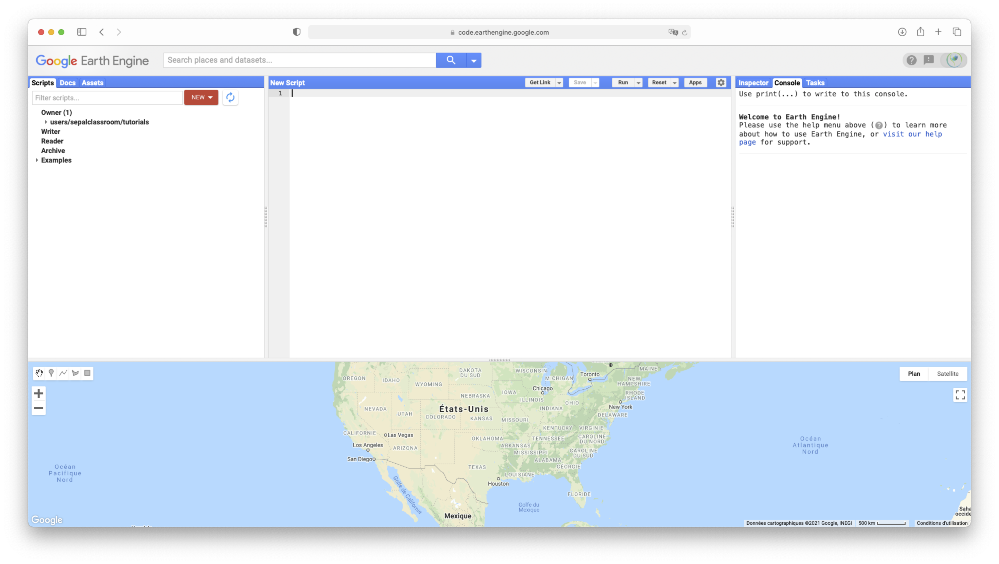

.. tip::

    On your first connection to the code editor it is strongly advised to follow the small tour proposed by the interface 

    .. image:: ../_images/setup/gee/editor_tour.png
        :alt: gee code editor tour
        :align: center

.. warning::

    If you experience trouble white listing your Google Account to GEE please let the SEPAL team know, we may be able to help you

Initialize the home folder
^^^^^^^^^^^^^^^^^^^^^^^^^^

To use your Google earth engine account in SEPAL you need to properly set up the **home** folder. The home folder is where all your **assets** (vectors, rasters, collection, mosaics, classifications.. etc) will be exported. If this folder is missing then, SEPAL will have nowhere to point to and every export request will raise an error.

First go to the GEE code editor:

.. image:: ../_images/setup/gee/gee_code.png
   :alt: gee code editor
   :align: center

The web-page is split in 3 zones and a map:

1.  **Zone 1**: will give you access to the information of GEE account. 3 panels are available:
    
    -   assets: that will display all the assets in your account 
    -   scripts: that will display all the scripts available with your account (shared and written)
    -   doc: the documentation of the JS GEE API that will be useful to those who actually need to code in this editor

2.  **Zone 2**: is where advanced users can code their own scripts using the GEE JS API

3.  **Zone 3**: is here to display information about current processes. 3 panels are available:

    -   Inspector: will transform the arrow of the mouse into a pointer. Click anywhere on the map to have information about what you are displaying
    -   Tasks: display all the tasks of your account (running, finished or failed) 
    -   Console: will display the console panel of the running scripts

Go in **zone 1** and select the **assets** panel. Click on the :code:`Create home folder` red button.

.. image:: ../_images/setup/gee/create_home.png
    :alt: gee asset creation
    :align: center

This will open a popup menu to select the name of this folder. This name can only be set once. It will remain the same forever and will never be changed in this account. If you're not satisfied by the suggested name you can change it. The only limitation is not to use space or special characters.

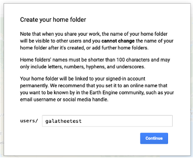

Now if you come back to your asset list (**zone 1** panel "asset") you should see the name you provided as first folder at the root of the asset tree. in this example we used "galatheetest":

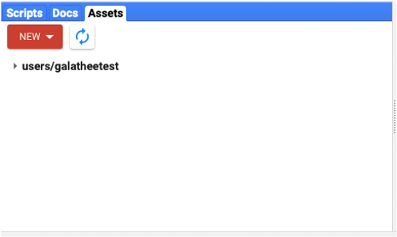

.. note:: 

    Now that you have connected and initialized your GEE account you can start the connection process between SEPAL and GEE

Connection  between GEE  and SEPAL
----------------------------------

SEPAL can work without being connected to your GEE account but you will lose numerous opportunities of interaction with our platform. In this section the connection procedure between GEE and SEPAL will be presented. 

Connection
^^^^^^^^^^

First go the landing page of SEPAL (`sepal.io <https://sepal.io>`_) and connect yourself to your account using your credentials. 

On the following page, click on your **username** that you'll find at the bottom left side of the window. On the following image the user name is in the red rectangle (:code:`prambaud`).

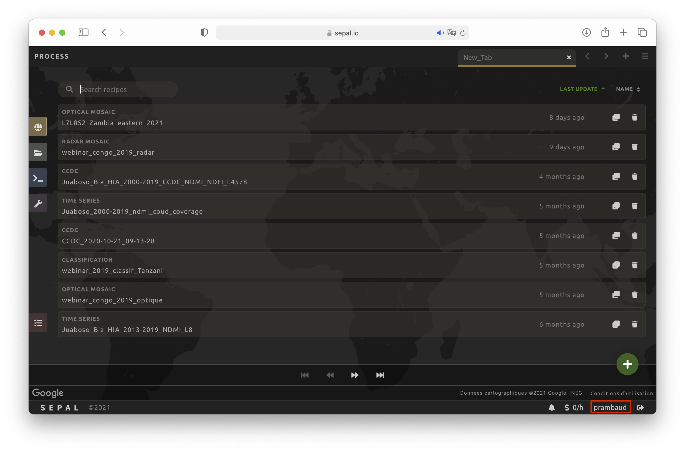

By clicking on it it will open a popup in the center of your screen. This popup is the **user manager**. In this interface you can modify the few information that SEPAL keep about you. On the top right side there is the Famous Google **G** logo. Next to it the status of the connection of your SEPAL with a user GEE account is displayed. If nothing is connected you should read "disconnected".

.. image:: ../_images/setup/gee/user_interface_disconnected.png
    :alt: sepal disconnected

Click on :code:`Google account` at the bottom of the popup. It will open another popup. If your GEE account is disconnected you will see the following text that reminds you what functionalities are unavailable without custom GEE account.

.. image:: ../_images/setup/gee/gee_disconnected.png
    :alt: connection popup

Click on :code:`Connect your Google account`. Google is now redirecting you to its connection page. in the given list of google account connect yourself to the one you use with GEE: 

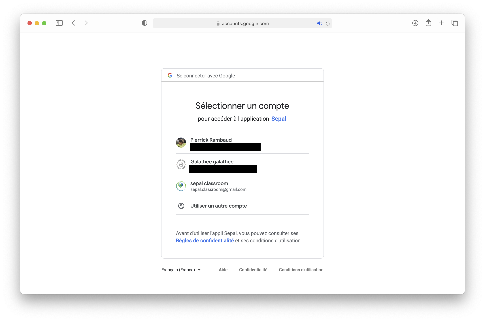

.. warning::

    You can authorized everything Google will be asking you. It will authorized SEPAL to interact with your Google Drive and Asset home folder to export recipes and modules results.

After this connection process, you will be redirected to SEPAL main page. If you click again on the user interface button, the popup window will display "Connected" in green at the top right side.

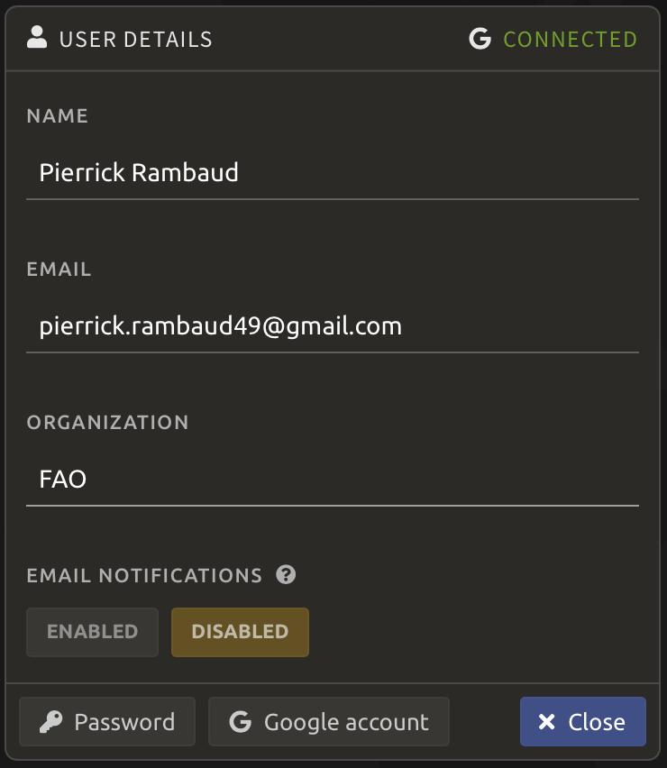

Disconnection
^^^^^^^^^^^^^

This operation is of course reversible so if you want to change account or simply remove the link between your SEPAL account and your GEE one you can disconnect SEPAL from the GEE service. 

Return to the user interface and click on :code:`Google account`. You should see the following window: 

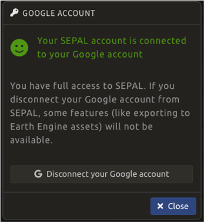

Simply click on the :code:`disconnect your Google account` Button and you're done! 

Upload files to GEE 
-------------------

When you'll be using our recipes and modules, you'll be asked to use Google EE assets to provide rasters or vectors to the core GEE based algorithm. These assets can be public assets that someone shared with you but it can also be assets that you created yourself and you would like to use.

.. tip::

    For vectors files SEPAL provide an interface to upload them from your computer to SEPAL and eventually to EE. This process allow you to deal with the full process directly from SEPAL without going to the GEE code interface. SEE the :doc:`../modules/dwn/import_to_gee` module documentation for more details

Go to the code editor page and get tot the **zone 1** panel "asset":

.. image:: ../_images/setup/gee/gee_asset_list.png
    :alt: gee asset list

Click on the :code:`new` Button. You will have several choices that we will describe in the following sections.

Raster
^^^^^^

If you need to upload a raster image use the :code:`Image` button. A popup window will open itself. In this popup select the file you want to upload in your computer folders. It can be any image in the following formats: :code:`.tiff`, :code:`.tif`, :code:`.json`, :code:`.tfrecord` or :code:`.tfrecord.gz`. You can then change the name of your asset in the next TextField.

.. tip:: 

    By default the asset will be named after the tif base-name.

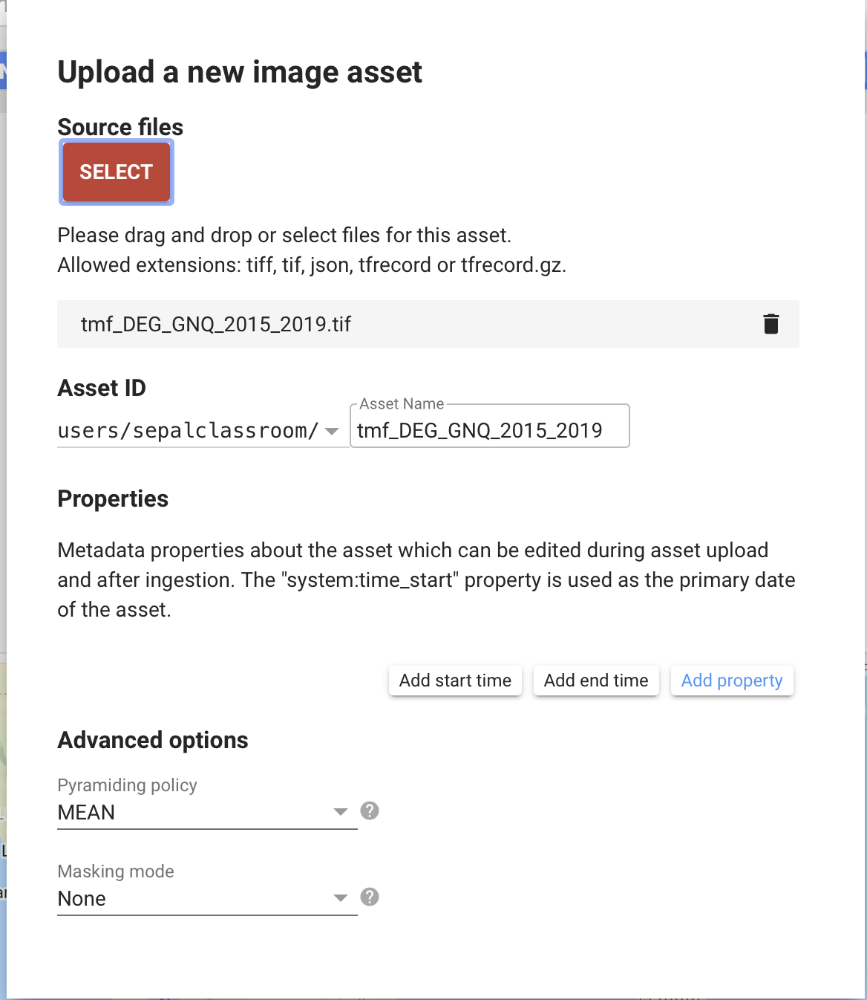

Shape
^^^^^

If you need to upload a shape as a :code:`ee.FeatureCollection`, click on the :code:`shape upload`Button. A popup window will open itself. In this popup select the files you want to upload from your computer: It can be any shape file in the following formats: :code:`.shp`, :code:`.zip`, :code:`.dbf`, :code:`.prj`, :code:`.shx`, :code:`.cpg`, :code:`.fix`, :code:`.qix`, :code:`.sbn` or :code:`.shp.xml`. Keep in mind that if you didn't compressed it, a :code:`.shp` alone is not sufficient and must come with all the other files describing the shape as in the following example: 

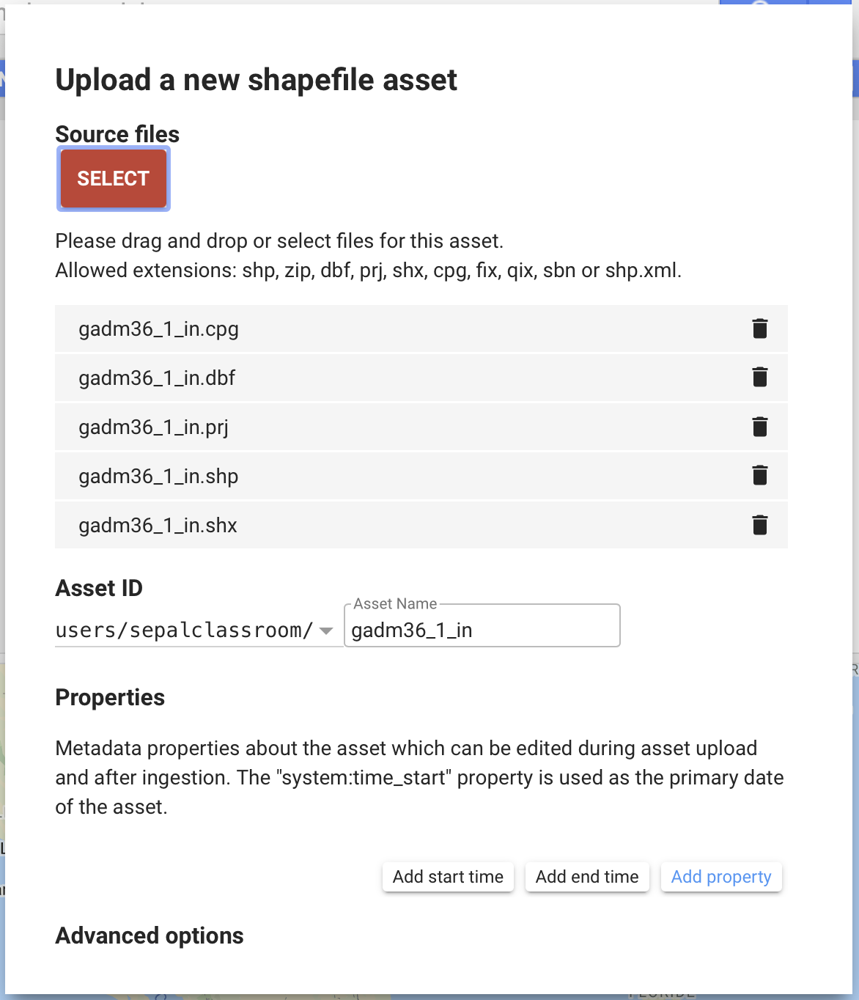

Table
^^^^^

If you need to upload a table as a :code:`ee.FeatureCollection`, click on the :code:`csv file upload`Button. A popup window will open itself. In this popup select the files you want to upload from your computer: It can be any table in the following formats: :code:`.csv`, :code:`.json`.

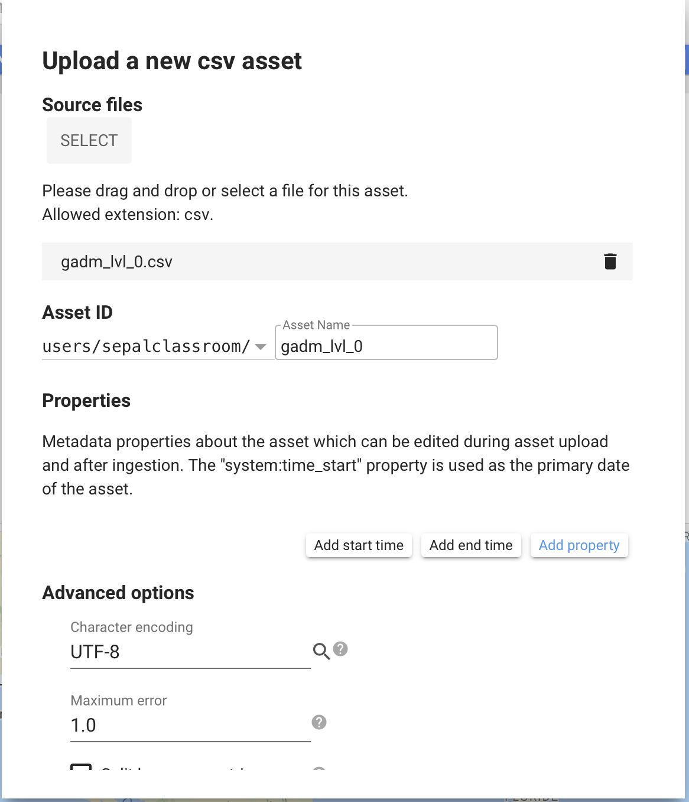

Use my assets
^^^^^^^^^^^^^

Once you've uploaded your assets, you will want to use them in SEPAL. To use them you simply need to copy paste the name of the asset in anywhere SEPAL will be asking an Asset name. but where to get it ? 

First go back to the **zone 1** panel "asset" and click on any asset in your asset list. It will open the following popup window: 

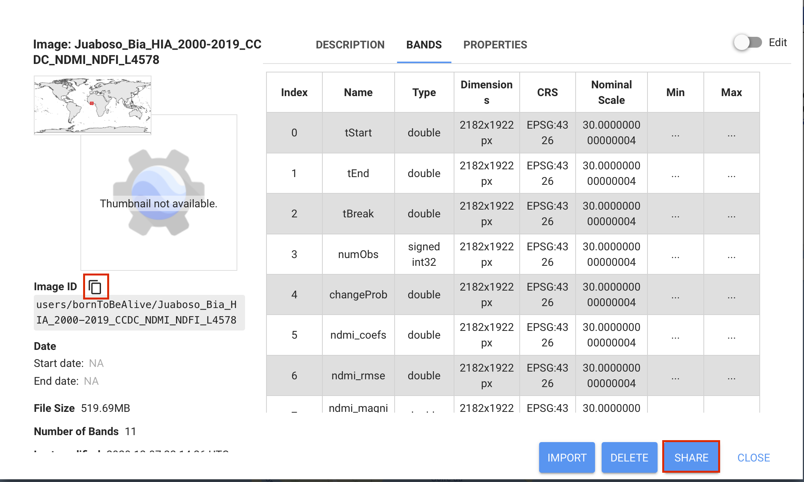

if you click on the :code:`copy link` button you will copy the link to the clipboard and you'll be able to paste it in SEPAL. If you want to share this asset to other people, you need to give them this link (the one you just copied to clipboard) and authorized them to use it. For this purpose, click on the :code:`share` button of the popup and choose between the different sharing options. 

.. spelling::

    galatheetest

 
