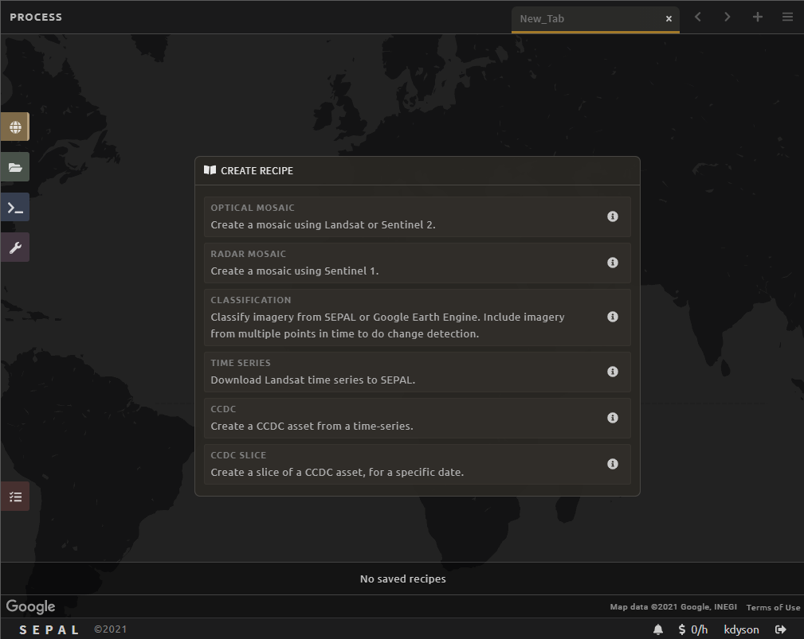
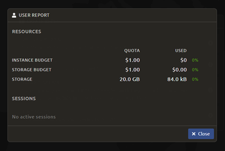

Introduction to SEPAL
=====================

In this page, you will be introduced to the SEPAL interface. You will learn how to access SEPAL's features to facilitate the remote sensing exercises in the rest of the documentation.

.. note::

    **objective**

    -   Navigate the SEPAL interface
    -   Learn about the functionalities of SEPAL

.. warning::

    **prerequites**

    -   Internet access
    -   SEPAL account (see 'Getting Started')
            

Access SEPAL
------------

Navigate to `https://sepal.io/ <https://sepal.io/>`_ to open SEPAL.

Type in your **Username** and **Password** and click **Login**.

.. image:: ../_images/setup/presentation/sepal_login.png
   :alt: SEPAL login page
   :align: center

.. tip::
   When working in SEPAL, do not click your browser's back button. This will go back to the previous web-page. Use the buttons within SEPAL to navigate to previous pages. There may also be an arrow in the upper left or right-hand corner of the SEPAL interface to navigate to a previous window.

Setup the locale
----------------

.. youtube:: Lv0HwPDQx50

The first step to create a SEPAL environment is to set up the language you want to use. 

.. note::

    You can always change your language preference from SEPAL's launch page.

Sepal is by default in English, but is also available in several languages such as French and Spanish. To use these languages in SEPAL, return to the launch page. (you may have to logout of SEPAL to return to launch page). On this page click on :code:`Launch`.

Once you've clicked, you will access the login page. At the top-right side of this panel, click on the button corresponding to your language: 

- fr: Français
- en: English
- es: español

The SEPAL launch page should reload itself and the language you selected will be used by the platform for all its tools. 

SEPAL Interface
---------------

Home
^^^^

Once you are logged in, you will see the following screen. Notice that your username is displayed in the bottom right of the window.

There are four main navigation tabs in the dock on the left side of the screen.

-   **Process:** select imagery and create mosaics.
-   **Files:** navigate through your personal SEPAL folders. This is where you can download or delete data, as well as visualize it using the Data Visualization link.
-   **Terminal:** access to the command line for the LINUX server.
-   **Apps:** links to a variety of pre-loaded tools.

At the lower left is the red :code:`Tasks` tab. Clicking on this brings up a list of currently running tasks.

**Account Information** can be found in the bottom right of the web-page by clicking the button that shows your username. This opens an overlay that displays important user account information.

You can edit your user account info, including Name, Password, Email and Organization here. Click :code:`Save` to make those changes permanent. 

.. note::

    You cannot edit your Username in this interface.

Link your Google Earth Engine account with your SEPAL account by clicking **Use my own Google Account** and following the instructions. If your GEE and SEPAL accounts are connected, SEPAL uses your Google Drive as a temporary storage space for data downloaded to your SEPAL workspace (e.g. any imagery tiles or mosaics that you “retrieve to SEPAL workspace” will first be saved to your Google Drive account before being saved in your SEPAL workspace). If your GEE and SEPAL accounts are not linked, data downloads to your SEPAL workspace will still be possible and the data will pass through the SEPAL service account Google Drive.

.. tip::

   Unilinking your GEE and SEPAL accounts for downloading to SEPAL workspace may help if you do not have sufficient space available in your personal Google Drive.

Linking your GEE and SEPAL accounts will enable the possibility to read and write from your GEE Assets. To save data created in SEPAL as a GEE Asset or to use your existing GEE Assets in classifications or further processing in SEPAL, you will need to have your GEE and SEPAL accounts linked.

.. tip::

   Link your SEPAL and GEE accounts in order to read and write to GEE Assets from SEPAL.

Next to your **Account Information** is a section called **User Report**, represented by the :code:`$ X/h`. This shows you your used / available processing and storage resources. Instance spending refers to the resources used / available to start and run cloud computers. Storage space and spending refers to the resources used / available for storage in your SEPAL workspace. If you are running any processes in your current session, they will show up here under Sessions.

   
.. tip::

   SEPAL is not to be used for long-term data storage. This is costly. The platform is best used by storing only the data necessary for processing. After processing and producing a product, data should be downloaded to your personal computer and deleted from SEPAL storage.
   

Process Tab
^^^^^^^^^^^

Click the :code:`Process` tab on the left side of the window.

.. image:: ../_images/setup/presentation/process_tab_location.png
   :alt: Arrow pointing out the process tab location
   :align: center

You should now see four options in the center of the screen:

-   **Optical Mosaic** allows you to create a mosaic using Landsat and/or Sentinel 2 data. This is what we will do in Exercise 1.2.
-   **Radar Mosaic** allows you to create a mosaic using Sentinel 1 data.
-   **Planet Mosaic** allows you to create a mosaic using NICFI / Planet basemaps (if you have permission from NICFI / Planet).
-   **Classification** allows you to use a random forest model to classify images from SEPAL or GEE. This will be the focus of Module 2.
-   **Time Series** allows you to download time series information to your SEPAL storage.
-   **CCDC** create a CCDC asset from a time series.
-   **CCDC Slice** create a slice of a CCDC asset for a specific date or date range.
-   **Class Change** create a class change map from two categorical images, either SEPAL recipes or GEE assets.
-   **Index Change** create an index change map from two single-band images, either SEPAL recipes or GEE assets.
-   **Remapping** remap categorical or continuous image bands into new categories.

When you click on one of these options, it will open a new tab with the GUI interface that allows you to specify your desired options.

Files Tab
^^^^^^^^^

Click the green :code:`Files` tab on the left side of the window. This will display all of your files stored in your SEPAL workspace.

For example, click the :code:`downloads` folder to expand it. This will display the folders containing any of the data you have downloaded in SEPAL. If you have not downloaded mosaics in SEPAL yet, then this folder will be empty.

.. image:: ../_images/setup/presentation/files_menu.png
   :alt: The files menu
   :align: center
   :width: 350

Notice that there are four buttons at the top right of the window. The three rightmost buttons are inactive, but activate when you select a file.

-   The left button will show hidden files (files and folder names starting with ‘.').
-   The second button will download selected data to your local computer.
-   The third button will delete the selected folder or file.
-   The last button will clear your selection.

Terminal Tab
^^^^^^^^^^^^

Click the :code:`Terminal` tab on the left side of the screen.

This links you to the Linux command line that you can use in a variety of ways to manage data, load data from an outside location or process data using a series of commands.

When you initially load the Terminal, you will see information about your usage and the available types of instances you can initialize.

One of the most important features of the Terminal is the ability to start and stop instances. 

To start an instance, use the following steps as a guide:

-   First examine the “Available instance types” table. This is updated periodically but an example from September of 2020 is shown below.
-   Choose an instance Type that fits your needs. Frequently a t2 or m2 is sufficient and cost effective.
-   Next to the “Select (t1):” text, type in ‘t2' or your chosen instance type.
-   Press Enter on your keyboard.
-   Wait for the new instance to start. This will take several minutes.

To stop an instance, type 'exit' at the command line. You can then refresh the terminal page to start a new instance. You can also stop an instance by clicking on your username on the right side of the screen and accessing your account information. Under 'Sessions' click on the trashcan icon to shut down your instances.

Once an instance has stopped, you can follow the instance startup steps again to select a larger instance if necessary.

.. image:: ../_images/setup/presentation/terminal.png
   :alt: The terminal page, including an example of changing the instance
   :align: center
   :width: 450

Apps Tab
^^^^^^^^

Click the **Apps** tab on the left side of the screen. This will open up a screen that shows applications that you can access through SEPAL. Applications are pre-programmed (typically using R or Python) to perform specific, useful tasks. Applications make use of instances and running an application will use your SEPAL computing resources.

.. image:: ../_images/setup/presentation/apps_interface.png
   :alt: The Apps interface
   :align: center

This will bring up a list of apps you can run in SEPAL. More information about each app is found by clicking on the “i” on the right hand side. Some of the apps include:

-   **R Studio:** provides access to R environment where you can run processing scripts and upload data to your SEPAL folder.
-   **Stratified Area Estimator- Design:** tool for creating stratified designs to estimate areas. We will use this tool in Module 4.
-   **Stratified Area Estimator- Analysis:** tool for analyzing the results of your stratified design sampling to estimate areas. We will use this tool in Module 4.
-   **Geo Processing- Beta:** offers a selection of easy-to-use change detection and segmentation tools.
-   **BFAST Explorer:** tool for performing pixel-based time series analysis of Landsat Surface Reflectance data.
-   Many more that can be found in the section `Modules <../modules/index.html>`_ of the documentation.
