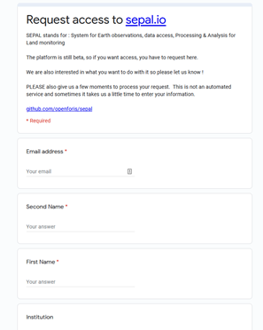

Register to SEPAL
=================

To get the full potential of the SEPAL platform you need to register to several services. They will all be presented here, the registration to SEPAL is the only compulsory one.

.. tip::

    All the tools referenced here are free to use and will not charge you in any way.

Sign Up to SEPAL
----------------

.. danger::

    This registration is compulsory to use the platform

.. image:: ../_images/setup/register/sepal_splash_page.png
   :alt: Sepal splash page.
   :align: center

You can request an account by visiting `sepal.io <sepal.io>`_ and clicking :code:`Sign Up`. This will take you to a Google Doc sign-up form to fill out. You will be set up with an account within a day or so.

If you do not have a SEPAL account, you can request access here: http://tinyurl.com/fao-sepal.

To request access to SEPAL, you will simply need to enter:

-   email address
-   name
-   institution or country
-   a brief explanation of why you want to use SEPAL

.. tip:: 

    Once you signup to SEPAL, you can request access to our group on Google. follow this `link <https://groups.google.com/g/sepal-users>`__ and click on :guilabel:`ask to join group`. 
    For community questions (only in english) we recommand to use the `GIS.StackExchange <https://gis.stackexchange.com/questions/tagged/sepal>`__ platform and use the :guilabel:`sepal` tag. Your question might be useful to others!

.. warning::

    Registrations are evaluated individually by the administrators of the platform to prevent bots and malicious users from accessing SEPAL. Thus registration process take between 1 and 3 days. For the same reasons, incomplete registration forms will be refused.  

Sign up to GEE
--------------

.. note::

    This step is not compulsory. SEPAL can run computation on its own Google Earth Engine account on your behalf. However, we highly recommend signing up for GEE as this will significantly improve your SEPAL experience.

You will need to have a Google email in order to sign up for Google Earth Engine. If you don't have one already, you can set one up here: http://mail.google.com/mail/sign-up. 

To request a GEE account, please visit https://earthengine.google.com/new_signup/.

.. image:: ../_images/setup/register/gee_landing.png
   :alt: Request access to google earth engine
   :align: center

Once you have a Google Earth Engine account, you can access GEE here: https://code.earthengine.google.com/.

.. image:: ../_images/setup/register/gee_code.png
   :alt: gee code editor
   :align: center

.. warning::

    If you experience trouble white listing your gmail address to GEE please let the SEPAL team know, we may be able to help you

Sign Up to CEO
--------------

.. note::

    This step is not compulsory. However, to get the best out of our classification and validation tools, we highly recommend using CEO or Collect Earth for collecting point-based training and validation data. CEO is used to produce training data for some of our models, for example.

In your browser window, navigate to https://collect.earth/. CEO supports Google Chrome, Mozilla Firefox, and Microsoft Edge.

Click :code:`Login/Register` on the upper right.

.. image:: ../_images/setup/register/ceo_landing.png
   :alt: CEO landing page
   :align: center

To set up a new account, click on :code:`Register a new account` and follow the instructions. When you have an account, login with your **email** and **password**.

.. note::

    If you forget your password, click on :code:`Forgot your password?` and follow the instructions.
