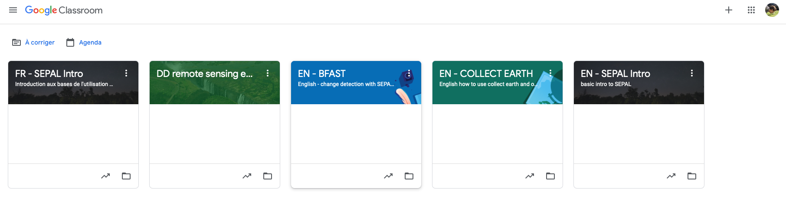
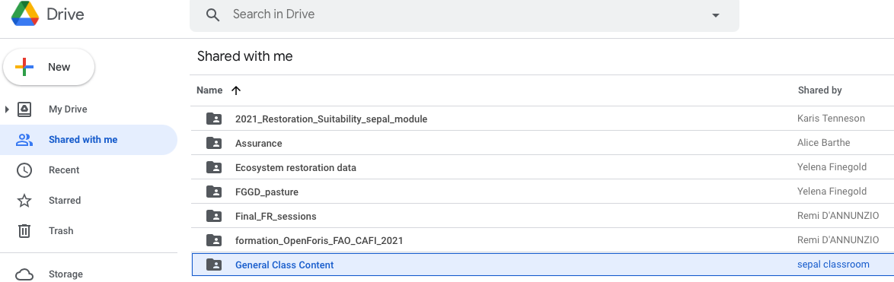
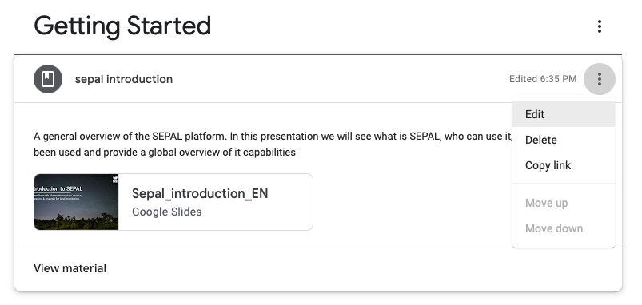

.. include:: disclaimer.rst

Google classroom
================

Usage
-----

Google classroom
^^^^^^^^^^^^^^^^

To provide the team with consistent and up to date formation material, we decided to use the Google classroom platform. It will allow everyone to share and update the presentations and material that will be used by the whole team. 

First open your professional Google account and go to the `Google Classroom page <https://classroom.google.com/u/0/h>`_:

You should see something like the following image, minus the classes : 

each class is composed by several :code:`topics` and each topic can embed different kind of material including : :code:`exercices`, :code:`exams` and :code:`material` as presented in the image below:

.. image:: ../_images/team/classroom/stream.png

.. seealso:: 

    If you have any question about the classrooms of the team and how to use them don't hesitate to contact the maintainer of the gmail account (`Aurelie shapiro <mailto:aurelie.shapiro@fao.org>`_ and `Pierrick Rambaud <mailto:pierrick.rambaud@fao.org>`_) they will answer as soon as possible.

Creating a classroom
^^^^^^^^^^^^^^^^^^^^

If you need material for a webinar you can either directly reuse one of the general classroom or create your own. You can follow the steps presented in the following tutorial to create a class of your own. 

.. youtube:: pl-tBjAM9g4

.. tip::

    If you create your own course as a combination of different modules, invite :code:`sepal.classrom@gmail.com` as a teacher, and then make this account owner of the classroom. As a teacher you will still be able to do everything but the content will resides in a communal account. 

When creating basic content, you can re-use posts from classes were you are teaching as shown in the following image:

.. image:: ../_images/team/classroom/new-post.png

.. warning:: 

    Don't forget to be add as teacher on any class you want to reuse. ask it via mail to the maintainer of the gmail account (`Aurelie shapiro <mailto:aurelie.shapiro@fao.org>`_ and `Pierrick Rambaud <mailto:pierrick.rambaud@fao.org>`_).

.. danger:: 

    To avoid duplicate copies of content, do NOT click the option to copy all attachments

    .. image:: ../_images/team/classroom/no-duplicate.png

Use the general content
^^^^^^^^^^^^^^^^^^^^^^^

To use the general content in your classrooms you need to add the general content folder to your drive. The command has disappeared in 2018 from Google drive. Now Google only offer the opportunity to create shortcut to other drives which is not sufficient in our case. As there were too many complains the reintegrated the feature.

In your drive got to the “share with me" section and click on the “General Class Content” folder.

.. note::

    If the content has not been shared with you ask for it to any of your colleague

Then press :code:`maj+Z`. You should see the following pop-up window. By clicking on add the folder will be wired to your own google drive. 

.. image:: ../_images/team/classroom/pop-up.png

In a classroom to reuse a file from this folder, edit the classroom content:

Then add a file from Gdrive (to make sure that you're reusing an already existing file):

.. image:: ../_images/team/classroom/add-file.png

.. note::

    The file you're using is made for general purpose and it's not supposed to be adapted to the specific needs of your formation. If the modification you're making are improving the quality of the presentation it's perfect but if you adapt it to your formation specific need, you should consider copy it to you drive.

.. danger:: 

    All the team members have the right to edit this file, mistakes will impact all of us and all the already existing classrooms that use this file.

List of available Classes
-------------------------

.. tip:: 

    If you have not been added to one of this class and you need to use it's content send an email to `sepal.classroom@gmail.com <mailto:sepal.classroom@gmail.com>`_ and you'll be add as a teacher

General classroom
^^^^^^^^^^^^^^^^^

.. warning::

    If you need or want to create a new classroom follow the steps described in the usage section. Add the language at the beginning of your class name to help the maintainers of the google account to order things. instead of "SEPAL Intro", you'll set "EN - SEPAL Intro".

.. tip::

    These classroom are intended to stay generic and reusable. You can use them in any of your own classroom and modify them to reflect the latest updates to the platform.

English
"""""""

.. csv-table::
    :header-rows: 1
    :file: ../data/general/en.csv

French
""""""

.. csv-table::
    :header-rows: 1
    :file: ../data/general/fr.csv

Spanish
"""""""

.. csv-table::
    :header-rows: 1
    :file: ../data/general/es.csv

Portuguese
""""""""""

.. csv-table::
    :header-rows: 1
    :file: ../data/general/pr.csv

Project classroom
^^^^^^^^^^^^^^^^^

English
"""""""

.. csv-table::
    :header-rows: 1
    :file: ../data/project/en.csv

French
""""""

.. csv-table::
    :header-rows: 1
    :file: ../data/project/fr.csv

Spanish
"""""""

.. csv-table::
    :header-rows: 1
    :file: ../data/project/es.csv

