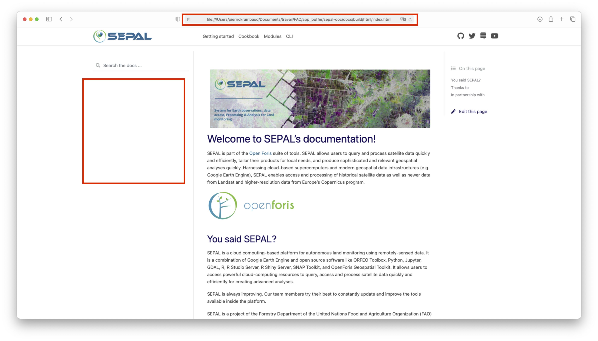

.. include:: disclaimer.rst

Contribute
==========

When contributing to this repository, please first discuss the change you wish to make via issue,
email, or any other method with the owners of this repository before making a change. 

Please note we have a `code of conduct <https://github.com/openforis/sepal-doc/blob/master/CODE_OF_CONDUCT.md>`_, please follow it in all your interactions with the project.

We are glad to receive feedback from our user and collegues from the SEPAL team. This documentation is yours, feel free to improve it!

Structure
---------

Minor change
------------

page edit
^^^^^^^^^

If you want to make modifications to an existing page of documentation because you've seen a typo, or you want to improve an explainantion the workflow is extremely simple. Click on the :code:`edit this page` button that will always be on the right side of the screen:

.. figure:: ../img/team/contribute/edit_page.png
    :alt: edit page button

    The edit page button on the landing page

By clicking it you will be send to a Github editor where you can make all the modification you want in this file. when you are done modifying click on the :code:`propose change` at the bottom of the page. It will create a PR including your modifications, our maintainer will evaluate it and the PR will be published in the documentation. 

.. figure:: ../img/team/contribute/edit_github.png
    :alt: edit a page directly in GitHub

    edit a page directly in GitHub

.. tip::

    To make sure that you modification are well uderstood modify the title of the commit by filling the first field. you can use "typo", "change image" "code-block error"; in short anything that describe the modification that you've done. This name CANNOT be changed.

module edit
^^^^^^^^^^^

If you find a error in a **module** page, the edit button will not work as the files are dynamically retreive from each module repository. If the documentation is well written, their should be a link at the very bottom to make modification to the source file in the module repository following the same procedure mentionned above. 

Once you're done notify the maintainer of sepal-doc with an issue, they will need to rebuild the documenation manually to retreive the latest version of the file you just modified. 

.. note:: 

    if you want to add a new module to the documentation, please follow the **major change** section instructions. 

Major change
------------

Major changes include:

-   new documentation page
-   multiple image modification
-   new section
-   new modules
-   new class on Google classroom

For these major changes, the simple GitHub edit process cannot work. You need to follow another worklfow that will allows you to modify multiple files at the same time and use the PR system to avoid publishing new pages without validation. 

In this section will will present the full process to include major changes to the documentation.

fork project
^^^^^^^^^^^^

To work on multiple files at the same time, you cannot work directly from GitHub and you need to install a local version of the source. You don't have the rights (even the maintainer doesn't have the right) to directly push to master to avoid the publication of bad quality documetation page. The first step will then be to fork the project in your own account. To do so click on the :code:`fork` button at the top right side of the `Github page of the doc <https://github.com/openforis/sepal-doc>`_:

.. figure:: ../img/team/contribute/fork.png
    :alt: github fork

    The fork button on GitHub

In the fork popu that will open select your the account you want to use (if you have only one account there will be 1 choice):

.. figure:: ../img/team/contribute/fork_select.png
    :alt: fork popup

    Select the acount to fork

Then you should end up in the following page. Take a look at the top left side of the page, it's explaining you were you are. this repository leaves in your account but it's a fork of the :code:`openforis/sepal-doc` one. 

.. note::

    To know more about the forking system in GitHub please go to this `link <https://docs.github.com/en/github/getting-started-with-github/fork-a-repo>`_

.. figure:: ../img/team/contribute/fork_landing.png
    :alt: landing page of the forked project

    landing page of the forked project

We are now ready for a local installation.

local installation
^^^^^^^^^^^^^^^^^^

You want to install the forked project locally to make you modifications. In your computer go to a terminal and run the following command. 

.. warning::

    don't forget to change :code:`<your account>` by the account name where you forked the project.

.. code-block:: console

    git clone https://github.com/<your account>/sepal-doc.git

now that the code is installed on your computer, you need to install the packages that are required to build the doc. run the following command: 

.. code-block:: console

    pip install -U -r sepal-doc/requirements.txt

lets check that the doc can be build without error, go to the doc folder and run the following command: 

.. code-block:: console 

    cd sepal-doc/docs
    make html

.. note:: 

    we try our best to avoid warning in the master branch. If some are still displayed just ignore them the maintainers will take care of them.

now a new folder :code:`build` have been created in your sepal-doc folder. double-click on :code:`sepal-doc/docs/build/html/index.html`. Your computer will open a browser page which should be the landing page of the documenation. you can then navigate wherever you fancy. the url at the top of the browser should not be starting with **https:://** but **file:///** meaning that it's a local html page. Another tip that you are displaying a local page is that there is no advertisment in the side bar. 

    landing of the local build documentation

We can now start to code our modifications!

.. tip::

    This procedure can also be performed in SEPAL. start a :code:`t1` instance and do the exact same process. 
    To open the html page you will need to use Jupyterlab as it is the only one able to load html content. JupyterLab will also be an excellent IDE to make modifications as it recognize **.rst** format.

