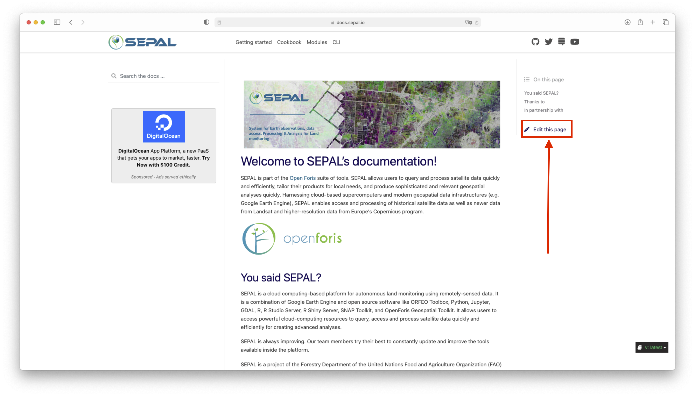
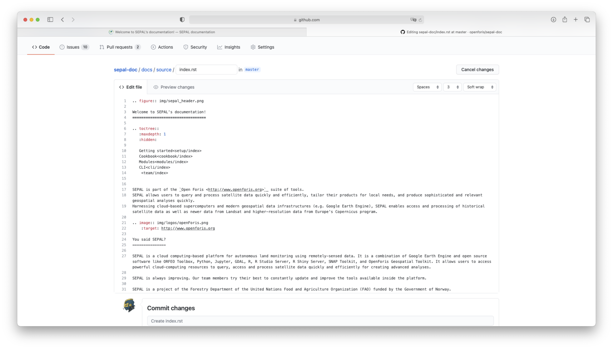
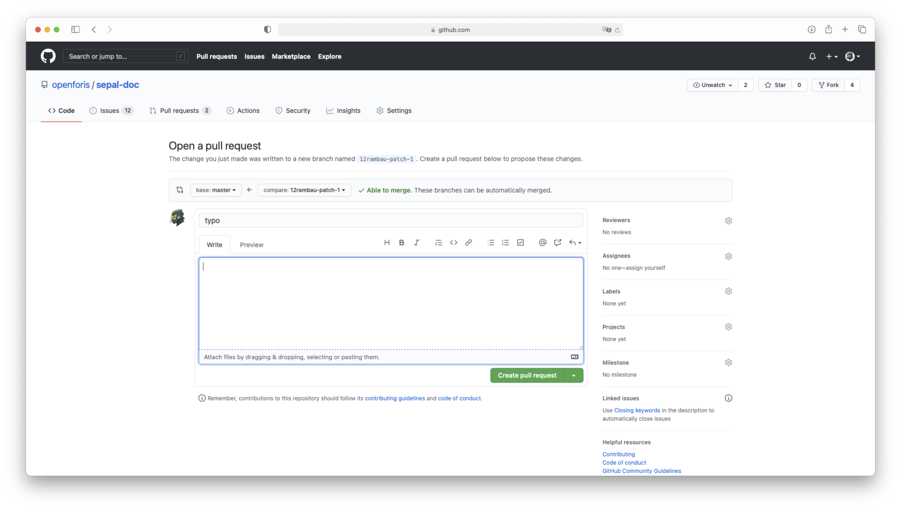
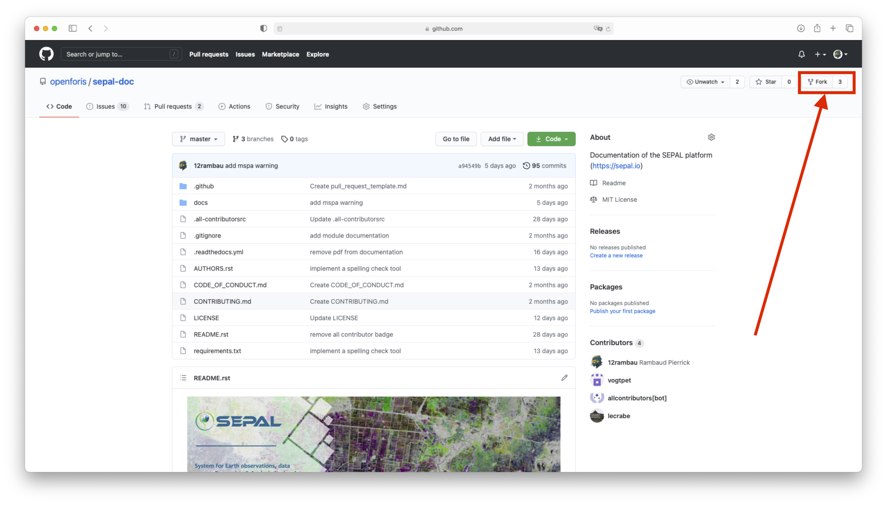
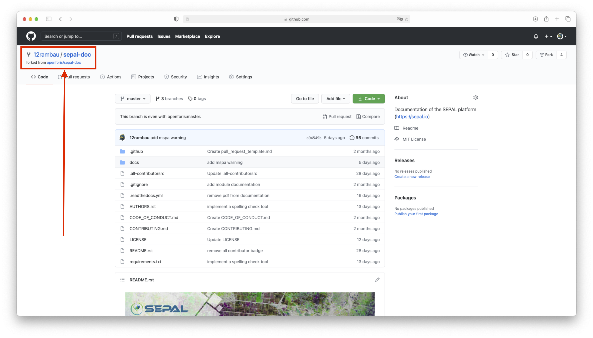
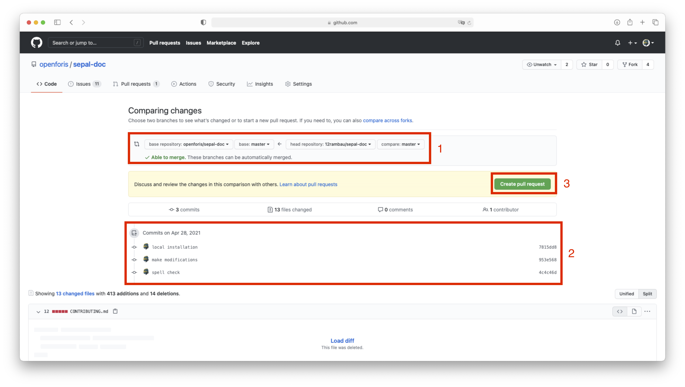

.. include:: disclaimer.rst

Contribute
==========

When contributing to this repository, please first discuss the change you wish to make via issue,
email, or any other method with the owners of this repository before making a change. 

Please note we have a `code of conduct <https://github.com/openforis/sepal-doc/blob/master/CODE_OF_CONDUCT.md>`_, please follow it in all your interactions with the project.

We are glad to receive feedback from our user and colleagues from the SEPAL team. This documentation is yours, feel free to improve it!

Introduction
------------

The :code:`sepal-doc` has a fixed structure that needs to be respected to stay inline withe Sphinx builder requirements. All modification should be made in the :code:`sepal-doc/docs/source/` folder and the images associated with a page should live in the corresponding folder in :code:`sepal-doc/docs/source/_images/`.

If some of the files are misplaced there build into html pages cannot be guaranteed. Please respect the following instructions when you consider making changes to the repository. 

Tools
^^^^^

The work of the sepal-doc repository is to create .rst files in an ordered way. To do that will will use at it's maximum the potential of the Python `Sphinx <https://www.sphinx-doc.org/en/master/>`_ library (to create the build) and the `ReadTheDoc <https://readthedocs.org>`_ website (to distribute the build).

.. warning::

    To work on this project you will need the following:

    - basic knowledge of any lightweight markup language ( markdown, latex, etc..) that will help you understand .rst
    - the `Sphinx directives documentation <https://www.sphinx-doc.org/en/master/usage/restructuredtext/directives.html>`_
    - a GitHub account 
    - basic understanding of terminal commands 

Guidelines
^^^^^^^^^^

There are very few guidelines to respect that are not directly specified by the .rst documentation or the template. 

- In all the files you write please respect the following indentation: :code:`4 spaces`. it includes directives (option and content) AND bullet points
- For the headings of your files use the following symbols (from heading 1 to heading 6) :code:`=`, :code:`-`, :code:`^`, :code:`"`, :code:`#`, :code:`+`

Custom
^^^^^^

Here you will find the custom directives that have been added to help us build our documentation: 

videos
""""""

ReST directive for embedding Youtube and Vimeo videos.
There are two directives added: :code:`youtube` and :code:`vimeo`. The only argument is the video id of the video to include.
Both directives have three optional arguments: 
- :code:`height`, 
- :code:`width`,
- :code:`align`

Default height is **281** and default width is **500**. By default the video will be aligned on the **left** side.

Here you'll find an example: 

.. code-block:: rst 

    .. youtube:: Ub6N8aWThw4
        :height: 315
        :width: 560

.. youtube:: Ub6N8aWThw4
    :height: 315
    :width: 560

line-break
""""""""""

ReST directive for creating line break in your documentation when needed.
The directive does note require any argument.

Here you'll find an example:

.. code-block:: rst

    .. line-break::

.. line-break

graphviz
""""""""

Directive to embed graphviz code. The input code for dot is given as the content. To better understand graphviz, please refer to the `graphviz documentation <https://www.sphinx-doc.org/en/master/usage/extensions/graphviz.html>`_.

Here you'll find an example:

.. code-block:: rst 

    .. graphviz::

        digraph foo {
        "bar" -> "baz";
        }

.. graphviz::

    digraph foo {
    "bar" -> "baz";
    }

icon
""""

ReST role to include inline icons in the documenation (usualy when referencing a btn). You can find the icon you're looking for in the fontawesome library `page <https://fontawesome.com/v5.15/icons?d=gallery&p=2>`__.

.. code-block:: rst 

    I'm a folder icon: :icon:`fa fa-folder`

I'm a folder icon: :icon:`fa fa-folder`

btn
"""

Rest role to include complete btn in the documentation. You can find the icon you're looking for in the fontawesome library `page <https://fontawesome.com/v5.15/icons?d=gallery&p=2>`__. The text is optional.

.. code-block:: rst 

    I'm a apply btn: :btn:`<fas fa-check> apply`

    I'm the app btn: :btn:`<fas fa-wrench>`

I'm a apply btn: :btn:`<fas fa-check> apply`

I'm the app btn: :btn:`<fas fa-wrench>`

Minor change
------------

Page edit
^^^^^^^^^

If you want to make modifications to an existing page of documentation because you've seen a typo, or you want to improve an explanation the workflow is extremely simple. Click on the :code:`edit this page` button that will always be on the right side of the screen:

    The edit page button on the landing page

By clicking it you will be send to a Github editor where you can make all the modification you want in this file. when you are done modifying click on the :code:`propose change` at the bottom of the page. It will create a PR including your modifications, our maintainer will evaluate it and the PR will be published in the documentation. 

    edit a page directly in GitHub

.. tip::

    To make sure that you modification are well understood modify the title of the commit by filling the first field. you can use "typo", "change image" "code-block error"; in short anything that describe the modification that you've done. This name CANNOT be changed.

    .. figure:: ../_images/team/contribute/create_branch.png
        :alt: create a branch 

        Create a branch when correcting anything

Once you're done, a PR will automatically be set for you in the OpenForis repository. Remove all the comments as you're not making a real PR but an adjustment, normally the title will automatically be set with the name of your commit. click on :code:`create pull request`.

    Create an automatic PR for minor modifications

.. note::

    Once your PR is accepted, you will be notified. please consider deleting your branch. 

    .. figure:: ../_images/team/contribute/delete_branch.png
        :alt: delete branch 

        Delete the branch once the PR is accepted by maintainers

Module edit
^^^^^^^^^^^

If you find a error in a **module** page, the edit button will not work as the files are dynamically retrieve from each module repository. If the documentation is well written, their should be a link at the very bottom to make modification to the source file in the module repository following the same procedure mentioned above. 

Once you're done notify the maintainer of sepal-doc with an issue, they will need to rebuild the documentation manually to retrieve the latest version of the file you just modified. 

.. note:: 

    if you want to add a new module to the documentation, please follow the **major change** section instructions. 

Major change
------------

Major changes include:

-   new documentation page
-   multiple image modification
-   new section
-   new modules
-   new class on Google classroom

For these major changes, the simple GitHub edit process cannot work. You need to follow another workflow that will allows you to modify multiple files at the same time and use the PR system to avoid publishing new pages without validation. 

In this section will will present the full process to include major changes to the documentation.

Fork project
^^^^^^^^^^^^

To work on multiple files at the same time, you cannot work directly from GitHub and you need to install a local version of the source. You don't have the rights (even the maintainer doesn't have the right) to directly push to master to avoid the publication of bad quality documentation page. The first step will then be to fork the project in your own account. To do so click on the :code:`fork` button at the top right side of the `Github page of the doc <https://github.com/openforis/sepal-doc>`_:

    The fork button on GitHub

In the fork popup that will open select your the account you want to use (if you have only one account there will be 1 choice):

.. figure:: ../_images/team/contribute/fork_select.png
    :alt: fork popup

    Select the acount to fork

Then you should end up in the following page. Take a look at the top left side of the page, it's explaining you were you are. this repository leaves in your account but it's a fork of the :code:`openforis/sepal-doc` one. 

.. note::

    To know more about the forking system in GitHub please go to this `link <https://docs.github.com/en/github/getting-started-with-github/fork-a-repo>`_

    landing page of the forked project

We are now ready for a local installation.

Local installation
^^^^^^^^^^^^^^^^^^

You want to install the forked project locally to make you modifications. In your computer go to a terminal and run the following command. 

.. warning::

    don't forget to change :code:`<your account>` by the account name where you forked the project.

.. code-block:: console

    git clone https://github.com/<your account>/sepal-doc.git

now that the code is installed on your computer, you need to install the packages that are required to build the doc. run the following command: 

.. code-block:: console

    pip install -U -r sepal-doc/requirements.txt

lets check that the doc can be build without error, go to the doc folder and run the following command: 

.. code-block:: console 

    cd sepal-doc/docs
    make html

.. note:: 

    we try our best to avoid warning in the master branch. If some are still displayed just ignore them the maintainers will take care of them.

now a new folder :code:`build` have been created in your sepal-doc folder. double-click on :code:`sepal-doc/docs/build/html/index.html`. Your computer will open a browser page which should be the landing page of the documentation. you can then navigate wherever you fancy. the URL at the top of the browser should not be starting with **https:://** but **file:///** meaning that it's a local html page. Another tip that you are displaying a local page is that there is no advertisement in the side bar. 

.. figure:: ../_images/team/contribute/local_landing.png
    :alt: local landing

    landing of the local build documentation

We can now start to code our modifications!

.. tip::

    This procedure can also be performed in SEPAL. start a :code:`t1` instance and do the exact same process. 
    To open the html page you will need to use Jupyterlab as it is the only one able to load html content. JupyterLab will also be an excellent IDE to make modifications as it recognize **.rst** format.

Modify the doc
^^^^^^^^^^^^^^

Every type of modification will be treated separately as they don't imply the same structure code structures. While doing local modifications, don't hesitate to regularly run the following command in the :code:`sepal-doc/doc/` folder to check the page your modifying, it will help you see typos and directives mistakes: 

.. code-block:: console

    make html

Also if you make a lot of modification don't hesitate to create multiple commits (from :code:`sepal-doc/docs/` folder). Always use a clear and synthetic commit message, if you cannot find an appropriate one, it means that you have done too many things and you should consider committing more often. 

.. code-block:: console 

    git add ../
    git commit -m "<your message>"

Once you are done with your modifications, simply push the repository to GitHub and jump to the next section:

.. code-block:: console

    get push 

New page
""""""""

Open the :code:`sepal-doc` folder in your favorite IDE it will be easier for modification. 

.. note::

    Any TextEdit software can do the trick it's just less user friendly

As explained in the beginning the folder has a specific structure corresponding to the `Sphinx template <https://pydata-sphinx-theme.readthedocs.io/en/latest/>`_ we are using to build the final doc. 
The first step will be to identify the section you want your page to be included. The following sections are currently available:

-   **Getting started**: everything you need to know to use SEPAL
        
    In :code:`sepal-doc/docs/source/setup/` folder

-   **Cookbook**: how to use the different recipe available in SEPAL
    
    In :code:`sepal-doc/docs/source/cookbook/` folder
    
-   **Modules**: the modules that are available in the app dashboard
    
    In :code:`sepal-doc/docs/source/modules/` folder

-   **CLI**: all the CLI tools that are installed by default in SEPAL
    
    In :code:`sepal-doc/docs/source/cli/` folder

-   **Team**: a hidden section only available to team member that helps them contribute to the platform 
        
    In :code:`sepal-doc/docs/source/team/` folder

.. note:: 

    in the :code:`module` section, only the :code:`index.rst` file should be modified as the others are all downloaded from their repository (see **New module** subsection)

.. danger:: 

    If you create a team page the first line of your .rst file should always be :

    .. code-block:: rst 

        .. include:: disclaimer.rst

Now that you have selected a section you can create a documentation page :code:`<my_page>.rst` using all the available `rst directives <https://www.sphinx-doc.org/en/master/usage/restructuredtext/basics.html>`_ that are available in Sphinx and the one we presented in the first section of this page. To keep the consistency of the folders and help people that will maintain the images, the images you will use should live in the following folder: :code:`sepal-doc/docs/source/_images/<section>/<page>/`. 

Add now the page you've created to the :code:`toctree` directive (table of content) in the :code:`<section>/index.rst` file. You just need to add your filename without the extension respecting the indentation as follow:

.. code-block:: rst

    .. toctree::
        :maxdepth: 1
        :hidden:
    
        page1
        page2
        my_page
        page3
    
the file will be linked to the rest of the documentation via the left panel of your section. The title of the page will be display instead of the file name. If you forget to link it, you will see the following message while compiling the doc. It means that you page cannot be accessed with navigation buttons.

.. code-block:: red

    <source_dir>/sepal-doc/docs/source/<section>/<my_page>.rst: WARNING: 
    The document is not included in any table of contents in the tree structure.

.. tip::

    If you are struggling with .rst don't hesitate to contact the maintainers of the doc they will be more than happy to help.

Modify images
"""""""""""""

As explained before for each page the contained images are saved in the mirror folder :code:`sepal-doc/docs/source/_images/` that reproduce the structure of the :code:`sepal-doc/docs/source` structure. 

Open the page you want to modify and search for the :code:`.. image` or :code:`.. figure` directive that set the image you want to modify. You now just need to change the image in the :code:`_images/` folder and continue using the same name. 

If you think that an image is missing you can add one in a any of the page. add the image in the appropriate folder and then call it using one of the following directives. Never forget the :code:`alt` option, it will be the only information displayed if your image fail to load.

-   the :code:`figure` directive add a nice padding at the bottom of the image and allow you to add a caption.

    .. code-block:: rst 

        .. figure:: ../_images/<section>/<page>/<image>.png
            :alt: <the image callback text>

            <A caption>

-   the :code:`image` directive is easier to manipulate but have less functionalities

    .. code-block:: rst 

        .. image:: ../_images/<section>/<page>/<image>.png
            :alt: <The image callback>

New section
"""""""""""

.. danger:: 

    Normally the documentation does not require any new section, If you really feel that something needs to be modified please let us know first in the `issue tracker <https://github.com/openforis/sepal-doc/issues>`_

To add a new section you need to create a new folder in :code:`sepal-doc/docs/source/`. This folder should contain at least 1 page that contain at minimum the following code: 

.. code-block:: rst

    <Section title>
    ===============

    .. toctree::
        :maxdepth: 1
        :hidden:

Then you need to add this section page to the documentation index. modify the :code:`toctree` of :code:`sepal-doc/docs/source/index.html` as followed. replace "Section name" by the name you want to see in the navbar and "<section>" by the folder name.

.. code-block:: rst

    .. toctree::
        :maxdepth: 1
        :hidden:
    
        Getting started<setup/index>
        Cookbook<cookbook/index>
        Modules<modules/index>
        CLI<cli/index>
         <team/index>
        Section name<<section>/index>

New modules
"""""""""""

You have created a new module (shinny or python based) and you proudly asked to add it on the app dashboard of SEPAL (following the issue template). One of the requirement to have your module accepted by the sepal team is to create a documentation file. To keep the modules consistency we decided to let the documentation live in the module original repository. So to create the actual documentation page follow the instruction provided in the `sepal_ui doc <https://sepal-ui.readthedocs.io/en/latest/tutorials/send-to-sepal.html#add-documentation>`_. 

Then you need to modify only 1 files in sepal-doc to make your documentation available.

1.  modify the :code:`sepal-doc/docs/source/data/modules/en.json` file by adding a new line with the following shape: 

    .. code-block:: json

        {
            "module_name": "https://raw.githubusercontent.com/<account>/<repository>/master/doc/en.rst"
        }

    This file will be pulled at each build of the documentation in the :code:`sepal-doc/docs/source/modules/dwn` folder

New Class on Google Classroom
"""""""""""""""""""""""""""""

You have created a new class under the google Classroom repository following the :doc:`classroom` doc. You now would like to add this class to the appropriate class table. 
Go to your classroom page and click on the share link. On the following page copy past in a note the following information:

-   the number of the class
-   the title of the class 
-   the invitation link of the class

.. figure:: ../_images/team/contribute/class_share.png
    :alt: the share links 

    Google class sharing links

You now have 1 single file to modify :code:`sepal-doc/docs/data/<type>/<locale>.csv`: replace "<type>" by the type of your classroom (**general** for reusable piece of documentation and **project** if linked to a FAO activity) and "<local>" by the language of your class (only "en", "es" and "fr" are available). Add 1 extra line at the bottom as such:

.. code-block::

    <title>, `<ID> <<link>>`_, <modification date>

Replace "<ID>" by the number of the class, "<link>" by the invitation link and "<title>" by the title of the classroom. Add also the latest "<modification date>" in "YYY-mm-dd" format.

Doc spell check 
"""""""""""""""

.. warning::

    Experimental feature, still require some work to identify all the FAO related words and avoid false positives.

If you want to spell check your work you can run a specific building tool based on `sphinxcontrib-spelling <https://sphinxcontrib-spelling.readthedocs.io/en/latest/customize.html#private-dictionaries>`_. Open a terminal and move to the :code:`sepal-doc/docs/` folder. There run the following command: 

.. code-block::

    make spelling

A long output of misspelled word will be displayed in your terminal. it's not really user-friendly. It's also building a spelling folder that contains all the files with misspelled words  in :code:`sepal-doc/docs/build/spelling/`. 

For each line you will have: 

-   the file
-   the line
-   the misspelled word
-   a list of suggestion
-   the context

Here is an example: 

.. code-block:: 

    cli/gwb.rst:
    748: 
    (informmation) 
    ["information", "inflammation", "information's", "informational", "conformation"] 
    If your are considering using the MSPA tool, keep in mind that the process is relatively complex and provide a lot of informmation (up to 25 classes). If you are only interested in fragmentation and/or less than 6 classes, please consider using 

.. tip:: 

    Instead of using our tool maybe your IDE is providing a spell check tool designed for .rst file. 

Create a PR
-----------

.. note::

    This very documentation page was requested in the `issue #19 <https://github.com/openforis/sepal-doc/issues/19>`_ and add to the main documentation through the `PR #24 <https://github.com/openforis/sepal-doc/pull/24>`_.

Now that you have finished your modifications and pushed them to GitHub we can go back to the web interface of our forked repository (:code:`https://github.com/<your account>/sepal-doc`). on this page click on the :code:`pull request` button:

.. figure:: ../_images/team/contribute/start_pr.png
    :alt: pull request btn 

    Start the pull request interface

In the pull request interface, click on :code:`new pull request` button: 

.. figure:: ../_images/team/contribute/new_pr.png
    :alt: new pull request

    create a new pull request

Now you need to select what is going to be pushed and where. Assuming that you have followed this entire documentation, you have not created any branch in your fork so on the left side leave :code:`openforis/sepal-doc/master` and on the right side :code:`<account>/sepal-doc/master` (1). Some extra information on the commit that will be added to master are displayed in (2). If everything is set properly (normally you don't have to change anything) then click on the :code:`create pull request` button.

Now you enter the final step of your modifications. fill the title and description of the PR (1) by filling the title area and respecting the template provided (as shown on the following image). As explained at the beginning of the documentation, you started your modifications to answer an issue from the issue tracker. It need to be referenced in your PR message at line 2 using :code:`#<issue number>`. It will help the maintainers that will review your PR understanding what you are adding to the documentation. 

.. note::
    
    You can click on the preview button to see what your PR look like with links

The :code:`Allow edits by maintainers` checkbox needs to always be checked (default behavior) (2). This will allow the maintainers to make modifications to your PR files (e.g. if you made a mistake in a rst directive)

When everything is set, you can click on :code:`create pull request` (3). 

.. figure:: ../_images/team/contribute/valid_pr.png
    :alt: valid pr 

    Validate the creation of the PR

Some check will be performed automatically to check if your PR can be build with ReadTheDoc and distribute in https://docs.sepal.io.

.. figure:: ../_images/team/contribute/ci_pr.png
    :alt: ci in pr 

    The continous integration will run in Github

When everything is ready the maintainer will look at your PR and make the appropriate modifications (if needed), afterward the PR will be accepted and the new page will be available in the main documentation.

.. tip:: 

    once the PR is validate, please consider deleting your fork in order to avoid merging issues next you'll want to make modification to the repository.

    .. figure:: ../_images/team/contribute/delete_fork.png
        :alt: delete fork

        click here and follow the instructions ot delete your repository

    .. figure:: ../_images/team/contribute/delete_popup.png
        :alt: delete popup

        Popu to delete the fork used in the closed PR
    
    IF YOU ARE OWNER OF :code:`openforis` DO NOT DELETE THE :code:`openforis/sepal-doc` ONE

