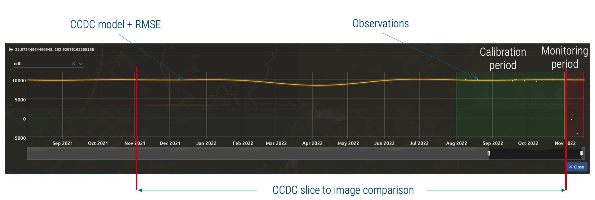

CCDC NRT-FDM
============

Background
----------
Near real-time forest disturbance monitoring (NRT-FDM) entails remote sensing techniques that are based on dense time series and target the generation of recent disturbance events in forested areas.

The main objective is to detect those changes as early as possible. This priotization usually comes at the cost of accuracy, as the methods are optimized for speed and timeliness. They are therefore not suited for area estimations, such as for measurement, reporting and verification (MRV), where accuracy is the main objective.

NRT-FDM is a rapidly evolving field of research and many different approaches have been proposed. The most common ones are based on the detection of abrupt changes in the time series, which are then classified as disturbance events.

This page provides background information and a detailed **How-to guide** (see below) for a customized implementation of the Continuous Change Detection and Classification (CCDC) algorithm on the SEPAL platform that is optimized for the generation of NRT alerts. It supports various sensor types and satellites, such as medium- to very high-resolution optical and radar data from Landsat, Sentinel-1 and Sentinel-2, as well as Planet Labs daily data.

Methodology
-----------
The CCDC algorithm is a well-established pixel-based method for the detection of changes in dense time series, usually applied for mapping changes of land use and land cover over longer periods of time.

The algorithm is based on the assumption that the time series can be modelled by a harmonic function, which is fitted to the time series; the modelled values are compared to the observations.

If the difference between the modelled and observed values exceeds a certain threshold, a break is added, and a new segment is created based on the subsequent observations, fitting a new harmonic model.

The threshold for a break is defined as a multiple of the root mean squared error (RMSE) of the harmonic model. (For more information, see `this article <https://www.sciencedirect.com/science/article/abs/pii/S0034425714000248>`_.)

The method implemented in SEPAL is a customized version of that technique, which is optimized for NRT alert generation, consisting of two elements:

1.    a historic reference in the form of a CCDC asset, containing past segments; and
2.    a pixel-wise change detection applied to current imagery and the modelled value of the CCDC asset from one year before.

The harmonic model of the historic CCDC asset allows to intersect the observations and retrieve a modelled reflectance at any given point in time – a process also called *slicing*. This information is used for comparison to newly incoming imagery. The observed value from a newly incoming image is compared to the modelled value from exactly one year before. This shall ensure that the comparison is always based on the same phenological stage. If the observed value deviates to a certain degree from the historic value, the pixel is flagged as disturbance.

The degree of deviation is defined as a multiple of the RMSE originating from the harmonic model fitting the observations from a year earlier. Going above that threshhold means a change is initially detected. This value defines the sensitivity of the detection and is expressed as confidence.

A disturbance event counts as confirmed when a number of subsequent observations adhere to the same criteria. This is to avoid false positives. The number of observations in a row is defined by the user. The default is three.

The logic of using a comparison to the modelled value from one year before has some important implications. A typical user of NRT-FDM is usually interested in a monitoring period the spans days to weeks, but not the entire year (the default value of the monitoring period is two months). Changes that happen within the year – but before the monitoring period – would be included. The method therefore introduces a calibration period that directly precedes the monitoring period. Confirmed changes that already happened before or during the calibration period are not included in the final output by default. This is to ensure that the user only receives alerts for changes that happened during the monitoring period. The length of the calibration period is defined by the user (three months by default). The advanced options allow to turn this behaviour off.

Another advanced option regards the handling of regrowth. Small disturbances from selective logging in tropical forests usually result in a quick canopy closure. By default, the algorithm removes those changes, as they could originate from image artefacts, such as reoccurring haze.

Supported sensors
-----------------

Optical sensors
"""""""""""""""

-    **Landsat/Sentinel-2**: Users can select both sensors; however, it is recommended to only use the combination of both in the **Change** recipe (see **How-to guide** below). For processing and storage efficiency, the historic reference can be based on a single sensor only. Even though Landsat has a lower resolution, it still provides a robust historical reference for the higher resolution Sentinel-2 data, while storage is reduced by a factor of 9.

-    **Planet**: It is possible to use daily Planet imagery to generate alerts at very high spatial and temporal resolution. Aside from some special arrangments, Planet daily imagery is not free. Regardless, it must be first accessed through the Planet API and ingested into Google Earth Engine (GEE) as an **Image collection** for both historical reference and monitoring. In an operational scenario, this **Image collection** is subseuqently populated over time with new, incoming images for the selected area.

Radar sensors
"""""""""""""

-    **Sentinel-1**: The Sentinel-1 sensor is supported. In first-test cases, it showed reasonable results; however, we encourage users to test against the dedicated **BayTS** recipe (which usually has more robust results) and check the current `Observation plan <https://sentinels.copernicus.eu/web/sentinel/missions/sentinel-1/observation-scenario>`_ (due to the failure of Sentinel-1B, some regions are not covered).

How-to guide
------------

Requirements
""""""""""""
1. Area of interest (AOI) (EE table, country/regional boundaries, self-drawn polygon)
2. Forest mask (optional, but recommended)
3. Planet application programming interface (API) key (optional, only for Planet daily imagery)

For a step-by-step guide of the use of a combination of Landsat and Sentinel-2 imagery over an area in Bolivia, download this presentation <https://docs.google.com/presentation/d/1gVb8Ewevp_fQNChSQT-wGRdSIM79x0II/edit?usp=sharing&ouid=107111160061452891127&rtpof=true&sd=true>`_. To understand the underlying logic of the workflow, read further.
