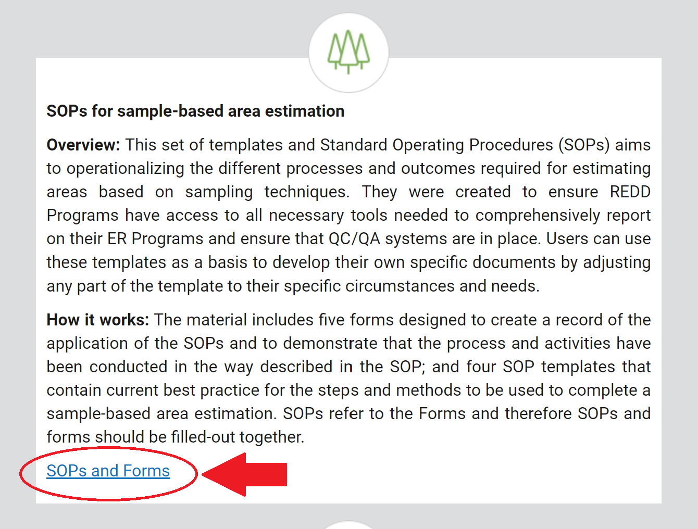
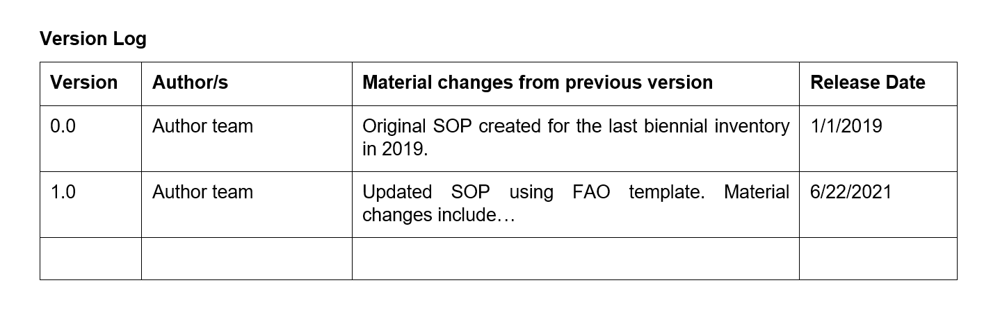

Creating Standard Operating Procedures (SOPs) for Sample-based Area Estimation for REDD+
=========================================================================================

.. note::

    All thanks goes to `SIG-GIS <https://sig-gis.com>`_ for this documentation material.

1. Background
--------------

This tutorial will teach you how to create Standard Operating Procedures (SOPs) for sample-based area estimation tasks using templates that are specific to your context and goals. These same techniques can be applied to create SOPs for other tasks.

SOPs are used in this context as guidance documents, operationalizing required processes for sample-based area estimation which are used to estimate greenhouse gas emissions and emission reductions in as REDD+ context. They include step-by-step procedures that should be unambiguous, so they can be easily repeated, even if successive assessments are undertaken by persons unfamiliar with the process. These documents should be reviewed periodically, regularly updated with any additions or changes to the methods, and their use should be reinforced.

SOPs are integral to a successful high quality analysis. Their use ensures consistency and documentation. They are especially important for reducing uncertainty in activity data and greenhouse gas emissions calculations. For countries in the REDD+ program, developing a high quality SOP can help explain their Measurement, Reporting, and Verification (MRV) systems, especially in the interaction with auditors that verify emission reduction reports. Generally, auditors will ask for any SOPs used in the creation of MRV processes early in the audit process in order to verify their rigor and that they were applied properly.

Benefits of a well written and utilized SOP include:

* defensibility of the methods;
* credibility, especially in compliance with requirements;
* easier comparability with similar entities’ procedures;
* consistency of methodology and thus higher quality data;
* reduction of effort needed to carry out the procedure;
* reduction of systematic errors; and
* reduction of uncertainty in data.

A brief YouTube video of the process can be watched below:

.. youtube:: d-A5_vy9EXM
   :height: 315
   :width: 560

2. Learning objectives
-----------------------

* Determine what SOPs are necessary for your specific context
* Introduce the FAO SOP templates
* Create effective SOPs tailored to your requirements

2.1 Prerequisites
^^^^^^^^^^^^^^^^^^^

* Internet connection

3. Tutorial: Creating area estimation SOPs using templates
-----------------------------------------------------------

3.1 What SOPs do you need?
^^^^^^^^^^^^^^^^^^^^^^^^^^^

Determining what SOPs you need to create to support your area estimation goals can be a daunting task.

This tutorial is focused on creating SOPs for sample-based area estimation. Area estimation answers questions concerning total areas of different categories (e.g. land use, land cover, land cover change) within administrative or physiographic boundaries. These estimates should be reported with their uncertainty. For example, you might ask “How much deforestation occurred between 2010 and 2015?” Area estimation would answer this question, for example “50,000 ha (± 15,000 ha) of forest was lost.”

SOPs describe the steps necessary to move from your question to arrive at an answer in a rigorous, standardized, and reproducible manner.

Major steps in sample-based area estimation include:

1. Sampling design
2. Response design
3. Data collection
4. Data cleaning
5. Data analysis
6. Analysis reporting

Your approach (or your organization’s approach) to area estimation may include all or some of these steps, or you may have other major steps not captured in this list.

In general, one SOP is created for each major step. For example,  sampling design and data collection would each get their own SOP.

If you have performed area estimation previously, consider your existing approach. Which steps does your approach include? Are there any steps not captured above? For example, perhaps you have a Data entry step. Below, write down the major steps that you need to create SOPs for.

1. Step 1:
2. Step 2:
3. Step 3:
4. Step 4:
5. Step 5:
6. Step 6:
7. Step 7:
8. Step 8:

We suggest you include at least the following SOPs:

1. Sampling design
2. Response design
3. Data collection
4. Data analysis

If you are creating SOPs for a process other than area estimation, you will need to define your question and the major steps that will take you from question to answer. Each major step will need its own SOP.

3.2 Creating SOPs using templates
^^^^^^^^^^^^^^^^^^^^^^^^^^^^^^^^^^

Starting with an SOP template has multiple advantages. SOP templates are a great place to start and help ensure that the finished document is of high quality. Templates are especially useful for teams who have not completed an SOP creation previously or are new to writing an SOP that meets specific requirements (e.g. World Bank requirements).

Even for teams familiar with SOP design, the use of templates can be useful for efficiency, as you begin with a partly completed SOP instead of remaking each SOP from scratch. Designing your own SOP can have the advantage of total customization when no template is available for your process or when your methods address unusual circumstances.

3.3 FAO’s templates for SOP creation
^^^^^^^^^^^^^^^^^^^^^^^^^^^^^^^^^^^^^

The templates from the Forest Carbon Partnership Facility (FCPF) and the Food and Agriculture Organization (FAO) for stratified area estimate SOPs are hosted online on the `Forest Carbon Partnership Facility Website <https://www.forestcarbonpartnership.org/measurement-reporting-and-verification-mrv>`_.

These templates aim to further standardize the development of SOPs for entities looking to estimate and monitor their activity data and greenhouse gas emissions. The availability of these templates helps ensure all participants in the REDD+ program have access to the necessary tools to ensure adequate quality assurance/quality control (QA/QC) systems and comprehensive reporting. The templates are generic outlines of sample-based area estimation approaches usable for most locations and conditions, but adaptations for specific ecosystems, land cover types, vegetation conditions, and other local circumstances are anticipated.

Additional guidance for the development of sample-based area estimation SOPs is forthcoming and will be hosted on `OpenMRV <www.openmrv.org>`_. This guidance document will describe descriptions of the different options each country can choose for each field in FAO’s template SOPs, good practices and some examples and tools when available. The guidance document will complement the steps in this module.

The templates for the SOPs outline current best practices for all the steps of sample-based area estimation. There is descriptive text with instructions for each stage which should be replaced with details from each user. Forms are also included, which are used to record the details about the application of the SOPs. Some of the templates have prerequisite requirements. Many of these can be generated through a pilot survey and/or careful planning.

**SOP Template descriptions:**

1. Sampling design: procedure and QA/QC for sampling design in land use / land cover change surveys.

    * Use to develop protocols for establishing sample plots.
    * Prerequisites: If you select stratified sampling, you will need categorized maps for every monitoring period from which to stratify.

2. Response design: assigning labels to samples and reducing interpreter bias.

    * Use to develop protocols for creating an interpretation key, specifying a decision tree for interpretation, choosing a data collection software and survey design, and/or establishing how to reduce interpreter bias.
    * No prerequisites.

3. Data collection: sample-based visual interpretation data collection.

    * Use to develop protocols for creating a classification manual, training your interpreters, establishing how samples will be divided or shared between interpreters, and/or deciding on your data archiving method.
    * Prerequisites: completion of sampling and response designs.

4. Data analysis: estimating areas and their uncertainties.

    * Use to develop protocols for building an error matrix or calculating strata weights, area proportions per class, area estimates, and/or standard errors and uncertainties.
    * Prerequisites: completion of data collection.

3.4 How to adapt FAO’s templates for your SOP
^^^^^^^^^^^^^^^^^^^^^^^^^^^^^^^^^^^^^^^^^^^^^^

FAO’s SOP templates can be adapted to your own context and be used to inform your own SOPs. We understand that many organizations have performed sample-based area estimation previously, but may not have existing SOPs or may need to revise existing SOPs. For example, you may have an existing SOP created during your last biennial inventory, and you want to make sure it is strong prior to applying it again or while you were applying it you found that there are updates needed.

If you have not previously worked through the sample-based area estimation process previously, you may need to work through these steps more than once.

.. tip::
   Throughout this section, we include tips, best practices, lessons learned, and advice from creators of existing REDD+ SOPs. We surveyed groups who had already completed at least one iteration of their SOP document(s) about their experience. We synthesized lessons learned and best practices based on reviewing SOPs from these countries and talking with those who created them.

1. Pick the SOP template that you will be using (see 3.3 above on when to use the different templates).

    a. For this example, we will use the Sampling Design template.
    b. `Download the template for the SOP and the blank form template. <https://www.forestcarbonpartnership.org/measurement-reporting-and-verification-mrv>`_

2. There are two key parts to FAO’s sample-based area estimate SOP templates.

    a. Templates for Standard Operating Procedures (SOPs). These contain current best practices for completing a sample-based area estimation.
    b. Blank form templates. These are designed to create a record when the SOPs are applied. This will demonstrate that the process has been conducted as described in the SOPs.
    c. These two templates are meant to be used in tandem. The SOP provides guidance for how to fill out the form templates.
    d. When you have completed adapting the templates to your context, you will have two documents for each step: The SOP themselves and the form to document its application. The SOP will provide directions and guide rails for filling out the form. Every time you need to create a sampling design, you will use your SOP to create the sampling design and record it in the blank form. The filled-in form will become the record of that particular sampling design.

3. Read through the entire template, including the templates for SOP and the blank form.

    a. Note the gray text, for example in the Version and Date of Issue fields. This text is meant for you to fill in to adapt the template to your context. You may find it helpful to write down key information that you will need to gather to complete the SOP.
    b. Note all of the roles that will be required. These are referred to either in the black or gray text, for example “The Coordinator” is referred to in the Sampling Design SOP template under Procedure in Step 0. Write down who will perform these roles in your organization. The same person may fulfill multiple roles. Do you have additional staff that will assist?
    c. The `SOP Instructions <https://www.forestcarbonpartnership.org/sites/fcp/files/Instructions.pdf>`_ have role definitions under “Assigning roles and responsibilities.”
    d. If the guidance for the development of sample-based area estimation SOPs is available on `OpenMRV <www.openmrv.org>`_`, please read the introduction and relevant sections for the SOP you have chosen. The guidance document includes detailed background information on each field that you might find very useful.

4. Gather information about existing sampling design processes for area estimation.

    a. Gather any previous written material that your organization has produced previously for sampling design, etc. This may include SOPs that you have used for sampling design previously (see also 3.6 Updating your SOPs below).
    b. Contact any members of your organization who have previously completed sampling design to understand what their process was.
    c. At the start of the process it is important to take the time to collect all necessary information, resources, involved personnel, and potential methodologies and tools. Although resources are becoming more available and more centralized, several inputs may still be scattered. The FAO template guides were promoted as particularly practical guides for knowing what information must be gathered and how it should be organized. These are also empty templates, so practical examples should be sought out as a complimentary resource. Completed SOPs of other countries should be examined at the start of the process for this purpose. Make note of all the example SOPs and other resources you use so you may properly cite their work.

5. Reach out to the stakeholders in your organization for the sampling design procedure. Bringing stakeholders in early stages can increase buy-in for your SOP.

.. tip::
   These templates are generalized and not tuned to the individual needs of each country or entity. Discuss with your team what additional SOP sections will be necessary for your situation. You should make an effort to adjust all variables so they are suitable for your location and environment. Differences in forest canopy density, different forest types within your area, farming practices, flooding, steep topography, cloud cover, and field collection accessibility are some examples of local conditions that may impact your data collection best practices based on what methods you are utilizing.

   Several survey respondents emphasized the importance of making SOP creation a participatory process. Involving the stakeholders early is invaluable and time-saving overall. SOP users and technical experts should be involved in the conversation. Occasionally interpreters may be necessary, so allocate time for this and other availability restrictions in your planning. Survey respondents also advised it is important to estimate the amount of work and experience required for each of the planned stages of the SOP.

6. Start with the documentation section of the SOP template.

    a. Add a Version and Date of Issue. You can find more information about versioning in 3.6.
    b. Edit the Purpose, if necessary. For example, you may want to ask your stakeholders for their input on what the appropriate Purpose is.
    c. List all of the roles and responsibilities. For the Sampling Design SOP, you will need: “Coordinator” and “Statistician”. As you go through refining your SOP procedure, these may change. Be sure to update the Responsibilities section if this happens.
    d. Similarly, your Prerequisites will change based on the Procedure. Be sure to update this section.
    e. Write down any Related Documents, including any material your organization produced previously or other documents you use to produce the SOP.

7. Complete the Procedure section.

    a. Compare the list of steps in the Procedure section of the SOP with the steps you previously used to complete a Sampling Design.
    b. Brainstorm with your team and stakeholders what additional steps may be needed to add to the template.
    c. The best practice is to go through the whole process and write down every step. Here, this means to go through your whole sampling design process from gathering inputs to producing the output.
    d. Do this, and have the template available. Make note of how your current process matches the steps laid out in the SOP template. This includes noting any software or code that you use.
    e. Often, your processes will somehow match the steps proposed in the template. You can then make a few modifications and add the important information required. Additions could include noting specific documentation requirements or including context specific requirements for strata.
    f. Modify the SOP template to fit your desired steps where your process cannot easily fit into the SOP template. For example, if your sampling design procedure includes defining which area (e.g. a province) the sampling design is for, you could add this as Step 1a.
    g. Be sure any changes do not reduce the rigor of the process. For example, suppose you previously used 5 samples per strata, regardless of area proportions or strata uncertainty. You would need to strongly consider the impact on the margin of error of using this sampling design (e.g. sub-step 3d in the template) and should perhaps discard the previous process in favor of the more rigorous method for establishing the number of sample units in the SOP template.
    h. The guidance document will have important methods background and can particularly help you complete this section of the SOP template.

.. tip::
   The sustainability of SOPs in the long-term is a concern of many countries. Technologies advance and often the uncertainties of results are incrementally improved. Respondents advised that you should always think about whether your chosen process is repeatable without external help. Standardization of the procedures may evolve over time. You should record your lessons-learned and learn from the experiences of other SOP creators. With detailed documentation of your methods as they evolve you will better be able to repeat your procedures with consistency and to make intentional improvements over time. Your SOP is not the start of your forest and emission monitoring process, but rather a living document that should be well planned and better established over time.

8. Fill in the Quality management section.

    a. If your organization has existing QA/QC procedures for sample-based area estimation, detail your QA/QC procedures here.
    b. The guidance document includes suggested QA/QC ideas and procedures for each SOP.
    c. If your organization does not have existing QA/QC procedures, we have also included some resources for you in the section titled “3.7 Additional resources for aid in writing SOPs”.

9. Once you have an initial draft Sampling Design SOP derived from the template SOP, use the draft to work through the Sampling Design blank form template.

    a. Note anything that is unclear and revise the SOP accordingly.
    b. Note anything that you do while working through the SOP that is not recorded in the blank form. Revise both the SOP and the blank form to make sure these items are recorded.

.. tip::
   SOPs are meant to communicate a process. In the case of area estimation, this process is complex. Clear communication is key. Some simple methods for achieving clarity are:

   * When relevant include screenshots, photographs, and other media to clearly communicate steps.
   * Be specific about any software tools, online tools, code (e.g. Python, R), and imagery that you use. Describe e.g. where imagery is hosted, how to access imagery, how to run code.
   * Use clear language, avoiding uncommon abbreviations and jargon. Define any common abbreviations the first time they are used.
   * Be intentional about choosing when to use paragraphs of text and when to use numbered steps.
   * Focus on making steps clear for the reader--if there are steps that get long, consider breaking them down.
   * Consider including descriptions of the purpose for each subsection.
   * Provide real life examples of your directions.
   * Use consistent formatting and structure throughout the document(s).
   * Consider all potential readers of your SOP.
   * Involve your stakeholders, people who will be following the SOPs, and those with oversight of the SOP creation process and deliverables to check for clarity early in the process.
   * Include definitions for terms and classes that are not universally accepted (forest, deforestation, degradation, and forest types are examples to include in this list).

10. Have other team members or colleagues review the SOP documentation. If possible, do a full trial run of your SOP. Have the team member or colleague go through the entire sampling design process using the SOP.

    a. They should be able to create a sufficient sample design product, including sample locations and completed form. This indicates that institutional knowledge can be passed on and that the product quality will be sufficient between different individuals.
    b. Watch them go through the SOP. Are there any places where they seem confused? Resist the urge to help them and instead if there is anything they do wrong make note of it.
    c. After they go through the SOP, have a conversation about the experience. Ask them if there were points where they were confused or uncertain of what to do next.
    d. Revise the SOP and blank form templates based on the team member or colleagues’ feedback and your notes from watching them complete the SOP.

11. You should now have a Sampling Design SOP and matching form that is complete and easy to understand.
12. Once you have created an SOP, you should not just let it sit on a shelf. Any team members doing sampling design work should be trained on the SOP and should follow the SOP whenever they create a sampling design.
13. Repeat steps 1-12 for any additional SOPs that you need to create.

3.5 Saving your SOPs and completed forms
^^^^^^^^^^^^^^^^^^^^^^^^^^^^^^^^^^^^^^^^^

Once you have completed your SOPs, you will need to store them for future reference. This location should be chosen carefully, so that they are available readily for anyone who needs to use them and so that they are not lost.

1. Name your SOP documents with clear descriptive titles and file names, so their purpose is easily discernible. This is especially important if you have an SOP divided into separate files by activity. Include the version number and/or year created.
2. Discuss with your stakeholders where your organization’s sample-based area estimation documents are located. Additionally, ask where they would expect to find the SOP documents (for example, if they did not know where the SOP documents were located, what is the first place they would look?).
3. Consider your stakeholders’ responses. Choose a location that will be readily available and intuitive to your stakeholders.
4. Create a folder to store all of your area estimation SOPs in this location.
5. Record where your SOPs are stored in multiple locations. For example, you may want to create ‘shortcuts’ in the folders where your stakeholders indicated that they would look for the SOP documents. You may also want to add a link to where the SOPs are stored in other documents related to your area estimation process, such as in your data dictionary document.

Additionally, when you use your SOPs, you will create completed forms recording your sampling design, response design, etc. You will need to save these documents in a project folder for archiving purposes.

If you intend to share these completed documents it may be helpful to include a ‘cite as’ statement so others can easily reference your work. For some public-facing uses it may also be necessary to attach a Creative Commons license within the document.

3.6 Updating your SOPs
^^^^^^^^^^^^^^^^^^^^^^^

In the future, you may want to revise your SOPs. This may happen when you developed an SOP previously (e.g. during the last biennial inventory) and you are applying it again. You may find areas where your SOP could be improved, for example to make it more rigorous or more clear. These updates should be recorded in a transparent and systematic manner.

When you revise your SOPs you will need to keep a few things in mind. The first is that you will need to keep track of versioning. With versioning, you use a unique version name or version number for each update to your SOP. For example, the first version of your sampling design for your sample-based area estimate SOPs may be 1.0 and your revision may be 2.0. FAO’s SOP templates include a field for versioning.

.. figure:: ../_images/workflows/sop_template/versioning.png
   :alt: The versioning section of the Sample Design SOP template.
   :align: center

Second, you will need to keep track of any revisions you make to your document. This is important so that future users of the SOP can see what changed and why. Including a section within the SOP briefly explaining what was changed from the last version is a good way to document this.

Third, you will need to revise the document in a methodical fashion. In these directions we will refer to the ‘previous SOP,’ which is the most recent version of the SOP, and the ‘updated SOP,’ which is the version you are actively revising.

1. Gather any historic versions of the SOP you are reviewing. Here we will use the example of a Sampling Design SOP.
2. Identify the most recent version of your SOP. This will be the ‘previous SOP’.
3. If your different SOP versions do not have versioning, consider adding versioning. At the very least, add versioning to your updated SOP.
4. In the Version Log section of the SOP template, fill in details of the historic versions of the SOP. You may choose to only fill in details for the previous SOP, or you may include additional previous versions.

.. figure:: ../_images/workflows/sop_template/changelog1.png
   :alt: Record information about your previous SOP in the Version Log.
   :align: center

5. Follow the directions in 3.4 How to adapt FAO’s templates for your SOP in order to create your updated SOP.
6. Record what changes were made to your SOP in the updated SOP version in the Version Log section of the SOP template.

7. Retain your previous SOP in an “archive” or “previous versions” folder within the same directory as the updated SOP.

3.7 Additional resources for aid in writing SOPs
^^^^^^^^^^^^^^^^^^^^^^^^^^^^^^^^^^^^^^^^^^^^^^^^^

**Guidance Documents:**

* Intergovernmental Panel on Climate Change (IPCC) guidelines `Good Practice Guidance and Uncertainty Management in National Greenhouse Gas Inventories <https://www.ipcc.ch/publication/good-practice-guidance-and-uncertainty-management-in-national-greenhouse-gas-inventories/>`_
* Global Forest Observations Initiative (GFOI) `Methods and Guidance Documentation <http://www.fao.org/gfoi/components/methods-and-guidance-documentation/en/>`_
* U.S. Department of Agriculture (USDA) and United States Forest Service (USFS) `reporting formats <https://www.fia.fs.fed.us/forestcarbon/>`_
* Forest Carbon Partnership Facility (FCPF) `Carbon Fund Methodological Framework <https://forestcarbonpartnership.org/system/files/documents/FCPF%20Carbon%20Fund%20Methodological%20Framework%20revised%202016_1.pdf>`_
* Olofsson, P., Foody, G.M., Herold, M., Stehman, S.V., Woodcock, C.E. and Wulder, M.A., 2014. Good practices for estimating area and assessing accuracy of land change. Remote Sensing of Environment, 148, pp.42-57. Available at `<http://www.fao.org/sustainable-forest-management/toolbox/tools/tool-detail/en/c/411863/>`_

**Sample-based Area Estimation Documents:**

* Food and Agriculture Organization of the United Nations `Map Accuracy Assessment and Area Estimation: A Practical Guide <http://www.fao.org/3/i5601e/i5601e.pdf>`_
* See the "Perform area estimation analysis with SEPAL-CEO" cookbook, particularly Module 4.
* Forthcoming guidance: Guidance for the development of sample-based area estimation SOP.
* Forthcoming white paper: Jonckheere, I., R. Hamilton, J. M. Michel, E. Donegan. Forthcoming 2021. Issues and good practices in sample-based area estimation.

**Tools:**

* ‘AcATaMa QGIS plugin for Accuracy Assessment of Thematic Maps <https://smbyc.github.io/AcATaMa/>’_
* ‘Collect Earth Online <https://collect.earth/support>’_
* ‘Collect Earth (Desktop) <http://www.openforis.org/tools/collect-earth/>’_
* <https://www.hsdl.org/?abstract&did=802131>`_ --- generalized SOP guidelines for quality assurance for reporting all environmental data and procedures.

**QA/QC Resources:**

* See the "Perform area estimation analysis with SEPAL-CEO" cookbook, particularly Module 4.
* Forthcoming guidance: Guidance for the development of sample-based area estimation SOP.
* Forthcoming white paper: Jonckheere, I., R. Hamilton, J. M. Michel, E. Donegan. Forthcoming 2021. Issues and good practices in sample-based area estimation.

**Other Information:**

Helpful for writing an SOPs, but are not specific to sample-based area estimation for activity and emission reporting:

* `How to Write a Standard Operating Procedure (SOP <https://gaps.cornell.edu/sites/gaps.cornell.edu/files/shared/documents/How-to-Write-SOP.pdf>`_ --- specific to farming, but outlines good practices for what to include in an SOP in a simple manner.
* `US Environmental Protection Agency - Guidance for Preparing Standard Operating Procedures (SOPs) <https://www.epa.gov/sites/default/files/2015-06/documents/g6-final.pdf>`_

4. Frequently Asked Questions (FAQ)
-----------------------------------

**How can I access the FAO template SOPs?**

Please visit the `Forest Carbon Partnership Facility Website <https://www.forestcarbonpartnership.org/measurement-reporting-and-verification-mrv>`_

**Does my SOP have to be in English, like the FAO templates?**

No, SOPs are usually written in the official language of the country in which they were developed. Translation is not required.

**How do I reference the SOPs of other countries or entities in my report?**

Citing the work of others is an important part of your SOP, and can provide further justification for methods you are replicating. On the `OpenMRV <www.openmrv.org>`_ website all the shared SOPs of other countries have a helpful ‘cite as’ statement included in the document. Resources not listed on OpenMRV are typically cited as government documents.

5. References
--------------
Bihn, E., Schermann, M., Wszelaki, A., Wall, G., & Amundson, S. (2014). On-Farm Decision Tree Project: Appendix—How to Write an SOP (1st ed.). Retrieved 9 June 2021, from https://gaps.cornell.edu/sites/gaps.cornell.edu/files/shared/documents/How-to-Write-SOP.pdf.
Bogor, Indonesia: Indonesia’s Work Programme for 2010 ITTO PD 519/08/Rev. 1 (F) Forest Policy and Climate Change Center, FORDA.
Forest Carbon Partnership Facility. (2016). FCPF Carbon Fund Methodological Framework. Retrieved 7 June 2021, from https://forestcarbonpartnership.org/system/files/documents/FCPF%20Carbon%20Fund%20Methodological%20Framework%20revised%202016_1.pdf.
Forestry Research and Development Agency Ministry of Forestry, Indonesia. (2010). Standard Operating Procedures (SOPs) for Field Measurement (p. 1).
IPCC. 2006. Guidelines for national Greenhouse Gas Inventories. Volume 4: Agriculture, Forestry and Other Land Use. http://www.ipcc-nggip.iges.or.jp/public/2006gl/vol4.html

Observations Initiative. Edition 3.0.  Available online at https://www.reddcompass.org/download-the-mgd

Olofsson, P., Foody, G. M., Herold, M., Stehman, S. V., Woodcock, C. E., & Wulder, M. A. (2014). Good practices for estimating area and assessing accuracy of land change. Remote Sensing of Environment, 148, 42-57.

Measurement, Reporting and Verification (MRV) | Forest Carbon Partnership Facility. forestcarbonpartnership.org. (2018). Retrieved 8 June 2021, from https://www.forestcarbonpartnership.org/measurement-reporting-and-verification-mrv.
United States, Environmental Protection Agency. (2007). Guidance for Preparing Standard Operating Procedures (SOPs) - EPA QA/G-6. Washington, DC: United States, Environmental Protection Agency.

Thank you for reading this tutorial on creating SOPs with templates!
